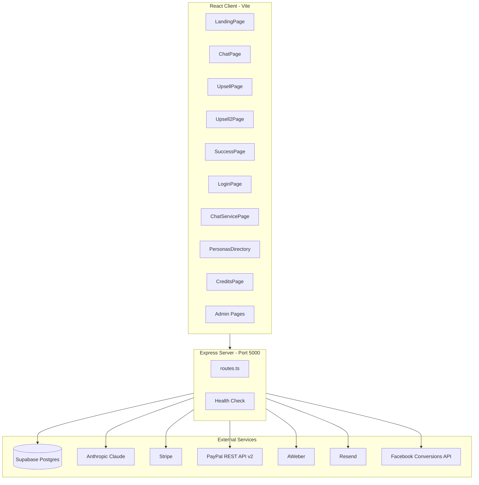
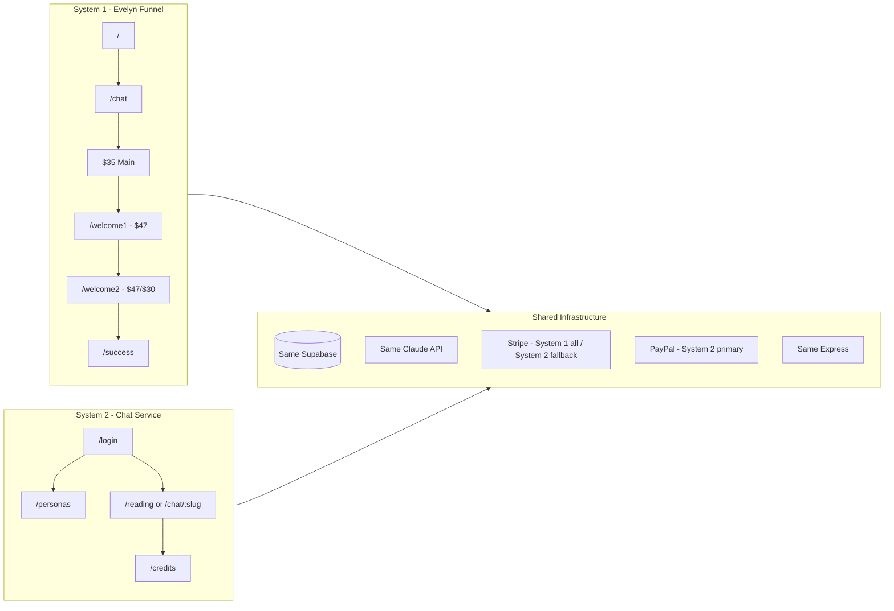
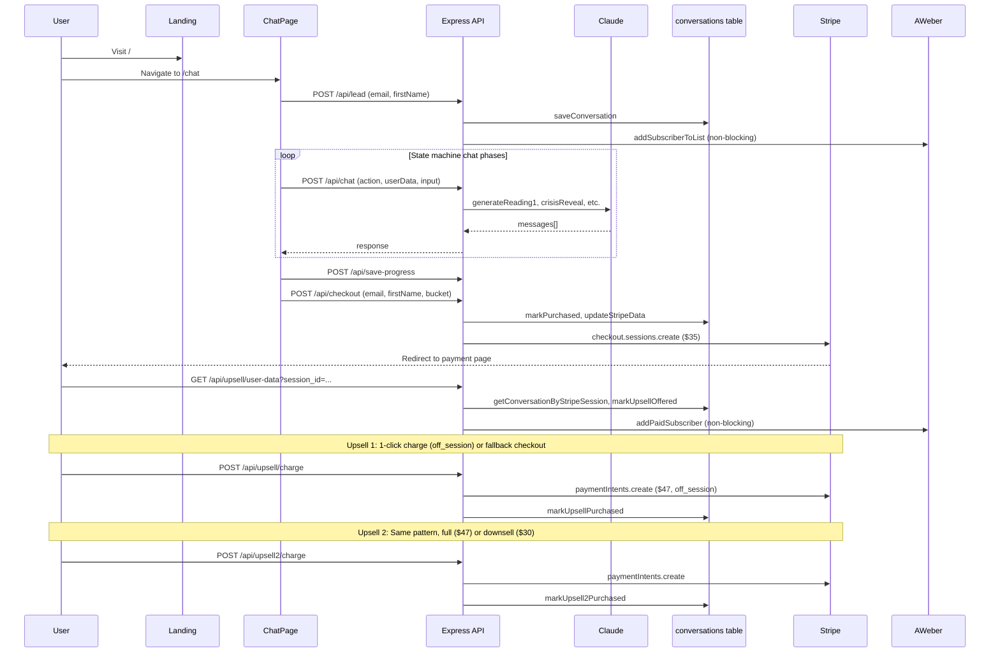
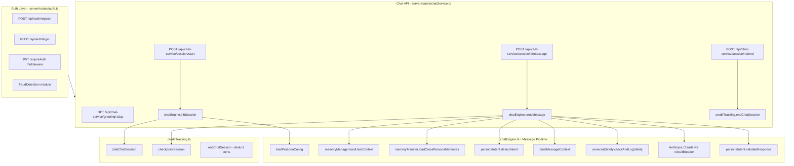
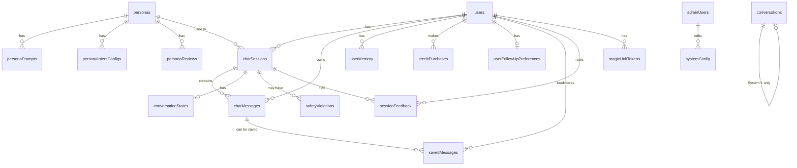
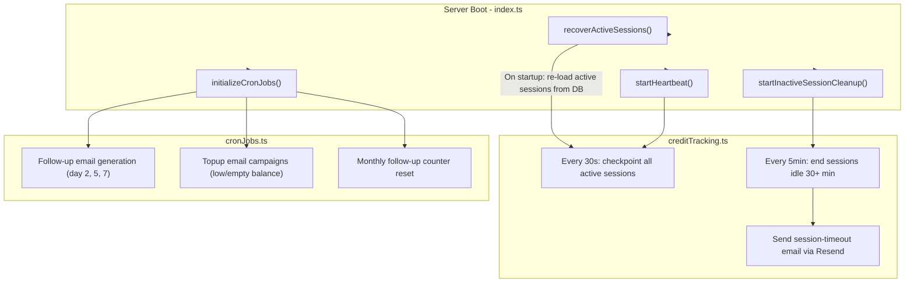
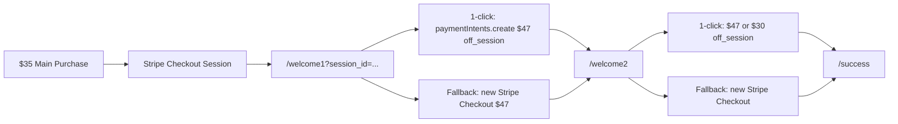
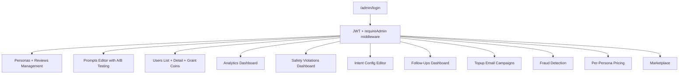
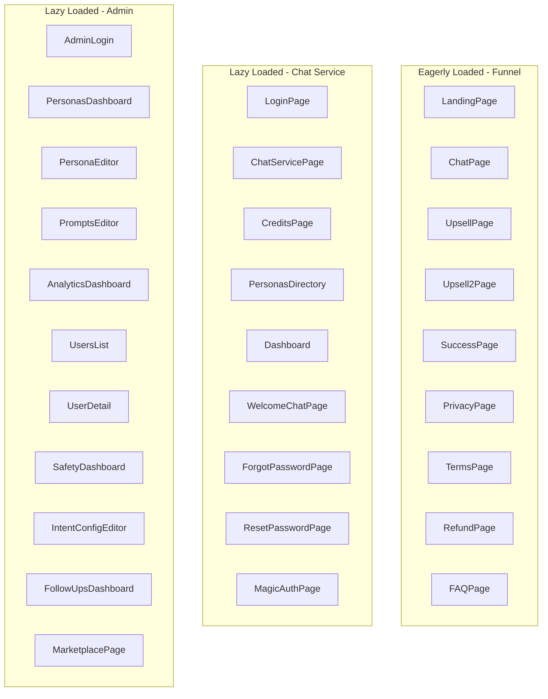

# The Seer Within -- Architecture Overview

## Executive Summary

The Seer Within is a full-stack spiritual guidance platform running **two independent systems** on shared infrastructure: a conversion funnel (no-login, one-time purchase) and a multi-persona chat service (account-based, credit system). Both use the same Express server, PostgreSQL (Supabase), and Claude AI. System 1 uses Stripe for all payments; System 2 uses PayPal Smart Buttons as the primary in-page payment method with Stripe Checkout as a visible card-payment fallback. Both providers write to the same `credit_purchases` table.

---

## 1. High-Level System Architecture

**Stack:**
- **Frontend:** React 19, Vite 7, Wouter (routing), TanStack Query (data fetching), TailwindCSS v4, Radix UI / shadcn/ui
- **Backend:** Express 5, TypeScript, Drizzle ORM
- **Database:** PostgreSQL via Supabase
- **AI:** Anthropic Claude (chatEngine, claude.ts, memory summarization, follow-up generation)
- **Payments:** Stripe (funnel checkout + credit package fallback), PayPal Smart Buttons (System 2 primary)
- **Email:** AWeber (funnel leads/paid lists), Resend (verification, password reset, follow-ups, topup)
- **Monitoring:** Sentry (error tracking), Winston (structured logging), Prometheus-style metrics at `/api/metrics`
- **Reliability:** Opossum circuit breaker around Claude API calls

---

## 2. Dual-System Architecture

The platform runs two completely independent user journeys side by side on the same codebase:

| Aspect | System 1: Funnel | System 2: Chat Service |
|--------|------------------|------------------------|
| **Access** | No login required | JWT auth required |
| **Personas** | Evelyn only | Evelyn, Marcus, Luna, Maren, Aiden (expandable) |
| **Pricing** | One-time $35 + upsells ($47 + $47/$30) | 180 free coins on signup, then purchase credit packages via PayPal (primary) or Stripe (fallback) |
| **Data Storage** | `conversations` table | `users`, `chat_sessions`, `chat_messages`, `user_memory` |
| **Memory** | Session-only | Cross-session, per-persona persistent |
| **Entry Point** | `/` landing page | `/login` |
| **Goal** | Immediate conversion | Long-term relationship / recurring revenue |

---

## 3. System 1 -- Funnel Flow

The funnel is a high-conversion sales flow: landing page, AI chat with Evelyn (state-machine driven), Stripe checkout for a $35 reading, then two upsell pages for physical products.

### Chat State Machine Actions

The funnel chat uses a state machine where the frontend sends an `action` string to `/api/chat`:

| Action | Purpose |
|--------|---------|
| `reading1` | First reading round |
| `reading2` | Second reading round (deepening) |
| `futureValidation` | Future validation phase |
| `crisisReveal` | Crisis/reveal phase |
| `crisisCost` | Cost of inaction |
| `crisisUrgency` | Urgency building |
| `shadowSummary` | Shadow summary |
| `valueExplain` | Value explanation |
| `objection` | Handle purchase objection |

### Key Files

| File | Purpose |
|------|---------|
| `client/src/pages/LandingPage.tsx` | Evelyn homepage with trust badges and scarcity |
| `client/src/pages/ChatPage.tsx` | State-machine chat interface |
| `client/src/pages/UpsellPage.tsx` | Upsell 1: Protection Ritual + Lava Stone ($47) |
| `client/src/pages/Upsell2Page.tsx` | Upsell 2: Manifestation Bracelet ($47/$30) |
| `client/src/pages/SuccessPage.tsx` | Purchase confirmation |
| `server/routes.ts` | All funnel API endpoints (inline) |
| `server/lib/claude.ts` | Claude prompt functions for each chat action |
| `server/lib/db.ts` | Conversation CRUD, Stripe data, upsell tracking |
| `server/lib/facebook.ts` | Facebook Conversions API (server-side events) |

---

## 4. System 2 -- Chat Service Flow

The chat service is an account-based platform where users register, verify their email to receive 180 free coins (3 minutes), and can chat with multiple spiritual advisor personas. Each message flows through a rich pipeline of safety checks, intent detection, memory loading, and response validation.

### Credit / Coin System

| Concept | Value |
|---------|-------|
| Standard rate | 60 coins = 1 minute (default `personas.coinsPerMinute`) |
| Premium rate | 90 coins = 1 minute (or any value set per-guide in admin) |
| Rate field | `personas.coinsPerMinute` — admin-editable per guide |
| Free on email verification | 180 coins (based on `personas.freeCoins`, default 3 min at standard rate) |
| Real-time deduction | Every 30 seconds (heartbeat): deducts completed full minutes (`Math.floor`) at guide's rate |
| Session end deduction | Deducts remaining partial minute (`Math.round`) — only the delta not already billed by checkpoints |
| No double-billing | `chat_sessions.coinsCharged` tracks the running total already deducted; checkpoints and end-session always compute delta |
| Idle session auto-close | 30 minutes of inactivity (configurable per persona via `sessionTimeoutMinutes`) |
| Idle time is free | Billing uses `lastMessageAt`, not wall-clock; idle time after last message is never charged |
| Pricing snapshot | Stored in `chat_sessions.pricingApplied` (JSON) for audit, includes `coinsPerMinute` at session start |

### sendMessage Pipeline (step by step)

1. **Load session** -- verify it exists, is active, and belongs to the user
2. **Check coins** -- ensure user has remaining coins (min balance required)
3. **Universal Safety** (`universalSafety.ts`) -- scan user message for crisis signals, inappropriate content, prompt injection, harassment, gibberish. Logs violations to `safety_violations` table.
4. **Persona Intent** (`personaIntent.ts`) -- detect conversation bucket (love, money, purpose, etc.) and user intent. Update `conversation_states` table.
5. **Memory Manager** (`memoryManager.ts`) -- load prior session summaries and long-term context for this user+persona pair
6. **Memory Transfer** (`memoryTransfer.ts`) -- load relevant memories from *other* personas the user has talked to
7. **Build prompt** -- assemble system prompt + memory context + intent context + last 20 messages
8. **Call Claude** -- via Opossum circuit breaker (`circuitBreaker.ts`) for fault tolerance
9. **Validate response** (`personaIntent.ts`) -- check response against character rules and persona consistency
10. **Save message** -- persist to `chat_messages` table with token counts
11. **Checkpoint session** -- update elapsed time, heartbeat timestamp

### Persona Specializations

| Persona | Specialty | Notable Features |
|---------|-----------|-----------------|
| Evelyn Cross | General guidance (love, money, purpose) | Default persona |
| Marcus Stone | Tarot + shadow work | In-chat tarot card draws |
| Luna Voss | Vedic astrology | Birth data collection → natal chart calculation |
| Maren Soleil | *(configurable)* | — |
| Aiden Powers | *(configurable)* | — |

**Birth Data State Machine** (Luna Voss / astrology personas): A multi-step in-chat flow collects birth date → birth time → birth city, then calls `astrologyEngine.calculateNatalChart()` and stores the result as a `birth_chart` memory entry.

### Key Files

| File | Purpose |
|------|---------|
| `server/routes/auth.ts` | Register, login, verify email, password reset, change password |
| `server/routes/chatService.ts` | Session start, message, end, history, free greeting |
| `server/routes/credits.ts` | Credit checkout, webhook, balance, packages |
| `server/routes/personas.ts` | List, detail, reviews |
| `server/lib/chatEngine.ts` | Core message pipeline (described above) |
| `server/lib/memoryManager.ts` | Session summarization, context loading |
| `server/lib/memoryTransfer.ts` | Cross-persona memory sharing |
| `server/lib/creditTracking.ts` | Session lifecycle, heartbeat, coin deduction |
| `server/lib/universalSafety.ts` | Safety classification and violation logging |
| `server/lib/personaIntent.ts` | Intent detection, conversation state, response validation |
| `server/lib/personaManager.ts` | Persona availability + scheduling |
| `server/lib/astrologyEngine.ts` | Natal/Vedic chart calculation, OpenStreetMap geocoding |
| `server/lib/numerologyEngine.ts` | Life path, destiny, personality numbers |
| `server/lib/magicLink.ts` | Tokenized one-click login for follow-up emails |
| `server/lib/circuitBreaker.ts` | Opossum circuit breaker for Claude API |
| `server/lib/fraudDetection.ts` | Registration fraud signals (IP, user agent, fingerprint) |
| `server/lib/rateLimiter.ts` | Express rate limiting for auth, chat, admin |
| `server/lib/auth.ts` | Password hashing (bcrypt), JWT sign/verify, requireAuth middleware |

---

## 5. Database Schema

All tables are defined in `shared/schema.ts` using Drizzle ORM with Zod validation. There are **20 tables** total.

### Table Reference

**System 1 (Funnel):**

| Table | Key Columns |
|-------|-------------|
| `conversations` | email, firstName, bucket, stripeSessionId, purchased, upsellPurchased, upsell2Purchased, shippingLine1, shipping2Line1, messages (JSON) |

**System 2 (Chat Service Core):**

| Table | Key Columns |
|-------|-------------|
| `personas` | slug (UK), displayName, tagline, description, avatarUrl, baseSystemPrompt, personality (JSON), categories, isActive, isDefault, isFeatured, sortOrder, freeCoins (default 180), coinsPerMinute (**admin-editable billing rate**, default 60; premium guides may use 90+), customPricing (JSON), sessionTimeoutMinutes, fromEmail, fromName, availabilitySchedule (JSON), onlineOverride, overrideExpiresAt, cyclicBreakSchedule (JSON), yearsExperience, readingsCount, overallRating |
| `persona_reviews` | personaId (FK), reviewerName, reviewText, starRating |
| `persona_prompts` | personaId (FK), promptType, promptContent, version, isActive, variantLabel, trafficPercent |
| `users` | email (UK), passwordHash, firstName, emailVerified, verificationToken, coinBalance, totalCoinsUsed, defaultPersonaId, accountStatus, lastLoginAt, suspensionReason, passwordResetToken, registrationIp, deviceFingerprint, accountFlags (JSON) |
| `chat_sessions` | userId (FK), personaId (FK), startedAt, endedAt, durationSeconds, coinsCharged (**running total of coins already deducted from user balance** — used as watermark to prevent double-billing across checkpoints and session end), status, lastHeartbeatAt, lastMessageAt, promptVariantId, pricingApplied (JSON snapshot incl. coinsPerMinute) |
| `chat_messages` | sessionId (FK), userId (FK), role, content, inputTokens, outputTokens, sentAt |
| `saved_messages` | userId (FK), messageId (FK), sessionId (FK), savedAt |
| `user_memory` | userId (FK), personaId (FK), memoryType (session_summary \| long_term_context \| birth_chart \| numerology_profile), summary, fullContext (JSON), importance (1–10), category, lastAccessedAt |
| `credit_purchases` | userId (FK), packageType, coinsPurchased, bonusCoins, priceUsd (cents), stripeSessionId, stripePaymentIntentId, paypalOrderId, paypalCaptureId, status |
| `conversation_states` | sessionId (FK unique), personaId, userId, currentBucket, turnCount, detectedIntents (JSON), userEngagement, bucketTransitions (JSON) |

**Safety & Admin:**

| Table | Key Columns |
|-------|-------------|
| `safety_violations` | sessionId (FK), userId (FK), violationType, userMessage, systemResponse, ipAddress, flaggedForReview, reviewedAt, reviewNotes |
| `persona_intent_configs` | personaId (FK), specialty, conversationBuckets (JSON), intents (JSON), characterRules (JSON), version, isActive |
| `admin_users` | email (UK), passwordHash, role, displayName |
| `system_config` | configKey (UK), configValue, configType (text \| number \| json \| prompt), description |

**Email & Re-engagement:**

| Table | Key Columns |
|-------|-------------|
| `follow_up_emails` | userId (FK), personaId (FK), recipientEmail, subject, bodyHtml, status, sequenceNumber (1=day2, 2=day5, 3=day7), opened, clicked, unsubscribeToken (UK) |
| `user_follow_up_preferences` | userId (FK unique), enableFollowUps, followUpDays, maxFollowUpsPerMonth, followUpsSentThisMonth, unsubscribedAt |
| `topup_emails` | userId (FK), personaId (FK), segment (empty_tank \| free_tier_dropoff \| loyal_refill \| dormant_low_balance), status, coinBalanceAtSend, unsubscribeToken (UK) |
| `magic_link_tokens` | token (UK), userId (FK), personaId (FK), personaSlug, expiresAt, usedAt |
| `session_feedback` | sessionId (FK), userId (FK), personaId (FK), starRating (1–5), feedbackText, approved, displayName |

---

## 6. API Route Map

### Funnel (inline in `server/routes.ts`)

| Method | Endpoint | Purpose |
|--------|----------|---------|
| POST | `/api/chat` | AI chat with action-based state machine |
| POST | `/api/lead` | Email/name capture, save to DB + AWeber |
| POST | `/api/checkout` | Create Stripe Checkout session ($35/$25) |
| POST | `/api/save-progress` | Persist conversation state |
| GET | `/api/conversation/:email` | Restore conversation cross-device |
| GET | `/api/location` | IP geolocation |
| GET | `/api/upsell/user-data` | Load user data for upsell page |
| POST | `/api/upsell/charge` | 1-click upsell charge (off_session) |
| POST | `/api/upsell/fallback-checkout` | Fallback Stripe Checkout for upsell |
| POST | `/api/upsell/confirm-fallback` | Server-side verification of fallback |
| POST | `/api/shipping/save` | Save upsell 1 shipping address |
| GET | `/api/upsell2/user-data` | Load user data for upsell 2 |
| POST | `/api/upsell2/charge` | 1-click charge for bracelet ($47/$30) |
| POST | `/api/upsell2/fallback-checkout` | Fallback Stripe Checkout for upsell 2 |
| POST | `/api/upsell2/confirm-fallback` | Server-side verification |
| POST | `/api/upsell2/shipping` | Save upsell 2 shipping address |
| POST | `/api/fb-event` | Server-side Facebook Conversions API |

### Auth (`server/routes/auth.ts`)

| Method | Endpoint | Purpose |
|--------|----------|---------|
| POST | `/api/auth/register` | Create account (+ fraud check, send verification email) |
| POST | `/api/auth/login` | JWT login |
| GET | `/api/auth/verify-email/:token` | Confirm email → grant 180 coins |
| POST | `/api/auth/resend-verification` | Resend verification email |
| GET | `/api/auth/me` | Current user info |
| POST | `/api/auth/change-password` | Update password |
| POST | `/api/auth/forgot-password` | Request password reset email |
| GET | `/api/auth/reset-password/:token` | Reset password with token |

### Chat Service (`server/routes/chatService.ts`)

| Method | Endpoint | Purpose |
|--------|----------|---------|
| GET | `/api/chat-service/greeting/:personaSlug` | Free greeting message (no session, no coin charge) |
| POST | `/api/chat-service/session/start` | Start chat session with a persona |
| POST | `/api/chat-service/session/:id/message` | Send message (full safety + AI pipeline) |
| POST | `/api/chat-service/session/:id/end` | End session, deduct coins |
| GET | `/api/chat-service/sessions` | Session history |
| GET | `/api/chat-service/sessions/:id/messages` | Message history |

### Credits (`server/routes/credits.ts`)

| Method | Endpoint | Purpose |
|--------|----------|---------|
| GET | `/api/credits/pricing` | Available credit packages (per-persona or default) |
| GET | `/api/credits/balance` | User's current coin balance |
| GET | `/api/credits/purchases` | User's purchase history |
| POST | `/api/credits/create-order` | **PayPal:** create order → returns `orderId` |
| POST | `/api/credits/capture-order` | **PayPal:** capture approved order → adds coins, returns `newBalance` |
| POST | `/api/credits/checkout` | **Stripe:** create Checkout session → returns redirect URL |
| POST | `/api/credits/webhook` | **Stripe:** webhook → add coins on `checkout.session.completed` |

### Personas (`server/routes/personas.ts`)

| Method | Endpoint | Purpose |
|--------|----------|---------|
| GET | `/api/personas` | List active personas |
| GET | `/api/personas/:slug` | Persona detail |
| GET | `/api/personas/:slug/reviews` | Persona reviews / testimonials |

### Admin (all behind `requireAdmin` + rate limiting)

| Method | Endpoint | Purpose |
|--------|----------|---------|
| POST | `/api/admin/login` | Admin JWT login |
| GET | `/api/admin/me` | Current admin info |
| * | `/api/admin/personas/*` | CRUD personas + reviews |
| * | `/api/admin/prompts/*` | Manage prompts with A/B variants |
| * | `/api/admin/users/*` | View/manage users, grant coins, suspend |
| * | `/api/admin/analytics/*` | Platform metrics |
| * | `/api/admin/safety/*` | Safety violation dashboard + review |
| * | `/api/admin/intent-configs/*` | Per-persona intent/bucket config |
| * | `/api/admin/follow-ups/*` | Follow-up email management |
| * | `/api/admin/fraud/*` | Fraud detection data |
| * | `/api/admin/pricing/*` | Per-persona pricing |

### Health & Monitoring

| Method | Endpoint | Purpose |
|--------|----------|---------|
| GET | `/api/health-check` | Simple liveness ping |
| GET | `/api/health` | Full dependency check (DB, Stripe, Anthropic, Resend) |
| GET | `/api/ready` | Readiness probe (for load balancers / K8s) |
| GET | `/api/metrics` | Prometheus-format metrics (request count, error count, latency) |

---

## 7. Background Processes

Several background processes run alongside the HTTP server:

| Process | Frequency | Source | Purpose |
|---------|-----------|--------|---------|
| **Session recovery** | Once on boot | `creditTracking.ts` | Re-load active sessions after server restart; deducts delta for any time elapsed while server was down |
| **Heartbeat** | Every 30 seconds | `creditTracking.ts` | Checkpoint: deducts coins for each newly completed minute (`Math.floor`) at the guide's rate; updates `coinsCharged` watermark to prevent double-billing |
| **Inactive cleanup** | Every 5 minutes | `creditTracking.ts` | End sessions idle for 30+ minutes; deducts only the delta not yet billed by prior checkpoints |
| **Session timeout email** | On idle end | `sessionTimeoutEmail.ts` | Notify user their session timed out |
| **Follow-up emails** | Cron (day 2, 5, 7) | `cronJobs.ts` + `followUpEmailGenerator.ts` | Claude-Haiku generates personalized re-engagement emails |
| **Topup emails** | Cron | `cronJobs.ts` + `topupEmailGenerator.ts` | Segment-based coin replenishment nudges |
| **Monthly reset** | Monthly | `cronJobs.ts` | Reset per-user follow-up email counters |

---

## 8. Payment Flows

### System 1 -- Funnel Payments

- **Main purchase:** Stripe Checkout ($35 or $25 downsell)
- **Upsell 1:** Protection Ritual + Lava Stone ($47). Tries 1-click off-session charge using saved payment method; falls back to full Stripe Checkout if card requires authentication.
- **Upsell 2:** Manifestation Bracelet ($47 full / $30 downsell). Same 1-click + fallback pattern.
- Both upsells collect shipping addresses, saved to DB and synced to Stripe metadata + AWeber.

### System 2 -- Credit Payments

System 2 uses a **dual-provider** model. PayPal Smart Buttons are the primary in-page option; Stripe Checkout is the visible "Pay with card instead" fallback. Both providers write to the same `credit_purchases` table.

```mermaid
flowchart TB
    subgraph primary [Primary — PayPal Smart Buttons]
        direction LR
        PP_Click["User approves PayPal"] --> CreateOrder["POST /api/credits/create-order\n(insert pending purchase, call PayPal REST v2)"]
        CreateOrder --> PayPalApproval["PayPal order created → SDK renders approval UI"]
        PayPalApproval --> CaptureOrder["POST /api/credits/capture-order\n(capture + verify COMPLETED status)"]
        CaptureOrder --> AddCoinsPP["Increment user.coinBalance\nSet paypalCaptureId on credit_purchases"]
        AddCoinsPP --> SuccessPP["onSuccess(newBalance) — in-page toast"]
    end

    subgraph fallback [Fallback — Stripe Checkout]
        direction LR
        Card_Click["User clicks 'Pay with card instead'"] --> StripeCheckout["POST /api/credits/checkout\n(insert pending purchase)"]
        StripeCheckout --> StripeRedirect["Redirect to stripe.com"]
        StripeRedirect --> Webhook["POST /api/credits/webhook\n(Stripe signature verified)"]
        Webhook --> AddCoinsStripe["Increment user.coinBalance\nSet stripePaymentIntentId on credit_purchases"]
    end
```

**Component breakdown:**

| Component | File | Role |
|-----------|------|------|
| PayPal REST client | `server/lib/paypal.ts` | `getAccessToken()`, `createOrder()`, `captureOrder()` via native `fetch` |
| PayPal button UI | `client/src/components/PayPalCreditButton.tsx` | `<PayPalButtons>` wrapper; calls create + capture endpoints |
| SDK provider | `client/src/App.tsx` | `<PayPalScriptProvider>` loads PayPal JS SDK once for the session |
| Stripe client | `server/routes/credits.ts` | Unchanged; `/checkout` + `/webhook` endpoints |

**Notes:**
- Credit packages are configurable per-persona via `customPricing` JSON in the `personas` table
- PayPal uses `PAYPAL_MODE=sandbox|live` to switch environments; no webhook required (capture is synchronous)
- Stripe webhook uses raw body buffer for signature verification (`STRIPE_CREDITS_WEBHOOK_SECRET`)
- Free coins (180 = 3 minutes) are granted on email verification, independent of both payment providers

---

## 9. Safety System

All user messages pass through `universalSafety.checkAndLogSafety()` before reaching Claude:

| Violation Type | Detection | Response |
|----------------|-----------|----------|
| `crisis` | Suicidal/self-harm intent | Block + 988 Lifeline message + flag for manual review |
| `soft_crisis` | Passive ideation ("can't go on") | Prepend crisis note, allow response to continue |
| `inappropriate` | Sexual content | Blocking response |
| `prompt_injection` | "ignore instructions", jailbreak patterns | Blocking response |
| `harassment` | Hostile/abusive language | Blocking response |
| `gibberish` | Keyboard spam, word salad, repeated characters | Ask user to clarify |
| `non_english` | Non-English message detected | Ask user to use English |

- 150+ regex patterns across all types, including multilingual crisis patterns (Spanish, French, Portuguese)
- All violations logged to `safety_violations` with session/user/IP/user-agent
- Confidence scoring (0–1) on every check

---

## 10. Admin Dashboard

The admin system at `/admin/*` provides full platform control:

| Feature | Client Route | Router File |
|---------|-------------|-------------|
| Persona CRUD + reviews | `/admin/personas` | `server/routes/admin/personas.ts` |
| Prompt management | `/admin/prompts` | `server/routes/admin/prompts.ts` |
| User management | `/admin/users` | `server/routes/admin/users.ts` |
| Analytics | `/admin/analytics` | `server/routes/admin/analytics.ts` |
| Safety review | `/admin/safety` | `server/routes/admin/safety.ts` |
| Intent configs | `/admin/intent-configs/:personaId` | `server/routes/admin/intentConfigs.ts` |
| Follow-up emails | `/admin/follow-ups` | `server/routes/admin/followUps.ts` |
| Fraud signals | `/admin/fraud` | `server/routes/admin/fraud.ts` |
| Pricing | `/admin/pricing` | `server/routes/admin/pricing.ts` |
| Marketplace | `/admin/marketplace` | `server/routes/admin/marketplace.ts` |

---

## 11. Frontend Architecture

### Client Routes

| Path | Component | Notes |
|------|-----------|-------|
| `/` | LandingPage | Evelyn Cross intro |
| `/chat` | ChatPage | State-machine funnel chat |
| `/welcome1` | UpsellPage | Protection Ritual $47 |
| `/welcome2` | Upsell2Page | Manifestation Bracelet $47/$30 |
| `/success` | SuccessPage | Post-purchase |
| `/privacy`, `/terms`, `/refund`, `/faq` | Static pages | |
| `/login` | LoginPage | Auth (register + login tabs) |
| `/forgot-password` | ForgotPasswordPage | |
| `/reset-password/:token` | ResetPasswordPage | |
| `/magic-auth` | MagicAuthPage | One-click login from follow-up emails |
| `/reading` or `/chat/:personaSlug` | ChatServicePage | Multi-persona chat |
| `/welcome-chat` | WelcomeChatPage | Post-registration onboarding |
| `/personas` | PersonasDirectory | Browse all advisors |
| `/credits` | CreditsPage | Purchase coins |
| `/dashboard` | Dashboard | User profile + session history |
| `/admin/login` | AdminLogin | |
| `/admin/personas`, `/admin/personas/:id` | PersonaEditor | |
| `/admin/prompts` | PromptsEditor | |
| `/admin/analytics` | AnalyticsDashboard | |
| `/admin/users`, `/admin/users/:id` | UsersList, UserDetail | |
| `/admin/safety` | SafetyDashboard | |
| `/admin/intent-configs/:personaId` | IntentConfigEditor | |
| `/admin/follow-ups` | FollowUpsDashboard | |
| `/admin/marketplace` | MarketplacePage | |

### Key Client Patterns

- **Routing:** Wouter (lightweight, ~1.5KB)
- **Data fetching:** TanStack Query with a shared `queryClient`
- **UI components:** Radix UI primitives + shadcn/ui (New York style)
- **Auth state:** `useAuth` hook (JWT in localStorage key `seer_auth_token`, validated against `/api/auth/me`)
- **Admin state:** `useAdmin` hook (separate JWT flow)
- **Error boundary:** Sentry `ErrorBoundary` wrapping the entire app
- **PayPal SDK:** `<PayPalScriptProvider>` wraps the entire app in `App.tsx`; loads PayPal JS SDK once per session using `VITE_PAYPAL_CLIENT_ID`
- **PayPal button:** `<PayPalCreditButton packageType personaId onSuccess>` is rendered per credit package in `CreditsPage`, `BuyCreditsModal`, and `OutOfCreditsModal`
- **Page tracking:** Facebook Pixel `trackPageView` on every route change
- **Code splitting:** Funnel pages eagerly loaded (critical path); chat service and admin pages lazy-loaded via `React.lazy()`
- **Typing simulation:** `client/src/lib/typingAnimation.ts` streams characters with length-based delays
- **Intent detection (client):** `client/src/lib/intent.ts` classifies user messages to show/hide quick reply buttons
- **Persona availability:** `personaManager.ts` checks `availabilitySchedule` + `onlineOverride` to show online/offline status

---

## 12. Environment Variables

| Variable | Purpose |
|----------|---------|
| `DATABASE_URL` | Supabase PostgreSQL connection string (URL-encode special chars) |
| `ANTHROPIC_API_KEY` | Claude API |
| `STRIPE_SECRET_KEY` | Stripe payments (System 1 all; System 2 card fallback) |
| `STRIPE_WEBHOOK_SECRET` | Funnel Stripe webhook signature |
| `STRIPE_CREDITS_WEBHOOK_SECRET` | Credits Stripe webhook signature |
| `PAYPAL_CLIENT_ID` | PayPal REST API client ID (server-side) |
| `PAYPAL_CLIENT_SECRET` | PayPal REST API secret (server-side) |
| `PAYPAL_MODE` | `sandbox` or `live` — selects PayPal API base URL |
| `VITE_PAYPAL_CLIENT_ID` | Same client ID, exposed to frontend for `PayPalScriptProvider` |
| `JWT_SECRET` | JWT signing key |
| `RESEND_API_KEY` | Email delivery |
| `MODEL_MODE` | `default` (Haiku + Sonnet), `economy` (Haiku only), `high-quality` (Sonnet only) |
| `FOLLOW_UP_FROM_EMAIL` | Sender address for follow-up emails |
| `FOLLOW_UP_FROM_NAME` | Sender name |
| `CRON_TIMEZONE` | Timezone for scheduled jobs |
| `BASE_URL` | App base URL (for email links and redirects) |
| `AWEBER_CLIENT_ID`, `AWEBER_CLIENT_SECRET` | AWeber OAuth |
| `AWEBER_ACCOUNT_ID`, `AWEBER_LIST_ID` | AWeber list targeting |
| `FB_PIXEL_ID` | Facebook Pixel ID |
| `FB_ACCESS_TOKEN` | Facebook Conversions API |
| `SENTRY_DSN`, `VITE_SENTRY_DSN` | Sentry error tracking (server / client) |
| `NODE_ENV` | `development` or `production` |
| `PORT` | Server port (default 5000) |

---

## 13. Key File Reference

| Purpose | File |
|---------|------|
| Server entry point | `server/index.ts` |
| All funnel routes (inline) | `server/routes.ts` |
| Chat engine (message pipeline) | `server/lib/chatEngine.ts` |
| Claude prompt functions (funnel) | `server/lib/claude.ts` |
| Memory manager (summarize + load) | `server/lib/memoryManager.ts` |
| Cross-persona memory transfer | `server/lib/memoryTransfer.ts` |
| Credit tracking (sessions + heartbeat) | `server/lib/creditTracking.ts` |
| Persona intent detection | `server/lib/personaIntent.ts` |
| Persona availability + scheduling | `server/lib/personaManager.ts` |
| Universal safety checks | `server/lib/universalSafety.ts` |
| Astrology engine (natal + Vedic charts) | `server/lib/astrologyEngine.ts` |
| Numerology engine | `server/lib/numerologyEngine.ts` |
| Magic link tokens | `server/lib/magicLink.ts` |
| Circuit breaker (Claude) | `server/lib/circuitBreaker.ts` |
| Model configuration | `server/lib/modelConfig.ts` |
| Auth (bcrypt, JWT, middleware) | `server/lib/auth.ts` |
| Fraud detection | `server/lib/fraudDetection.ts` |
| Rate limiter | `server/lib/rateLimiter.ts` |
| Health check + metrics | `server/lib/healthCheck.ts` |
| Structured logger (Winston) | `server/lib/logger.ts` |
| Cron jobs (follow-ups, topup, resets) | `server/lib/cronJobs.ts` |
| Follow-up email generator | `server/lib/followUpEmailGenerator.ts` |
| Topup email generator | `server/lib/topupEmailGenerator.ts` |
| Session timeout email | `server/lib/sessionTimeoutEmail.ts` |
| Database connection (Drizzle) | `server/lib/db.ts` |
| Full schema (all tables) | `shared/schema.ts` |
| Shared types | `shared/types.ts` |
| Auth routes | `server/routes/auth.ts` |
| Chat service API routes | `server/routes/chatService.ts` |
| Credits routes (PayPal + Stripe) | `server/routes/credits.ts` |
| PayPal REST API v2 client | `server/lib/paypal.ts` |
| Persona directory routes | `server/routes/personas.ts` |
| Admin route index | `server/routes/admin/index.ts` |
| Client routing | `client/src/App.tsx` |
| Auth hook | `client/src/hooks/useAuth.ts` |
| PayPal credit button | `client/src/components/PayPalCreditButton.tsx` |
| Client intent detection | `client/src/lib/intent.ts` |
| Typing animation | `client/src/lib/typingAnimation.ts` |
| Facebook pixel | `client/src/lib/facebook.ts` |

---

## 14. Summary

The architecture cleanly separates two business models on one stack:

- **System 1** targets immediate conversion with a state-machine chat and one-time Stripe purchases plus two upsell flows with 1-click off-session charging.
- **System 2** supports ongoing relationships with user accounts, multiple AI personas (including astrology and tarot specializations), persistent memory (per-persona and cross-persona), a coin-based billing system with **variable per-guide rates** (default 60 coins/minute, premium guides 90+ coins/minute — admin-configurable via `personas.coinsPerMinute`), and automated re-engagement via follow-up and topup email campaigns. Coins are deducted in **real-time every completed minute** during a session (heartbeat every 30s), with remaining time visible as a coin balance (`360 🪙`) in the chat UI. Credits are purchased via **PayPal Smart Buttons** (primary, in-page) or **Stripe Checkout** (card fallback) — both providers write to the same `credit_purchases` table; PayPal uses a synchronous capture flow while Stripe relies on a signed webhook.

Shared infrastructure (PostgreSQL, Claude, Express on port 5000) keeps operational complexity low. Background jobs (heartbeat every 30s, idle cleanup every 5min, cron-based follow-up and topup campaigns) handle session lifecycle and re-engagement without blocking HTTP requests. Safety, intent detection, and circuit breakers ensure reliability and responsible AI usage.
