# The Seer Within -- Architecture Overview

## Executive Summary

The Seer Within is a full-stack spiritual guidance platform running **two independent systems** on shared infrastructure: a conversion funnel (no-login, one-time purchase) and a multi-persona chat service (account-based, credit system). Both use the same Express server, PostgreSQL (Supabase), Claude AI, and Stripe, but maintain separate data models and user journeys.

---

## 1. High-Level System Architecture

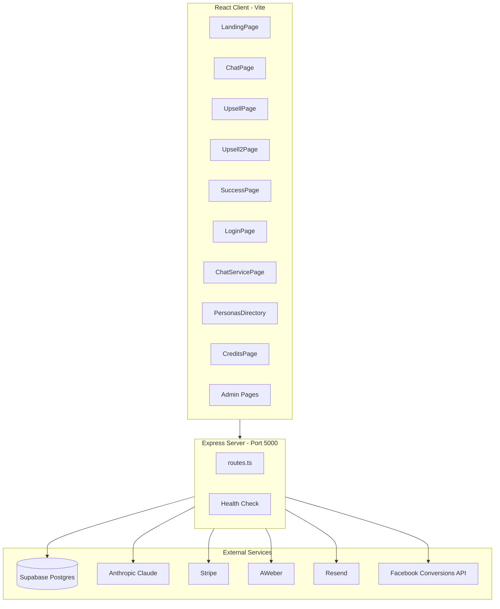

**Stack:**
- **Frontend:** React 19, Vite 7, Wouter (routing), TanStack Query (data fetching), TailwindCSS, Radix UI
- **Backend:** Express 5, TypeScript, Drizzle ORM
- **Database:** PostgreSQL via Supabase
- **AI:** Anthropic Claude (chatEngine, claude.ts, memory summarization)
- **Payments:** Stripe (funnel checkout + credit packages)
- **Email:** AWeber (funnel leads/paid lists), Resend (verification, password reset, follow-ups)
- **Monitoring:** Sentry (error tracking), Winston (structured logging), Prometheus-style metrics at `/api/metrics`
- **Reliability:** Opossum circuit breaker around Claude API calls

---

## 2. Dual-System Architecture

The platform runs two completely independent user journeys side by side on the same codebase:

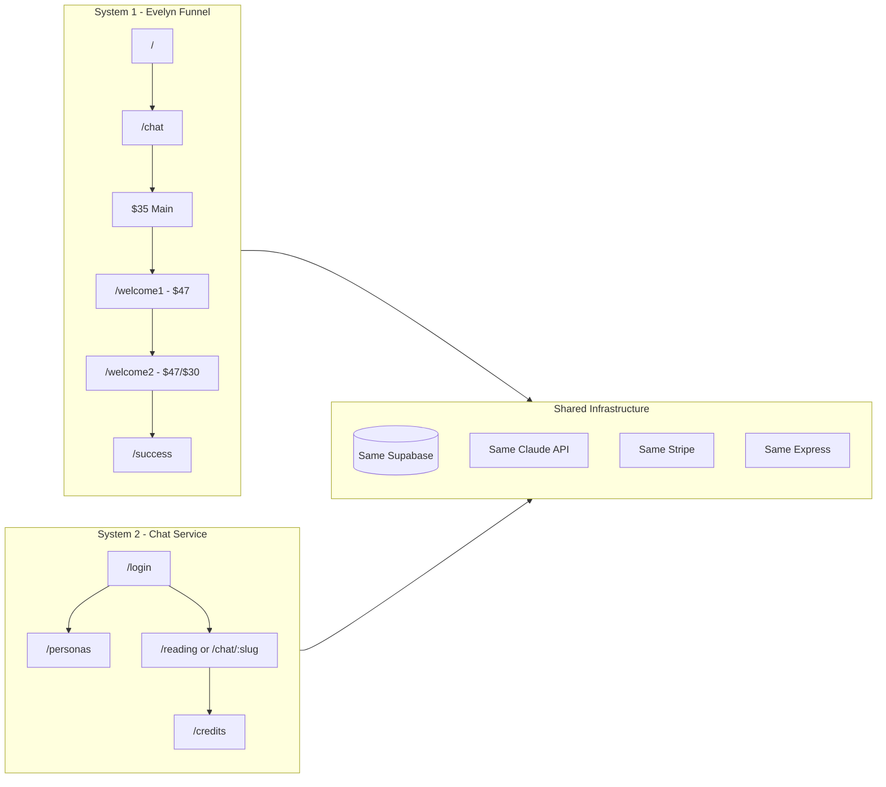

| Aspect | System 1: Funnel | System 2: Chat Service |
|--------|------------------|------------------------|
| **Access** | No login required | JWT auth required |
| **Personas** | Evelyn only | Evelyn + Marcus (expandable) |
| **Pricing** | One-time $35 + upsells ($47 + $47/$30) | 3 free mins, then purchase credit packages |
| **Data Storage** | `conversations` table | `users`, `chat_sessions`, `chat_messages`, `user_memory` |
| **Memory** | Session-only | Cross-session, per-persona persistent |
| **Entry Point** | `/` landing page | `/login` |
| **Goal** | Immediate conversion | Long-term relationship / recurring revenue |

---

## 3. System 1 -- Funnel Flow

The funnel is a high-conversion sales flow: landing page, AI chat with Evelyn (state-machine driven), Stripe checkout for a $35 reading, then two upsell pages for physical products.

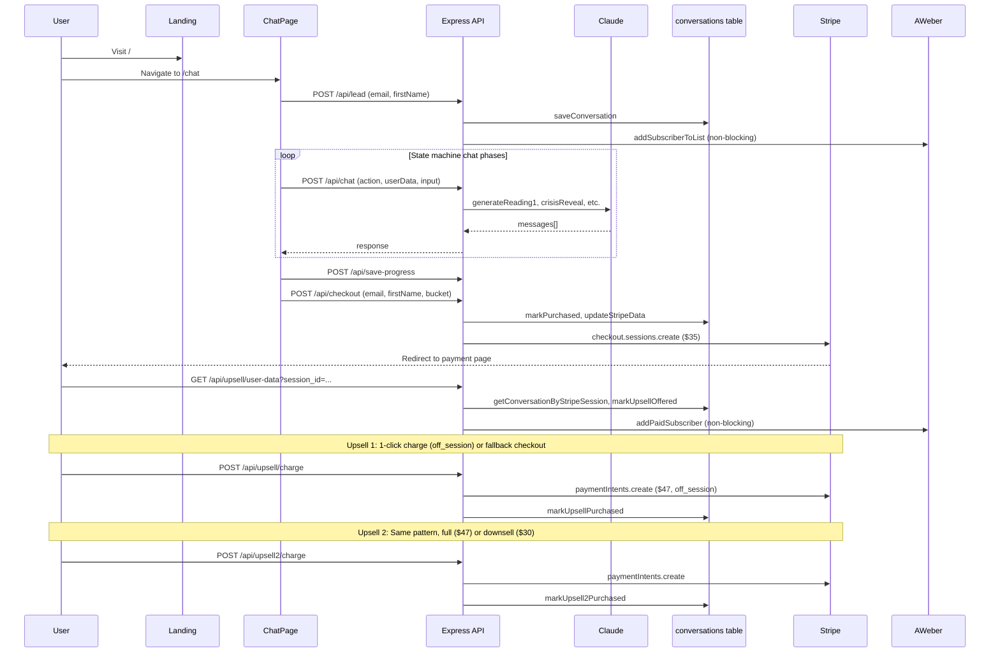

### Chat State Machine Actions

The funnel chat uses a state machine where the frontend sends an `action` string to `/api/chat`:

| Action | Purpose |
|--------|---------|
| `reading1` | First reading round |
| `reading2` | Second reading round (deepening) |
| `futureValidation` | Future validation phase |
| `crisisReveal` | Crisis/reveal phase |
| `crisisCost` | Cost of inaction |
| `crisisUrgency` | Urgency building |
| `shadowSummary` | Shadow summary |
| `valueExplain` | Value explanation |
| `objection` | Handle purchase objection |

### Key Files

| File | Purpose |
|------|---------|
| `client/src/pages/LandingPage.tsx` | Evelyn homepage with trust badges and scarcity |
| `client/src/pages/ChatPage.tsx` | State-machine chat interface |
| `client/src/pages/UpsellPage.tsx` | Upsell 1: Protection Ritual + Lava Stone ($47) |
| `client/src/pages/Upsell2Page.tsx` | Upsell 2: Manifestation Bracelet ($47/$30) |
| `client/src/pages/SuccessPage.tsx` | Purchase confirmation |
| `server/routes.ts` | All funnel API endpoints (inline) |
| `server/lib/claude.ts` | Claude prompt functions for each chat action |
| `server/lib/db.ts` | Conversation CRUD, Stripe data, upsell tracking |
| `server/lib/facebook.ts` | Facebook Conversions API (server-side events) |

---

## 4. System 2 -- Chat Service Flow

The chat service is an account-based platform where users register, get 3 free minutes, and can chat with multiple spiritual advisor personas. Each message flows through a rich pipeline of safety checks, intent detection, memory loading, and response validation.

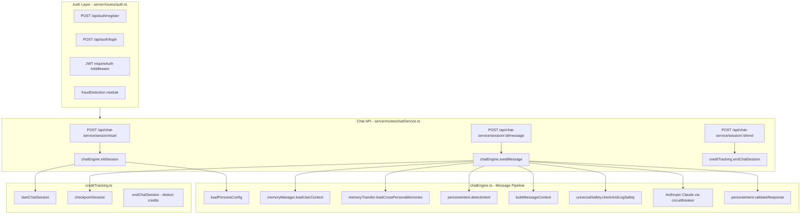

### sendMessage Pipeline (step by step)

1. **Load session** -- verify it exists, is active, and belongs to the user
2. **Check credits** -- ensure user has remaining minutes
3. **Universal Safety** (`universalSafety.ts`) -- scan user message for crisis signals, inappropriate content, prompt injection, harassment, gibberish. Logs violations to `safety_violations` table.
4. **Persona Intent** (`personaIntent.ts`) -- detect conversation bucket (love, money, purpose, etc.) and user intent. Update `conversation_states` table.
5. **Memory Manager** (`memoryManager.ts`) -- load prior session summaries and long-term context for this user+persona pair
6. **Memory Transfer** (`memoryTransfer.ts`) -- load relevant memories from *other* personas the user has talked to
7. **Build prompt** -- assemble system prompt + memory context + intent context + last 20 messages
8. **Call Claude** -- via Opossum circuit breaker (`circuitBreaker.ts`) for fault tolerance
9. **Validate response** (`personaIntent.ts`) -- check response against character rules and persona consistency
10. **Save message** -- persist to `chat_messages` table with token counts
11. **Checkpoint session** -- update elapsed time, heartbeat timestamp

### Key Files

| File | Purpose |
|------|---------|
| `server/routes/auth.ts` | Register, login, verify email, password reset, change password |
| `server/routes/chatService.ts` | Session start, message, end, history |
| `server/routes/credits.ts` | Credit checkout, webhook, balance |
| `server/routes/personas.ts` | List and detail personas |
| `server/lib/chatEngine.ts` | Core message pipeline (described above) |
| `server/lib/memoryManager.ts` | Session summarization, context loading |
| `server/lib/memoryTransfer.ts` | Cross-persona memory sharing |
| `server/lib/creditTracking.ts` | Session lifecycle, heartbeat, credit deduction |
| `server/lib/universalSafety.ts` | Safety classification and violation logging |
| `server/lib/personaIntent.ts` | Intent detection, conversation state, response validation |
| `server/lib/circuitBreaker.ts` | Opossum circuit breaker for Claude API |
| `server/lib/fraudDetection.ts` | Registration fraud signals (IP, user agent, fingerprint) |
| `server/lib/rateLimiter.ts` | Express rate limiting for auth, chat, admin |
| `server/lib/auth.ts` | Password hashing (bcrypt), JWT sign/verify, requireAuth middleware |

---

## 5. Database Schema

All tables are defined in `shared/schema.ts` using Drizzle ORM with Zod validation.

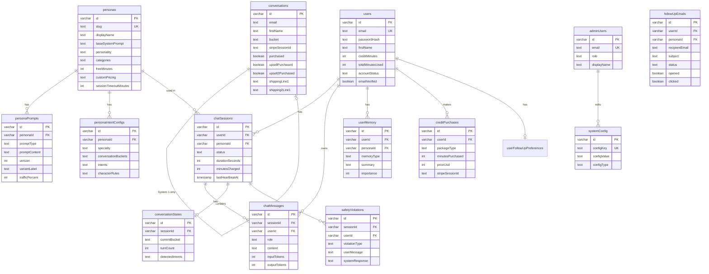

### Table Groups

**System 1 (Funnel):** `conversations` -- stores lead data, conversation state, purchase tracking, Stripe session IDs, shipping addresses for both upsells.

**System 2 (Chat Service):**
- `users` -- accounts with credit balance and verification status
- `personas` -- advisor profiles with system prompts, pricing, timeout config
- `personaPrompts` -- versioned prompts with A/B testing support (variant labels, traffic %)
- `chatSessions` -- session lifecycle with heartbeat and pricing snapshots
- `chatMessages` -- individual messages with token counts
- `userMemory` -- session summaries and long-term context (per-persona)
- `creditPurchases` -- transaction log for credit purchases
- `personaIntentConfigs` -- per-persona bucket/intent/character-rules config
- `conversationStates` -- per-session tracking of bucket, turn count, detected intents
- `safetyViolations` -- logged safety events (crisis, inappropriate, injection)
- `followUpEmails` -- re-engagement email tracking with open/click analytics
- `userFollowUpPreferences` -- per-user email preferences and rate limits

**Admin:** `adminUsers`, `systemConfig`

---

## 6. API Route Map

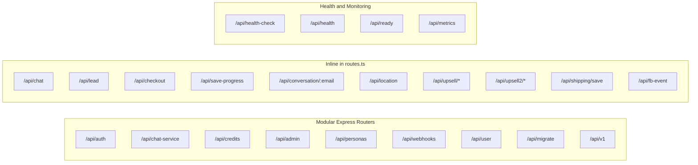

### Endpoint Summary

**Funnel (inline in `server/routes.ts`):**
| Method | Endpoint | Purpose |
|--------|----------|---------|
| POST | `/api/chat` | AI chat with action-based state machine |
| POST | `/api/lead` | Email/name capture, save to DB + AWeber |
| POST | `/api/checkout` | Create Stripe Checkout session ($35/$25) |
| POST | `/api/save-progress` | Persist conversation state |
| GET | `/api/conversation/:email` | Restore conversation cross-device |
| GET | `/api/location` | IP geolocation |
| GET | `/api/upsell/user-data` | Load user data for upsell page |
| POST | `/api/upsell/charge` | 1-click upsell charge (off_session) |
| POST | `/api/upsell/fallback-checkout` | Fallback Stripe Checkout for upsell |
| POST | `/api/upsell/confirm-fallback` | Server-side verification of fallback |
| POST | `/api/shipping/save` | Save upsell shipping address |
| GET/POST | `/api/upsell2/*` | Same pattern for upsell 2 |
| POST | `/api/fb-event` | Server-side Facebook Conversions API |

**Chat Service (modular routers):**
| Method | Endpoint | Purpose |
|--------|----------|---------|
| POST | `/api/auth/register` | Create account (+ fraud check) |
| POST | `/api/auth/login` | JWT login |
| GET | `/api/auth/me` | Current user info |
| POST | `/api/auth/verify-email` | Email verification |
| POST | `/api/auth/forgot-password` | Request password reset |
| POST | `/api/auth/reset-password` | Reset password with token |
| POST | `/api/chat-service/session/start` | Start chat session with persona |
| POST | `/api/chat-service/session/:id/message` | Send message (full pipeline) |
| POST | `/api/chat-service/session/:id/end` | End session, deduct credits |
| GET | `/api/chat-service/sessions` | Session history |
| GET | `/api/chat-service/sessions/:id/messages` | Message history |
| POST | `/api/credits/checkout` | Purchase credit package |
| POST | `/api/credits/webhook` | Stripe webhook for credits |
| GET | `/api/personas` | List active personas |

**Admin (all behind `requireAdmin` middleware + rate limiting):**
| Method | Endpoint | Purpose |
|--------|----------|---------|
| POST | `/api/admin/login` | Admin JWT login |
| GET | `/api/admin/me` | Current admin info |
| * | `/api/admin/personas/*` | CRUD personas |
| * | `/api/admin/prompts/*` | Manage prompts with A/B variants |
| * | `/api/admin/users/*` | View/manage users, grant credits |
| * | `/api/admin/analytics/*` | Platform metrics |
| * | `/api/admin/safety/*` | Safety violation dashboard |
| * | `/api/admin/intent-configs/*` | Persona intent/bucket config |
| * | `/api/admin/follow-ups/*` | Follow-up email management |
| * | `/api/admin/fraud/*` | Fraud detection data |
| * | `/api/admin/pricing/*` | Per-persona pricing |

---

## 7. Background Processes

Several background processes run alongside the HTTP server to manage session lifecycle and re-engagement:

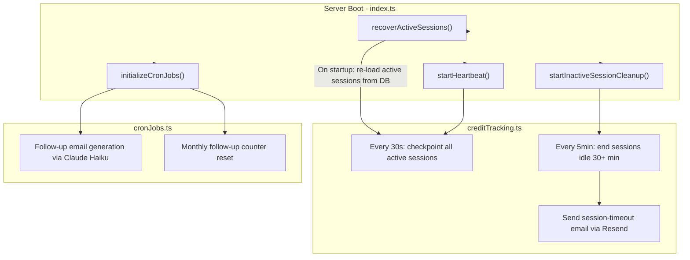

| Process | Frequency | Source | Purpose |
|---------|-----------|--------|---------|
| **Session recovery** | Once on boot | `creditTracking.ts` | Re-load active sessions after server restart |
| **Heartbeat** | Every 30 seconds | `creditTracking.ts` | Checkpoint active sessions (update elapsed time) |
| **Inactive cleanup** | Every 5 minutes | `creditTracking.ts` | End sessions idle for 30+ minutes, deduct credits |
| **Session timeout email** | On idle end | `sessionTimeoutEmail.ts` | Notify user their session timed out |
| **Follow-up emails** | Cron schedule | `cronJobs.ts` | Generate re-engagement emails for inactive users |
| **Monthly reset** | Monthly | `cronJobs.ts` | Reset follow-up email counters |

---

## 8. Payment Flows

### System 1 -- Funnel Payments

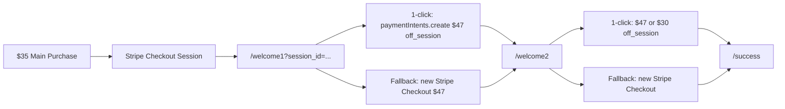

- **Main purchase:** Stripe Checkout ($35 or $25 downsell)
- **Upsell 1:** Protection Ritual + Lava Stone ($47). Tries 1-click off-session charge using saved payment method; falls back to full Stripe Checkout if card requires authentication.
- **Upsell 2:** Manifestation Bracelet ($47 full / $30 downsell). Same 1-click + fallback pattern.
- Both upsells collect shipping addresses, saved to DB and synced to Stripe metadata + AWeber.

### System 2 -- Credit Payments

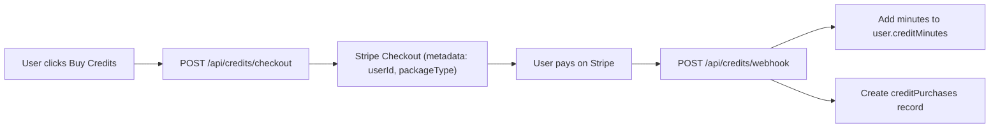

- Credit packages are configurable per-persona via `customPricing` JSON in the `personas` table
- Webhook uses raw body buffer for Stripe signature verification (`STRIPE_CREDITS_WEBHOOK_SECRET`)
- Free minutes (default 3) are granted on email verification

---

## 9. Admin Dashboard

The admin system at `/admin/*` provides full control over the platform:

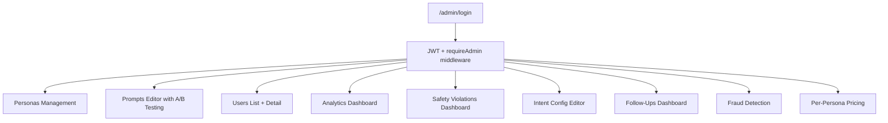

| Feature | Route | Admin Router File |
|---------|-------|-------------------|
| Persona CRUD | `/admin/personas` | `server/routes/admin/personas.ts` |
| Prompt management | `/admin/prompts` | `server/routes/admin/prompts.ts` |
| User management | `/admin/users` | `server/routes/admin/users.ts` |
| Analytics | `/admin/analytics` | `server/routes/admin/analytics.ts` |
| Safety review | `/admin/safety` | `server/routes/admin/safety.ts` |
| Intent configs | `/admin/intent-configs` | `server/routes/admin/intentConfigs.ts` |
| Follow-up emails | `/admin/follow-ups` | `server/routes/admin/followUps.ts` |
| Fraud signals | `/admin/fraud` | `server/routes/admin/fraud.ts` |
| Pricing | `/admin/pricing` | `server/routes/admin/pricing.ts` |

---

## 10. Frontend Architecture

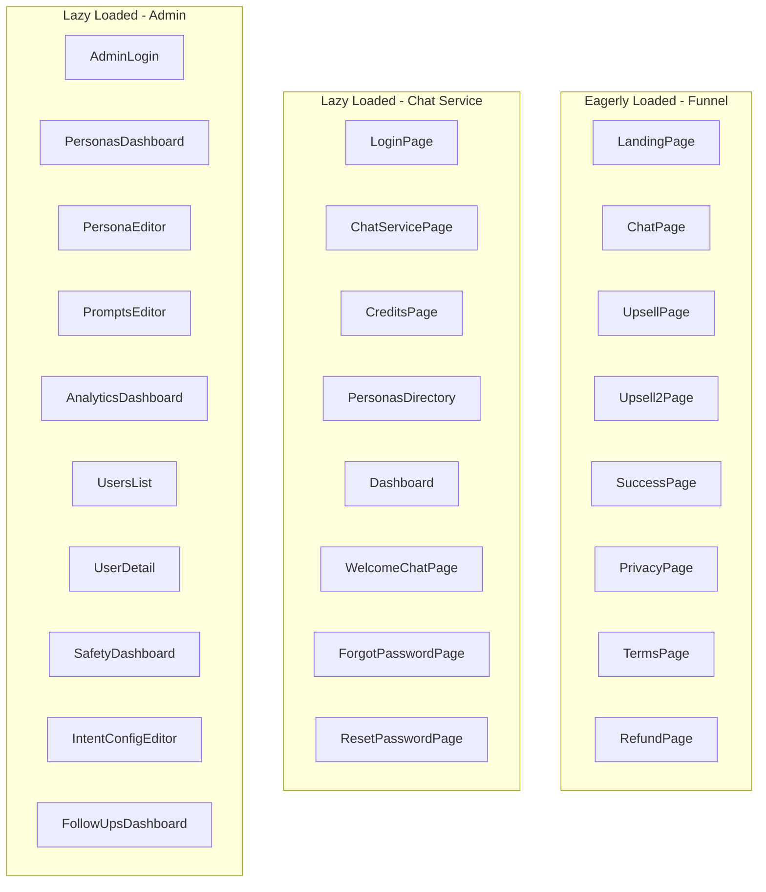

- **Routing:** Wouter (lightweight, ~1.5KB)
- **Data fetching:** TanStack Query with a shared `queryClient`
- **UI components:** Radix UI primitives + shadcn/ui patterns
- **Auth state:** `useAuth` hook (JWT in localStorage, `/api/auth/me` validation)
- **Admin state:** `useAdmin` hook (separate JWT flow)
- **Error boundary:** Sentry `ErrorBoundary` wrapping the entire app
- **Page tracking:** Facebook Pixel `trackPageView` on every route change
- **Code splitting:** Funnel pages are eagerly loaded (critical path); chat service and admin pages are lazy-loaded with `React.lazy()`

---

## 11. Key File Reference

| Purpose | File |
|---------|------|
| Server entry point | `server/index.ts` |
| All funnel routes (inline) | `server/routes.ts` |
| Chat engine (message pipeline) | `server/lib/chatEngine.ts` |
| Claude prompt functions (funnel) | `server/lib/claude.ts` |
| Memory manager (summarize + load) | `server/lib/memoryManager.ts` |
| Cross-persona memory transfer | `server/lib/memoryTransfer.ts` |
| Credit tracking (sessions) | `server/lib/creditTracking.ts` |
| Persona intent detection | `server/lib/personaIntent.ts` |
| Universal safety checks | `server/lib/universalSafety.ts` |
| Circuit breaker (Claude) | `server/lib/circuitBreaker.ts` |
| Auth (bcrypt, JWT, middleware) | `server/lib/auth.ts` |
| Auth routes (register, login, etc.) | `server/routes/auth.ts` |
| Chat service API routes | `server/routes/chatService.ts` |
| Credits routes + webhook | `server/routes/credits.ts` |
| Admin route index | `server/routes/admin/index.ts` |
| Fraud detection | `server/lib/fraudDetection.ts` |
| Rate limiter | `server/lib/rateLimiter.ts` |
| Health check + metrics | `server/lib/healthCheck.ts` |
| Structured logger (Winston) | `server/lib/logger.ts` |
| Model config (Claude models) | `server/lib/modelConfig.ts` |
| Cron jobs (follow-ups, resets) | `server/lib/cronJobs.ts` |
| Follow-up email generator | `server/lib/followUpEmailGenerator.ts` |
| Database connection (Drizzle) | `server/lib/db.ts` |
| Supabase client | `server/lib/supabase.ts` |
| Full schema (all tables) | `shared/schema.ts` |
| Shared types | `shared/types.ts` |
| Client routing | `client/src/App.tsx` |
| Auth hook | `client/src/hooks/useAuth.ts` |

---

## 12. Summary

The architecture cleanly separates two business models on one stack:

- **System 1** targets immediate conversion with a state-machine chat and one-time Stripe purchases plus two upsell flows with 1-click charging.
- **System 2** supports ongoing relationships with user accounts, multiple AI personas, persistent memory (per-persona and cross-persona), a credit-based billing system, and automated follow-up re-engagement.

Shared infrastructure (PostgreSQL, Claude, Stripe, Express on port 5000) keeps operational complexity low. Background jobs (heartbeat every 30s, idle cleanup every 5min, cron-based follow-ups) handle session lifecycle and re-engagement without blocking HTTP requests. Safety, intent detection, and circuit breakers ensure reliability and responsible AI usage.
