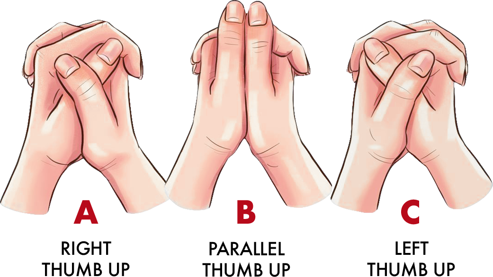
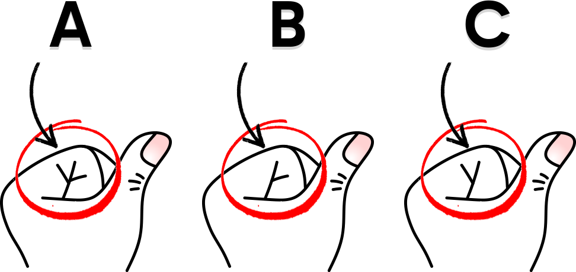
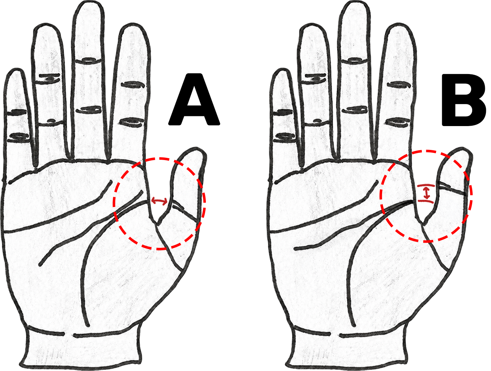

# Pattern: Diagnostic / Self-Identity Quiz → AI Chat → Offer (a portable conversion-funnel architecture)

> **The one thing that must be true:** this funnel **starts with a diagnostic or
> self-identity quiz** — a "which of these is *you*?" moment. The visitor recognizing
> something true about themselves is the mechanic the entire funnel is built on. If your
> entry point isn't a self-recognition quiz, this pattern doesn't apply; fix the entry
> point first.

> **If you are an AI assistant reading this in a new project:** this file describes a
> proven, stack-agnostic pattern for turning a paid-ad click into a sale. It is NOT
> a drop-in library — it's an architecture to *adapt*. Read the whole file, then map
> each concept onto this project's actual stack (its router, its API layer, its LLM
> provider, its payment provider). The **"Porting checklist"** and **"Questions to
> ask about the target project"** sections at the bottom tell you exactly what to
> produce. Do not copy the reference field names verbatim; copy the *shape*.
>
> **Companion images:** the example quiz creatives are in the sibling
> `image-quiz-to-chat-funnel.assets/` folder. Keep that folder next to this file when
> importing — the images (referenced with relative paths in §1) are the clearest signal
> that this is fundamentally a **diagnostic quiz**.

---

## 1. What this pattern is (in one paragraph)

It **begins with a diagnostic or self-identity quiz.** A visitor clicks an ad that asks
them to identify themselves against an **image with 2–3 tappable options** ("Which of
these looks most like *yours* — A, B, or C?"). They land on a lightweight **bridge page**
that mirrors the ad, they tap the option that's *them*, and a short personalized
"reading"/result appears. That result **hands off into an AI chat** that continues the
conversation in a persona's voice, builds rapport and desire, and steers toward a **paid
offer** (checkout). The entire thing is **driven by config + URL parameters**, not by
per-campaign code: one bridge component and one chat engine serve unlimited quiz
variants. Adding a new quiz concept is a **content/config edit**, not a new page.

It works for any funnel where (a) a cheap **self-recognition** interaction earns
attention, (b) an AI can produce a personalized, emotionally resonant response keyed to
what they identified, and (c) there's something to sell at the end. Palmistry/astrology
readings are the reference case, but the same skeleton fits any self-recognition entry
point: skincare *diagnostic* quiz → product, "what's your *personality/attachment/skin*
type" → coaching, symptom-checker → consult, style/identity quiz → curated cart, etc.

### Diagnostic vs. self-identity — two flavors of the same mechanic

Both start the funnel; pick whichever the domain supports, or blend them. What they share
is the load-bearing move: **the visitor recognizes something true about themselves and
commits to it with a tap.**

| | **Diagnostic quiz** | **Self-identity quiz** |
|---|---|---|
| The ask | "Observe a *physical/factual* trait — which is yours?" | "Which of these *describes you* / your type?" |
| Basis | An observable fact about the person | Self-perception, values, behavior, preference |
| Examples | which thumb/finger/palm marking is yours; skin-type photo match; which symptom pattern | "what's your attachment style / love language / money archetype / skin concern" |
| Why it converts | Feels *objective* — "the reading is based on real data about me" | Feels *seen* — "this is literally me" |
| Result copy leans on | Naming the observed trait back precisely (recognition) | Affirming the chosen identity and its emotional truth |

**Why the distinction matters when porting:** the *quiz* changes, but everything after the
tap is identical — the option they pick becomes the seed the read and the chat respond
to. Choose the flavor with the strongest, most confident self-recognition in your domain;
that confidence is what makes the personalized read land as "how did it know?"

### The quiz creative — what the visitor actually taps (this is a diagnostic / self-identity quiz)

At its core this is a **diagnostic / self-identity quiz**: the ad shows one image split
into 2–3 labeled options (A/B/C), each highlighting a small self-observable difference,
and asks the visitor to pick the one that *is them*. That single tap is the input the
entire personalized funnel is built on. Everything downstream — the "read", the chat, the
offer — is a response to *which option they chose about themselves*. These are the real
ad creatives from the reference implementation (a **diagnostic** flavor — a physical tell
you can observe on your own hand):

**3-option, realistic, with plain-language labels** (interlace your fingers — which thumb lands on top?):



**3-option, line-art, a subtle "tell"** (the crease pattern at the base of the thumb — trident vs. Y-shapes), highlighted with a circle + arrow so the visitor can self-identify:



**2-option** (does the life line meet or part from the thumb line? — the arrow marks the exact spot to look):



**What every good quiz creative in this pattern shares** (design rules to reuse):
- **A binary/ternary, self-observable difference.** The visitor must be able to look at
  themselves and confidently pick — no expertise required.
- **A visual highlight** (circle, arrow, dimension marker) pointing at the exact spot, so
  the choice is unambiguous.
- **Equal, clearly-labeled panels** (A/B/C), one per option, so the tap targets are obvious.
- **The same "tell" can be drawn multiple ways** (line-art vs. photo, full-hand vs.
  zoom) — those are *art variants* of one diagnostic, tested against each other with
  identical downstream copy.

The tapped letter (a/b/c) is the seed value that flows through the whole funnel
(`?option=a`), so the art and the config must agree on what A, B, and C mean.

---

## 2. The mental model: three independent axes

The key idea that makes this scale is separating three things that ad-tech usually
tangles together. Every live URL is one point in a 3-axis space:

| Axis | What it is | Reference name | Example values |
|------|-----------|----------------|----------------|
| **Variant** | *Which* image/mechanism the quiz uses (the visual "tell") | `sign` | thumb-crease, finger-lock, life-line-arc |
| **Angle** | *Which emotional question* the ad asked (independent of the image) | `hook` | "when is my soulmate coming?", "will I love again?" |
| **Delivery** | *How* the result is delivered after the tap | `version` | A = static card, B = scripted chat, C = interactive LLM |

Because they're orthogonal, one image variant × three angles × three deliveries = 9
live experiences from **one config entry + one component**. The visitor's tapped option
(A/B/C) is a fourth, per-visit value carried in the URL.

**Why this matters for porting:** find the equivalent axes in the target funnel. There is
almost always a "which visual/mechanism" axis and a "which emotional angle" axis, and
they should be independent config, not branched code.

---

## 3. Architecture: one template, a registry, and URL params

```
  Ad (image + question)                     ┌─────────────────────────────┐
        │  click                            │   CONTENT REGISTRY          │
        ▼                                   │   (single source of truth)  │
  /bridge?variant=X&angle=Y&version=Z ─────▶│   variant → {               │
        │                                   │     ui copy, option art,    │
   [Bridge component]  reads registry ◀─────┤     per-option label +      │
        │  visitor taps an option (A/B/C)   │     "read" copy per angle   │
        ▼                                   │   }                         │
  Personalized result (static or LLM)       └─────────────────────────────┘
        │  hand off: forward variant/angle/option/version in the URL
        ▼
  /chat?variant=X&angle=Y&option=A ────────▶ [Chat engine] ── LLM API ──▶ persona reply
        │  rapport → desire → objection handling
        ▼
  Offer / checkout  ──▶ payment provider  ──▶ success + upsells
```

**Three moving parts:**

1. **The bridge (lander) component.** *One* component renders every variant. It reads
   `variant`/`angle`/`version`/tapped-option from the URL and pulls everything else —
   headline, instruction copy, the option image strip, the result text — from the
   registry. **Adding a variant requires no change to this component.** (In the
   reference impl its header comment literally says "adding a new concept needs no
   change here.")

2. **The content registry.** A single data structure keyed by variant id. Each entry
   holds the UI copy, the option art reference, per-option labels, and the personalized
   "read" copy indexed by `[angle][option]`. This is the source of truth the bridge and
   the chat both read from.

3. **The chat engine.** After the quiz, the tapped context is forwarded (via URL params
   or session) into a chat page. The engine builds an LLM prompt seeded with the
   variant/angle/option context and streams a persona reply, then runs the conversion
   conversation.

---

## 4. The content model (what one variant needs)

Generalized shape of a single registry entry (the reference impl calls this a
`SignConfig`). Rename fields to fit the target domain:

```ts
interface QuizVariant {
  id: string                     // url-safe, propagates to ?variant= and asset filenames

  // — UI copy shown on the bridge —
  eyebrow: string                // small label above the headline
  instruction: string            // "Tap the one that looks most like yours."
  resultNoun: string             // "reading your {resultNoun}…" beat
  continueCta: string            // button text into the chat

  // — Tap-target art —
  optionImage: { url: string; width: number; height: number } // one strip, N equal panels
  options: ('a' | 'b' | 'c')[]   // 2- or 3-option
  layoutColumns?: 1 | 2 | 3      // stack vs side-by-side (portrait art → stack)

  // — Per-option vocabulary —
  optionMark: Record<Option, string>     // the concrete thing "seen" (names sentence 1)
  optionLabel: Record<Option, string>    // the archetype/result label ("the free heart")

  // — The personalized response, indexed by angle then option —
  // Partial on the angle axis: an angle may target only some variants; missing → fallback.
  reads: Partial<Record<Angle, Record<Option, string[]>>>
}
```

Plus two funnel-level maps keyed by **angle** (shared across all variants, because the
emotional question is independent of the image):

- `headlines[angle]` — the verbatim ad question, for message-scent match.
- `angleFraming[angle]` — a short instruction the LLM uses to shape the "yes" it affirms.

---

## 5. The "read": a repeatable copy structure

The personalized result is not freeform. It follows a fixed **4-beat build** that makes
the reader feel seen while withholding the specifics the paid product will reveal. This
structure is the conversion engine — copy it exactly:

1. **Name the mark.** State the concrete thing "seen" in the option they picked, plus its
   archetype label. *"The arc of your life line meets your thumb line — the entwined heart."*
2. **Mirror their question back.** Reflect the emotional angle, acknowledging the wound
   first if it hurts. *"You're wondering if the one meant for you has already appeared."*
3. **The "yes" beat.** Affirm the hopeful answer with certainty, justified *through* the
   archetype — but **withhold the specifics** (who, when, the deeper why). *"A heart this
   entwined only settles when it finds its match — and it already has; yes, closer than
   you think."*
4. **Open loop.** Hand into the deeper reading. *"Let me look closer…"*

Beat 1 is the `optionMark` line and repeats as the opening sentence of every read for
that option, so its clarity is worth an extra pass. Beats 2–4 vary by angle.

**General principle:** every "read" = *recognition* (specific, feels accurate) →
*empathy* (their stated pain) → *affirmation with a withheld specific* (creates the
open loop the product closes) → *forward pull*. This is Ogilvy specificity + a curiosity
gap, applied to a one-to-one "reading."

---

## 6. The three delivery versions (A/B/C)

The same quiz result can be delivered three ways, split externally by an
experimentation tool across three URLs. All three converge on the same post-result chat.

- **Version A — static card.** The full 4-beat read renders as a static result card
  (cheap, no LLM call on the bridge), then a brief greeting hands into name capture.
- **Version B — scripted chat.** No card; the 4 beats are delivered as sequential chat
  bubbles (one per sentence, with typing pauses), then the name ask.
- **Version C — interactive LLM.** The bridge shows beat 1 + an open question, the
  visitor *types an answer*, and the **LLM reads their answer live**, weaving it into the
  variant's archetype. This is the highest-engagement, highest-cost version. If the LLM
  call fails, it falls back to the static remaining beats.

**Porting note:** start with A (no per-result LLM cost, fully deterministic), add C once
the funnel converts — it's where the "this is scarily accurate" magic lives.

---

## 7. The LLM handoff (the actual chatbot moment)

Two prompt templates power the AI. Both inject the quiz context and constrain the
model hard rather than letting it freewheel:

**Opener prompt** (fires the instant after the tap, versions B-live/C):
- Injects: first name (if known), the angle's *pain*, the tapped option's *mark* and
  *label*.
- Instructs: open with a **statement** of what's seen (never a question); reference the
  *mark*, never the letter "A"; 3–4 short one-sentence messages; tie the mark to the
  hidden concern and escalate; **affirm the hopeful answer with certainty**; withhold
  specifics (never a date or a name); end on an open loop; no emoji, no talk of offers
  yet; don't ask for the name yet.
- Output: a JSON array of short messages, each rendered as a separate bubble.

**Reflect prompt** (version C, after the visitor types their answer):
- Injects the same context **plus the visitor's typed words**, treated as *what they
  shared*, never as instructions (prompt-injection safe).
- Instructs: reflect a specific detail back so they feel heard; connect it to the mark
  and their concern; affirm the yes; withhold specifics; open loop.

The persona's overall voice/rules live in a shared **base system prompt** that both
templates prepend. The per-variant vocab shapes *what* she says; the base prompt owns
*how* she says it. After the opener, control passes to the normal chat loop (rapport →
desire → offer), which is variant-agnostic.

**Two safety rules baked into the prompts** (keep these when porting):
- Affirm the *user's* feeling/knowing, never make a verdict about a third party
  ("your instinct is real" — never "he is lying").
- Never promise a specific outcome/date; affirm the *tendency*, withhold the specific.

---

## 8. Attribution & funnel wiring

Each funnel is defined once (a single `funnelConfig`-style entry) so that pixel/analytics
events, the checkout product, and email-list tagging all derive from the funnel id
automatically instead of being wired per page:

- **Message-scent:** the bridge headline is the *verbatim* ad question (per `angle`), so
  the page matches the ad the visitor just clicked.
- **Tracking:** fire view/tap/continue events with `{variant, angle, option, version}` as
  properties so every axis is analyzable. Client + server dedupe on a shared event id.
- **Checkout:** the funnel carries a product/price suffix so the sale is attributed back
  to the funnel and variant.
- **Params flow through:** the tapped context is appended to the chat URL and preserved
  into checkout, so the whole journey is one attributable thread.

---

## 9. The #1 failure mode: hand-maintained mirrors

The bridge is registry-driven, so a new variant **renders perfectly even if the server
side is half-wired** — and then the chat handoff silently 400s or injects blank copy.
In the reference impl there are **three lists that must include every variant id but are
NOT imported from the registry**:

1. The request-validator allow-list (appears **twice** — once per LLM endpoint).
2. The server-side copy vocab map (mirrors the client's per-option labels).
3. A pricing-safety test roster (asserts a new variant never gets a scoped price test).

**Generalized lesson:** whenever you add a config-driven variant system, audit for
*every* place a variant id is enumerated by hand. Each one is a silent-failure trap.
Prefer deriving these from the single registry; if you can't, add a test that fails when
they drift, and document the list. When porting, make a one-line "add a variant touches
these N places" checklist and keep it in sync.

---

## 10. Adding a new variant (the workflow, generalized)

1. **Get the art.** One image strip of N equal panels (one per option), or N images.
   Portrait panels → stack vertically; landscape → side by side.
2. **Write the copy** (the creative core — do not autogenerate blindly): the per-option
   `mark` + `label`, and the `reads` (4-beat build × each angle × each option). Draft,
   generate 2–3 alternatives, get human sign-off.
3. **Add one registry entry** keyed by the new variant id.
4. **Sync every hand-maintained mirror** (§9) — validators, server vocab, tests.
5. **Verify:** typecheck; grep each mirror for the new id and confirm the expected count;
   run the funnel at mobile width through all delivery versions; confirm the chat handoff
   does **not** error.
6. **Ship** — no route/component change; the variant goes live via `?variant=<id>` on the
   next deploy. Hand the ad URLs (`?variant=&angle=&version=`) to the media buyer.

Art variants of the *same* tell (e.g. line-art vs photo of the same mechanism) are
separate variant ids that **reuse the same `reads`/vocab** — only the image differs. This
lets an experimentation tool test the *visual* with identical copy.

---

## 11. Porting checklist (what to produce in the target project)

- [ ] **Confirm the entry point is a diagnostic or self-identity quiz** (a
      self-recognition "which of these is you?" moment). This is the prerequisite — if it's
      missing, design it first; the rest of the pattern depends on it.
- [ ] Identify the funnel's two content axes (the "variant/mechanism" axis and the
      "emotional angle" axis) and confirm they're independent.
- [ ] Build **one** bridge/lander component driven by URL params + a registry — not one
      page per campaign.
- [ ] Define the registry entry shape (§4) in the target's language/types.
- [ ] Implement the 4-beat read structure (§5) for the target's domain/voice.
- [ ] Pick delivery versions to support (start with static A; add interactive-LLM later).
- [ ] Write the opener (and reflect) prompt templates (§7) against the target's LLM
      provider, with the context-injection + hard-constraint + safety rules intact.
- [ ] Wire attribution once per funnel (§8): scent-matched headline, event props with all
      axes, checkout attribution, params flowing through to purchase.
- [ ] Enumerate every place a variant id is hand-listed (§9) and either derive it from the
      registry or add a drift-detecting test.
- [ ] Write the target's own "add a variant" checklist (§10) so the next one is mechanical.

---

## 12. Questions to ask about the target project before adapting

1. **Is there a diagnostic or self-identity quiz at the entry point** — a "which of these
   is you?" self-recognition moment — or would you add one? This is the prerequisite for
   the whole pattern. What self-observable trait or self-perceived identity does it quiz,
   and is the visitor able to answer it confidently about themselves? (Low-confidence
   self-recognition → the personalized read won't land.)
2. **What are the two axes?** What's the visual/mechanism dimension, and what's the
   emotional-angle dimension? If there's only one, the registry is simpler.
3. **What's the product at the end,** and what's the "withheld specific" the read teases
   that the product delivers? (No withheld specific → no open loop → weak conversion.)
4. **Which LLM provider + streaming setup** does the project already use? Match it; don't
   introduce a second.
5. **What's the router and how are URL params read?** The whole pattern hinges on
   param-driven rendering.
6. **What payment/attribution stack** is in place? Wire the funnel id through it.
7. **What's the persona/voice?** The base system prompt owns tone; the per-variant vocab
   only owns content.
8. **Compliance constraints?** Bake the "affirm the user, never verdict a third party;
   tendency-not-promise" rules (or the domain's equivalent) into the prompts, not into
   review.

---

## Appendix: reference implementation (for context only — do not copy verbatim)

The reference funnel is a spiritual-reading platform:
- Stack: React SPA + lightweight client router, Express API, an Anthropic-style chat
  completion API, Stripe checkout, a pixel + server-side conversions API, Postgres.
- Axis names: `sign` (variant), `hook` (angle), `version` (A/B/C delivery), and the tapped
  `option`/`thumb` (a/b/c).
- Registry: a single `SignConfig` map; the bridge is one `PalmBridge` component; the LLM
  prompts are `buildOpenerPrompt` / `buildReflectPrompt` over a shared base persona prompt.
- The three hand-maintained mirrors are two request-validator arrays, a server vocab map,
  and a pricing-scope test — the classic "renders fine but the chat 400s" trap.
- There is an internal skill (`fb-palm-add-sign`) that automates the §10 workflow,
  including calling a copywriting skill to draft read alternatives.

The domain is incidental. What ports is the skeleton: **image quiz → registry-driven
bridge → param handoff → constrained-LLM persona chat → attributed offer.**
```
