# The Live Thread — A New Arrival Mechanic for Email-to-Lander Traffic

**Date:** 2026-08-01
**Status:** Design approved by operator, pending implementation plan

## Background

A 10-agent audit (2026-08-01) found that Aiden, Evelyn, and Luna's daily emails each sell a specific, half-finished story (Aiden's "444"/Pinnacle Period, Evelyn's "the sentence you keep repeating," Luna's daily transit) and earn the click — but the lander the reader arrives at throws that story away: Aiden's lander doesn't parse the campaign param at all, Evelyn's captures it but never renders anything different because of it, and Luna shares a fully generic template with three other personas. Operator's read, after a first pass proposing incremental fixes to the existing 3-question quiz: **the quiz itself is just one possible concept, and it's the wrong one** — the goal is new structural concepts for the arrival mechanic, not a punch-list of timer/copy tweaks to the current one.

This spec covers the arrival mechanic only — what a reader sees between clicking an email and hitting the signup ask. The *requirement* that new accounts verify their email is not being removed or restructured (see Scope) — but this design does add real new mechanics around that boundary (account detection, a passwordless magic-link path for existing accounts, campaign-aware content resolution, and a differentiated grant), which are in scope and specified below even though the verification requirement itself is not up for debate.

**Revised after a Codex technical review (2026-08-01, see `docs/superpowers/specs/2026-08-01-live-thread-arrival-design-codex-review.md` for the full findings)** — this pass resolves the inconsistencies and gaps that review surfaced: a missing shared email-entry step in the wireframes, drifting redirect-destination naming, an unresolved handoff-token design, an unhandled pending/unverified-account case, and several others. Genuine product decisions raised by that review (rollout order, legacy-link handling, unverified-account eligibility, account-enumeration exposure) were decided by the operator and are captured inline below.

## Goal

Replace the quiz mechanic on the Aiden, Evelyn, and Luna landers with a single shared concept — **the Live Thread** — that:
1. Continues the specific email/campaign hook that earned the click, instead of resetting to a generic intro.
2. Looks and behaves like the real chat product from the first second, so there's no jarring switch between "marketing page" and "product."
3. Never loses what the reader typed, even across the signup/verification step.
4. Keeps *deliberate* friction at account creation (per operator: free credits shouldn't be handed to someone who won't complete even one more step) while removing *accidental* friction (artificial timers, dead air, generic "sign up" framing).

## Scope

**In scope:**
- The arrival experience on `/aiden`, `/evelyn`, `/luna` — replacing the quiz mechanics (`AidenQuizPage.tsx`'s quiz flow, `EvelynQuizMechanic.tsx`, `PersonaLanderPage.tsx`'s bucket-opener flow for Luna specifically).
- Campaign-aware content: replacing Evelyn's existing `emailReadingBriefs.ts` / `arrivalReading.ts` pattern with the single short-link-code registry described in Architecture, and extending that same pipeline integration to Aiden and Luna, so all three personas' content reaches the *lander*, not just the chat engine.
- An owned short-link redirector for carrying campaign context from email to lander reliably, resolving directly to the lander's content in one lookup (replacing the `?campaign=` query param for all three personas — see Architecture).
- The account-detection branch at the point the reader submits their email (existing account → magic link; no account → activation-incentive signup), and the in-thread confirmation messaging for both branches.
- An auth check at arrival, before any of the above: a reader already authenticated in that browser (with a *verified* account — see Decisions) skips the lander entirely. This check gates all four arrival surfaces — the `/e/:code` redirector AND direct visits to `/aiden`, `/evelyn`, `/luna` — not just the redirector.
- A persona-by-persona rollout: Evelyn ships first (her infrastructure is closest to ready), Luna and Aiden follow once their pipeline integration exists. A persona without pipeline integration yet simply always falls to the generic fallback opener — not a blocker for shipping the others.
- Preserving the reader's typed reply across the signup/verification gap and seeding the real first chat message with it.
- Trivial friction removal that falls directly out of this redesign: no artificial per-question auto-advance delay, no forced "transition" wait screen, immediate resend availability (no 30s/60s hidden-button timer).

**Out of scope (explicitly not part of this design):**
- Marcus, Nova, Maren's shared `PersonaLanderPage.tsx` — no active email program drives traffic to them today per the audit; de-genericizing that shared component is a separate, later effort.
- Structurally removing or restructuring email verification itself (the "collapse the double-verification hop" bigger bet from the prior audit). The verification *requirement* is unchanged for new accounts, and an authenticated-but-unverified account does NOT get to skip it via the auth-check tier (see Decisions) — it's still routed through the normal verify-or-resume path. What IS in scope: the account-detection routing, the passwordless magic-link path for already-verified accounts, and preserving context across whichever path fires.
- Migrating already-sent emails. Emails already sitting in inboxes use the old `?campaign=` query param, not the new `/e/:code` link — those links simply degrade to the generic fallback opener once the old lookup is retired. No compatibility window is being built.
- Live/AI-generated payoff content for anonymous, pre-signup visitors. All arrival-mechanic content is pre-written per campaign, produced by each persona's email-build pipeline (see Architecture), so there is no LLM cost for a visitor who never converts.
- Any pay-to-enter or entry-pricing experiment. Per the prior audit's recommendation, that's held until continuity/friction fixes are shipped and measured.
- The exact free-minutes number. This spec uses **10 minutes** as the working number for the activation-incentive path; the operator may revise before implementation.

## The concept: Live Thread

Instead of a quiz, a bio card, or a form, the lander renders as a chat transcript already in progress, visually identical to the real chat product. The persona's first bubble continues the specific hook from the email/campaign the reader clicked. The reader's reply goes in as a normal chat message, not a form field. Signup happens as a brief inline interruption inside that same thread, not a page swap — and once past it, the reader lands in the real chat with their reply already there and the persona responding to it directly.

Two other concepts were considered and set aside for now:
- **The Continuation Page** — a static page with the campaign's open loop as a headline and a single text box. Cheaper to build (reuses the brief data with a plain page instead of chat-styled UI) but doesn't remove the jarring page-to-product switch. Worth revisiting as a fast fallback if the Live Thread's build cost proves too high for a first slice.
- **Instant Mini-Reveal Card** — a one-tap, no-typing reveal (numerology flourish / card flip / chart wheel) delivering a free templated "verdict" before any signup ask, Keen-competitor style. Removes typing friction entirely but loses the "half-typed disclosure, skin in the game" effect the winning email format depends on.

## Wireframes

All frames below use Aiden's "444" send (`aiden-blueprint-04-tell` campaign, reached via a short-link code like `/e/f8k2m1` rather than a query param — see Architecture) as the concrete example. Same structure applies to Evelyn and Luna, reskinned with persona voice/visuals.

Frames 1 through 3 below cover the anonymous path (tiers 2 and 3 — not yet logged in). Tier 1 — already authenticated and verified — never sees any of them; it's a separate, shorter branch shown first.

### Frame 0 — Already logged in (tier 1, one behavior regardless of history)

```
┌─────────────────────────────────────┐
│  ← Aiden Powers           ● online   │
├─────────────────────────────────────┤
│                                       │
│  ┌───────────────────────────────┐   │
│  │ 🔮 Aiden                       │   │
│  │                                │   │
│  │ You're back — good. That 444   │   │
│  │ from this morning's email is   │   │
│  │ still sitting with me.         │   │
│  │                                │   │
│  │ Tell me — what number's been   │   │
│  │ calling you? I'll tell you     │   │
│  │ what it's actually saying.     │   │
│  └───────────────────────────────┘   │
│                          10:41 AM    │
│                                       │
│    (no lander, no quiz, no wait —    │
│     one click from the email landed  │
│     directly here, in the real chat) │
│                                       │
├─────────────────────────────────────┤
│  ┌───────────────────────────────┐   │
│  │ Type your reply...           │▶│   │
│  └───────────────────────────────┘   │
└─────────────────────────────────────┘
```

This is the entire tier-1 experience, and it's the SAME for a reader who's never talked to Aiden before and one who's talked to him fifty times — the app only ever has one active conversation per user at all (starting any chat ends whatever was active, always, even across personas; there's no "reopen an idle thread" state to branch on). So every tier-1 arrival goes through the exact same mechanism: a fresh session starts, and `generateGreeting` fires with the arrival-reading context injected — the same function that already produces a persona's very first message today, just now campaign-aware. If there IS prior history with this persona, the greeting is also informed by it, reusing the existing pattern `chatEngine.ts` already applies when starting a new session with a returning persona (e.g. restoring birth-chart data) — extended to also acknowledge the campaign hook, not a separate "quiet" behavior. Unlike Frame 1's `continueSeed`, this is generated live, not a static pre-written string, since there's no pre-auth cost constraint once someone is already an authenticated user.

### Frame 1 — Arrival (0 seconds after click, before any signup ask)

```
┌─────────────────────────────────────┐
│  ← Aiden Powers           🔒 secure  │
├─────────────────────────────────────┤
│                                       │
│  ┌───────────────────────────────┐   │
│  │ 🔮 Aiden                       │   │
│  │                                │   │
│  │ You picked up. Good.           │   │
│  │ I've been holding that 444     │   │
│  │ since your email came in.      │   │
│  │                                │   │
│  │ Tell me — what number's been   │   │
│  │ calling you? I'll tell you     │   │
│  │ what it's actually saying.     │   │
│  └───────────────────────────────┘   │
│                          10:41 AM    │
│                                       │
│         (nothing else on screen —    │
│          no quiz, no bio card,       │
│          no star rating, no wait)    │
│                                       │
├─────────────────────────────────────┤
│  ┌───────────────────────────────┐   │
│  │ Type your reply...           │▶│   │  ← real chat compose bar, not a form
│  └───────────────────────────────┘   │
└─────────────────────────────────────┘
```

The persona's opening bubble is the `continueSeed` resolved directly from the short-link code (see Architecture) — produced as a byproduct of that day's email-build pipeline, not written separately. If the code is missing, unresolvable, or not yet paired with content (e.g. direct traffic, a forwarded/typo'd link, a test send), fall back to a generic-but-still-in-character opener — never to the old quiz.

### Frame 1.5 — Reader replies, hits send (shared step, both branches read the same email)

```
┌─────────────────────────────────────┐
│  ← Aiden Powers           🔒 secure  │
├─────────────────────────────────────┤
│  ┌───────────────────────────────┐   │
│  │ 🔮 Aiden: Tell me — what       │   │
│  │ number's been calling you? ... │   │
│  └───────────────────────────────┘   │
│                    ┌───────────────┐ │
│                    │444. Every day.│ │  ← their reply, rendered as a real
│                    └───────────────┘ │     sent chat bubble, not form input
├─────────────────────────────────────┤
│  Save this so Aiden can answer it:   │
│                                       │
│  [ your@email.com              ]     │
│  [ Continue →                  ]     │
└─────────────────────────────────────┘
```

This single email field is the ONE entry point both Frame 2 and Frame 2b read from — the reply is always saved (blocking, before this field becomes interactive) so a reply can never be lost even if account-detection fails or the reader abandons here. Whatever they type is checked server-side and routes to exactly one of the two frames below; the reader never sees an intermediate "checking..." state, the check is fast enough to resolve inline.

### Frame 2 — Existing (verified) account detected

```
┌─────────────────────────────────────┐
│  ← Aiden Powers           🔒 secure  │
├─────────────────────────────────────┤
│  ┌───────────────────────────────┐   │
│  │ 🔮 Aiden: Tell me — what       │   │
│  │ number's been calling you? ... │   │
│  └───────────────────────────────┘   │
│                    ┌───────────────┐ │
│                    │444. Every day.│ │
│                    └───────────────┘ │
│  ┌───────────────────────────────┐   │
│  │ 🔮 Aiden                       │   │
│  │ I know you — good. Check your  │   │
│  │ email for a one-tap link back  │   │
│  │ to right here.                 │   │
│  └───────────────────────────────┘   │
├─────────────────────────────────────┤
│  ✉️  Sent to you@example.com          │
│      Resend available now            │
└─────────────────────────────────────┘
```

### Frame 2b — No account found (activation-incentive framing)

```
┌─────────────────────────────────────┐
│  ← Aiden Powers           🔒 secure  │
├─────────────────────────────────────┤
│  ┌───────────────────────────────┐   │
│  │ 🔮 Aiden: Tell me — what       │   │
│  │ number's been calling you? ... │   │
│  └───────────────────────────────┘   │
│                    ┌───────────────┐ │
│                    │444. Every day.│ │
│                    └───────────────┘ │
├─────────────────────────────────────┤
│  Activate your account to unlock     │
│  this — you'll get 10 free minutes   │
│  with Aiden to keep going.            │
│                                       │
│  We'll email you a one-click link.   │
│  No password needed.                 │
└─────────────────────────────────────┘
```

A third, less visible outcome from the same email field: if it matches an existing account that has **never verified**, treat that as neither "match" nor "no match" — resend/resume that account's original verification (with the reply still preserved against this lander session), not a fresh account and not Frame 2's magic-link copy.

### Frame 2c — Right after they submit their email (still inside the thread)

```
┌─────────────────────────────────────┐
│  ← Aiden Powers           🔒 secure  │
├─────────────────────────────────────┤
│  ┌───────────────────────────────┐   │
│  │ 🔮 Aiden: Tell me — what       │   │
│  │ number's been calling you? ... │   │
│  └───────────────────────────────┘   │
│                    ┌───────────────┐ │
│                    │444. Every day.│ │
│                    └───────────────┘ │
│  ┌───────────────────────────────┐   │
│  │ 🔮 Aiden                       │   │
│  │ Good — I've got it saved.      │   │
│  │ Check your email: one tap and  │   │
│  │ your 10 free minutes go live,  │   │
│  │ and I'll tell you what 444's   │   │
│  │ really saying.                 │   │
│  └───────────────────────────────┘   │
│                          10:42 AM    │
├─────────────────────────────────────┤
│  ✉️  Sent to you@example.com          │
│      Resend available now            │
└─────────────────────────────────────┘
```

The reward/confirmation is a message from the persona, in the thread, not a system banner — it stays part of the scrollable conversation history the reader can revisit while checking their inbox, rather than copy that disappears once submitted.

### Frame 3 — Post-auth (magic link or verification click), same thread continues

```
┌─────────────────────────────────────┐
│  ← Aiden Powers           ● online   │
├─────────────────────────────────────┤
│  ┌───────────────────────────────┐   │
│  │ 🔮 Aiden: Tell me — what       │   │
│  │ number's been calling you? ... │   │
│  └───────────────────────────────┘   │
│                    ┌───────────────┐ │
│                    │444. Every day.│ │
│                    └───────────────┘ │
│  ┌───────────────────────────────┐   │
│  │ 🔮 Aiden                       │   │
│  │ Every day — that's not         │   │
│  │ coincidence. That's a Pinnacle │   │
│  │ Period doing exactly what it   │   │
│  │ does right before it turns...  │   │
│  └───────────────────────────────┘   │
├─────────────────────────────────────┤
│  ┌───────────────────────────────┐   │
│  │ Type your reply...           │▶│   │
│  └───────────────────────────────┘   │
└─────────────────────────────────────┘
```

Sequencing, precisely: at the moment authentication completes, the persona's opener bubble and the reader's reply are both inserted as real `chat_messages` rows (in that order) — the confirmation bubbles from Frame 2/2c are lander-only UI and do not carry over as chat history. Because a real user message already exists at that point, the response is generated via the normal reply path (`buildMessageContext` in `chatEngine.ts`, reading `arrivalReading.ts` for extra context), NOT `generateGreeting` (which only fires on a truly empty history) — this avoids a race between a cold greeting and the reply-aware response.

## Decisions from design discussion

- **Shared framework, reskinned per persona** — one Live Thread component/pattern, not three bespoke builds. Persona voice/visuals come from the same kind of per-persona config that already differentiates system prompts today (`personaLanderConfig.ts`).
- **Campaign-aware, not just persona-aware** — the opening bubble reacts to the specific email/campaign, not just which persona sent it. Requires extending pipeline integration to Aiden and Luna (today only Evelyn has any per-campaign continuity at all, and it doesn't yet reach her lander either).
- **Pre-written payoff content, zero live-AI cost pre-signup** — every persona bubble a visitor can see before authenticating is resolved from content produced ahead of time by the email-build pipeline, usually reusing a line already written for the email itself rather than net-new authoring (see "Lander content is a byproduct" below).
- **Existing VERIFIED account → magic link, not re-registration.** Detected by email lookup at submit time. Reuses the magic-link mechanism that already works cleanly for Path B (registered-user re-engagement) elsewhere in the app.
- **Existing UNVERIFIED account → resume/resend verification, not a fresh account and not the magic-link copy.** A third outcome alongside "verified match" and "no match" — treating an unverified match as "no match" would attempt to create a conflicting second account. The reply stays preserved against the lander session either way.
- **No account → intentional friction stays, reframed as reward-claim.** Verification is not removed. The ask is framed as "activate & claim N free minutes" rather than "sign up," on the reasoning that someone unwilling to complete one more step to claim a named reward was never a real prospect. Free-minute grant is provisionally **higher (10 min, exact number TBD)** for readers who engaged via a real typed disclosure through this flow, versus whatever the baseline grant is for a cold signup elsewhere (e.g. directly via `/login`). Eligibility for this higher grant is server-derived (a non-empty reply must exist on the lander session at account-creation time) — never a client- or link-carried flag, since that would be trivially tamperable.
- **Authenticated-but-unverified sessions do NOT get the tier-1 skip.** The auth check that skips the lander requires a *verified* account — an authenticated session on an unverified account is routed through the normal verify/resume path instead, so verification stays a meaningful requirement rather than something a half-finished signup can route around.
- **Account enumeration is accepted, not redesigned around.** The three distinct outcomes above (verified/unverified/none) necessarily reveal whether an email has an account, since each produces different messaging. Operator accepted this as normal for a consumer app's sign-in-vs-sign-up flow; mitigation is basic rate-limiting on the account-detection endpoint (exact threshold deferred to implementation), not obscuring the outcomes.
- **Persona-by-persona rollout, not a single coordinated launch.** Evelyn ships first (closest to ready), Luna and Aiden follow once their pipeline integration exists. A persona without integration yet always falls to the generic fallback opener — that's an acceptable, expected state, not a launch blocker for the others.
- **Already-sent `?campaign=` links degrade gracefully, no compatibility window.** Once the old query-param lookup is retired, previously sent emails simply resolve to the generic fallback opener. Given the campaign-matching benefit is about the NEXT email a subscriber gets, not making old sends retroactively better, this costs nothing worth engineering around.
- **Reply survives the gap.** Whatever the reader typed before hitting the signup/magic-link branch is stashed against the session and reappears as the seed of the real first chat message — never re-asked, never lost.
- **Confirmation lives in the thread, not a banner.** Both the magic-link case and the activation-incentive case post their confirmation as a persona-voiced chat bubble, not a system-style status message, so it's still visible if the reader scrolls back while waiting.
- **No artificial resend delay.** Resend is available immediately, rather than the current pattern of hiding it for 30-60 seconds.
- **Three tiers at arrival, not two — an already-authenticated (and verified) reader skips the lander's signup gate entirely, via the existing client-side check, now fed correctly.** Accounts aren't persona-specific (one account, many personas via the credit system), so "already logged in" applies regardless of which persona's email was clicked. (1) Already authenticated + verified in this browser → `EvelynLanderPage.tsx`'s existing redirect fires (unchanged), but only after the `/start` call (now JWT-aware) has recorded the campaign against that user's `resolvedUserId` — no lander UI is shown, no reply-then-gate step. Landing in `/reading?persona=evelyn-cross` then triggers the existing `generateGreeting`/arrival-reading mechanism exactly as it already does for any other returning user, now with a row to find. **One behavior regardless of history with that persona** (see Frame 0) — the app only ever runs one active session per user at all (starting any chat ends whatever else was active, always, even a different persona), so there's no "reopen an idle existing thread" state to design around. (2) Not authenticated, email matches an existing verified account → today's Frame 2 (magic link) path. (3) Not authenticated, no account exists (or matches an unverified one) → today's Frame 2b/2c path. The `/start` call's JWT check covers both the short-link redirector's landing point and direct visits to `/evelyn`, since both ultimately load the same `EvelynLanderPage.tsx`.
- **The auth check is read-only for an authenticated visitor — it never durably mutates state via a bare `GET`.** Campaign context is injected transiently at the point the next assistant response generates, not written back to a persisted "current campaign" field on the account. This keeps `GET /e/:code` safe against prefetching, link-preview bots, and security scanners for authenticated sessions. (For anonymous visitors, a lander-session row IS created on `GET` — accepted as inexpensive, self-limiting, and not worth blocking pre-launch, since it carries no account or content until a reply/email is actually submitted.)
- **An unresolvable code (no campaign, no persona — not even a fallback target) routes to `/personas`,** the existing persona directory, rather than guessing a lander to redirect to. A code that resolves to a persona but not yet to content still falls back to that persona's generic in-character opener.
- **Lander content is a byproduct of each day's email pipeline, not a second authoring task.** At a daily send cadence (Luna sends every day), requiring a human to separately write lander copy for every campaign in addition to the email itself doesn't scale. Instead, whatever already builds that day's email (Evelyn's `render-aweber.mjs`-style pipeline, Luna's transit-driven generation, Aiden's equivalent once built) is extended to also emit the lander's opening bubble in the same pass — usually by reusing a line that's already being written for the email's own CTA/open-loop (see Architecture), not composing new copy.
- **One registry, not two, and it's resolved as ONE full snapshot everywhere it's used — including the authenticated skip path.** The short-link code maps directly to the full lander content (`continueSeed`/`openLoop`/`readingRecap`), not just to a campaign label that then requires a second lookup into a separate brief file. This applies equally whether the visitor is anonymous (content renders on the lander) or already authenticated (the same row's content is what gets injected into the existing session) — there is no second, campaign-label-only lookup anywhere in the design. `campaign` itself is a stable reporting/grouping identifier (a slug, e.g. `aiden-blueprint-04-tell`) — it is not shown to the reader and doesn't need to be prose-readable.
- **Campaign context travels via an owned short-link redirector, not a query param.** `?campaign=` (and Kit's equivalent UTM-adjacent params) are unreliable in practice: Apple's Link Tracking Protection and similar tools strip recognized tracking-style query parameters, the ESP's own click-tracking wrapper adds another hop that can mangle a long descriptive URL, and the app itself has a confirmed existing bug where in-app email-client redirects drop query params. A short opaque path-based code (`/e/f8k2m1`), resolved server-side and turned into a durable session before React ever renders, sidesteps the stripping heuristics (which target query strings, not path segments) and removes dependence on the original param surviving multiple hops. This applies to **campaign context only** — the `email` merge-tag hint is a separate, best-effort query param appended to the SAME link (`/e/f8k2m1?email={!email}`), read by the redirector to prefill the Frame 1.5 email field and nothing else — never trusted for identity, never persisted as a security-relevant value, and carrying it isn't expected to always survive (that's fine, since Frame 1.5 asks for the email again regardless).
- **The auth check is the client attaching its existing `localStorage` JWT as an `Authorization` header on the `/start` call it already makes.** There is no server-set cookie anywhere in this app — corrected after checking the real auth model (see Architecture). `GET /e/:code` itself can't see this (a bare redirect has no JS context), which is exactly why it doesn't try to — it just resolves the code and 302s into the lander, where the existing client-side check already runs.

## Architecture

### Components

**Corrected against the real codebase (2026-08-01) — three points where the original design assumed infrastructure that doesn't exist, when a smaller fix on top of what's already built is both simpler and more accurate:**

1. **The app's auth is a JWT held in `localStorage`, checked client-side via `useAuth()` — there is no server-set session cookie anywhere in the app.** `EvelynLanderPage.tsx` already has the tier-1 "already logged in → skip the lander" behavior (lines 186-193: if `useAuth()` reports a `user`, it navigates straight to `/reading?persona=evelyn-cross`). What's actually missing is narrower: this redirect fires *before* anything records which campaign the visitor arrived from against their account, so `arrivalReading.ts`'s lookup (`WHERE resolvedUserId = userId`) has nothing to find. The fix is extending `resolveSegment()` (`server/routes/evelynLander.ts:83-147`) to also recognize an already-authenticated caller — not a new cookie/session mechanism.
2. **The short-link redirector doesn't need to snapshot content into a cookie-based session.** Apple's Link Tracking Protection and similar tools strip params from links *as they appear inside Mail* — they don't touch a 302 `Location` header our own server issues afterward, once the browser has already left Mail. So `GET /e/:code` can safely resolve the code and redirect to `/evelyn?campaign=<slug>&email=<hint>`, reusing the *entire existing* `/start` → `evelynLanderSessions.campaign` → `arrivalReading.ts` pipeline unchanged. The only genuinely new persistence needed is a nullable `pendingReply` column, for the one thing that pipeline doesn't yet do: hold a reader's typed reply before they have an account.
3. **Reuse the existing `magicLink.ts` as-is (30-day, re-clickable) rather than a new single-use token type.** The replay concern that motivated a stricter token doesn't really apply here — account creation/verification is naturally idempotent (a second click doesn't grant a second reward, since eligibility is checked from server state at creation time, not re-derived from the link).

With that corrected, here's the actual component list:

- **`LiveThreadLander`** (new, shared) — one React component rendering the chat-styled transcript. For this plan's scope, it replaces `EvelynQuizMechanic` specifically (Aiden's `AidenQuizPage.tsx` and Luna's `PersonaLanderPage.tsx` bucket-opener flow are separate, later rollout slices per the persona-by-persona decision). Mounted inside the existing `EvelynLanderPage.tsx` shell, in place of the `chatbox`/`quiz` A/B arms it currently renders.
- **Short-link redirector** (new) — a `GET /e/:code` route plus one mapping table:
  ```
  email_link_codes
    code:          "f8k2m1"   ← primary key, CSPRNG-generated, unique-constrained (retry on collision)
    personaSlug:   "evelyn-cross"   ← FK to personas
    campaign:      "reframe-04-serious"   ← stable slug, for reporting/grouping only, not shown to readers
    readingRecap:  "..."   ← nullable
    openLoop:      "..."   ← nullable
    continueSeed:  "You came — good. I've been holding that line of yours..."   ← NOT NULL, the only field required to render Frame 1
    createdAt
  ```
  A code+row is immutable once its email has actually sent — a pre-send rerun may overwrite the same draft row, a post-send correction mints a NEW code (the original keeps resolving to what was actually mailed out). On hit: resolve the code, then redirect to `/evelyn?campaign=<slug>&email=<hint if present>` — no cookie, no session snapshot; the existing lander flow takes it from there.
- **Already-authenticated recognition (small extension, not new infra)** — `resolveSegment()` in `evelynLander.ts` gains a fourth branch, checked before the existing `token`/`email` checks: if the `/start` request carries a valid JWT (the client attaches its `localStorage` token as an `Authorization` header when present — it already holds one for logged-in visitors), resolve directly to `{ segment: 'v2_active', resolvedUserId: <that user's id>, isReturning: true }`, skipping the email/token lookups entirely. `EvelynLanderPage.tsx`'s existing "already logged in" redirect (lines 186-193) is changed to `await` the `/start` call completing (so the `campaign`-tagged, `resolvedUserId`-set row is written) before navigating to `/reading?persona=evelyn-cross` — today it can navigate away before that row is ever written. Once that row exists, `arrivalReading.ts`'s existing lookup and `generateGreeting`'s existing arrival-reading branch (`chatEngine.ts:1098-1103`) apply with zero further changes — this is exactly the mechanism that already restores continuity data for returning users, now correctly fed for the tier-1 case.
- **Pipeline integration for content authoring** — Evelyn's `render-aweber.mjs` (`docs/aweber/evelyn-reframe-deck/scripts/render-aweber.mjs`) is extended: its `parse()` function gains new frontmatter fields for `continueSeed`/`openLoop`/`readingRecap` (today it reads `num`/`subject`/`preheader`/`slug`/`ctaLabel` from the send's markdown source and discards everything else), and the script additionally writes one row to `email_link_codes` per send, mints its code, and bakes `/e/<code>` into the rendered CTA link instead of the current plaintext `?campaign=` URL. Aiden and Luna's equivalent pipeline work is out of scope for this plan (separate future plans per the persona-by-persona rollout).
- **Anonymous reply persistence** — add a nullable `pendingReply` column to `evelynLanderSessions` (`shared/schema.ts`, alongside its existing `campaign`/`resolvedUserId` columns) to hold the reader's typed reply before any account exists, keyed to the same client-generated `sessionToken` the lander already uses. The client blocks the email field from becoming interactive until this save completes, so a reply is never lost to a race with the next step.
- **Account-detection endpoint** (new) — `evelynLander.ts` gains a route hit at email-submit time (Frame 1.5), rate-limited using the same pattern as the existing `landerLimiter`/`landerTurnLimiter` (`server/lib/rateLimiter.ts`). Three outcomes, replacing today's `/api/auth/register` behavior of a bare `409` on any existing email: (a) matches an existing VERIFIED account → generate a magic link via the existing `generateMagicLinkToken` (`server/lib/magicLink.ts`, unchanged, 30-day/re-clickable); (b) matches an existing UNVERIFIED account → resend that account's existing verification email; (c) no match → proceed to the existing `/api/auth/register` flow, now passing through the lander session's `pendingReply` and a server-derived activation-incentive flag. The existing DB unique-constraint-on-email behavior (`server/routes/auth.ts:263-272`) already makes (c)'s duplicate-email case safe — a race lands on (a) or (b) instead of a raw 409.
- **Verification/magic-link click → reply attachment** — on the existing `/api/auth/verify-email/:token` (new-account case) or `magic-verify` (existing-account case) success paths, look up the lander session by its `sessionToken` (already linked at registration time via the existing `landerSessionToken` field `auth.ts` already accepts, per `registerSchema`), pull `pendingReply`, and insert it as the session's first `chat_messages` row before the greeting/response path runs — same ordering principle as Frame 3 (insert the real message first, so the reply path — not a cold `generateGreeting` — produces the response).
- **Differentiated free-minute grant** — extend `getFreeMinutesForSignup()` (`server/lib/verificationEmail.ts:37-43`) and its lockstep coin-grant counterpart in `auth.ts` with a check for "this lander session has a non-empty `pendingReply`" → award the higher (10 min, TBD) amount. Eligibility is server-derived from that stored reply, never a client- or link-carried flag.

### Flow diagram

```mermaid
flowchart TD
  subgraph PIPE["Daily email-build pipeline — per persona, once per send"]
    A1["Write / generate today's<br/>email content"] --> A2["Mint short code<br/>e.g. f8k2m1"]
    A2 --> A3["Write one row to email_link_codes<br/>(persona, campaign, continueSeed,<br/>openLoop, readingRecap)"]
    A3 --> A4["Bake /e/f8k2m1<br/>into email CTA"]
    A4 --> A5["Send via AWeber / Kit"]
  end

  A5 --> B1["Reader clicks /e/f8k2m1"]
  B1 --> B2{"Code resolves<br/>and has content?"}
  B2 -- no persona at all --> BNONE["Redirect to /personas"]
  B2 -- persona, no content --> B3["Generic in-character<br/>opener (fallback)"]
  B2 -- yes --> B4["Resolve persona,<br/>campaign, full content row"]
  B4 --> B6["302 redirect to<br/>/evelyn?campaign=slug&email=hint"]
  B3 --> B6
  B6 --> C1["FRAME 1 — LiveThreadLander (inside<br/>EvelynLanderPage) renders continueSeed"]
  C1 --> CAUTH{"/start call: JWT present<br/>+ verified in localStorage?"}
  CAUTH -- yes --> G1["resolveSegment resolves directly to<br/>v2_active, resolvedUserId set,<br/>campaign written to the row"]
  G1 --> G2["Existing redirect fires:<br/>navigate to /reading?persona=evelyn-cross<br/>(now AFTER the row is written)"]
  G2 --> G3["FRAME 0 — existing generateGreeting +<br/>arrivalReading path fires unchanged,<br/>now finds the row"]

  CAUTH -- no --> C2["Reader types a reply"]
  C2 --> C3["Reply save BLOCKS the email<br/>field from becoming interactive<br/>(new pendingReply column)"]
  C3 --> C15["FRAME 1.5 — shared email field<br/>(both branches below read this)"]
  C15 --> C4["Reader submits email"]

  C4 --> D1{"Email matches an account?<br/>(rate-limited check)"}
  D1 -- verified match --> D2["Existing generateMagicLinkToken<br/>(unchanged, 30-day/re-clickable)"]
  D1 -- unverified match --> D2U["Resend that account's existing<br/>verification email (unchanged)"]
  D1 -- no match --> D3["Existing /api/auth/register, now<br/>passed pendingReply + incentive flag"]
  D2 --> D4["FRAME 2 — in-thread confirmation<br/>'I know you — check your email'"]
  D2U --> D4
  D3 --> D5["FRAME 2b/2c — activation-incentive<br/>ask + in-thread confirmation"]

  D4 --> E1["Reader clicks magic link"]
  D5 --> E2["Reader clicks verification link"]
  E1 --> E3["Existing verifyMagicLinkToken /<br/>verify-email route (unchanged)"]
  E2 --> E3
  E3 --> E4["Look up pendingReply via the<br/>lander session's sessionToken"]
  E4 --> E5["Insert opener + reply as real<br/>chat_messages, in that order"]
  E5 --> E6["Redirect into /reading?persona=evelyn-cross"]
  E6 --> F1["FRAME 3 — response generated via<br/>buildMessageContext, replying to<br/>the already-inserted message"]
```



Everything in the pipeline subgraph happens once per send, ahead of time — not per visitor. Everything below it follows one reader's actual path, forking on: whether their code resolves (and to how much), whether the `/start` call carries a valid verified JWT, and — if not — whether their submitted email matches an account (and its verified status).

### Data flow
1. Reader clicks email → hits `/e/{code}` → server resolves the code (persona, campaign, and all three content fields) and redirects to `/evelyn?campaign=<slug>&email=<hint if present>` — a plain query param on OUR OWN redirect, safe from the Mail-side stripping that motivated the opaque code in the first place. An unresolvable code with no determinable persona redirects to `/personas` instead.
2. `EvelynLanderPage.tsx` loads and calls `/start` as it already does today, now also attaching the `localStorage` JWT as an `Authorization` header if one exists.
   - **JWT present + valid + verified** → `resolveSegment()` short-circuits to `v2_active` with `resolvedUserId` set, the row is written with `campaign`, and the existing "already logged in" redirect (now awaiting this call) sends the reader to `/reading?persona=evelyn-cross`. The existing `generateGreeting`/`arrivalReading.ts` mechanism finds the row and produces Frame 0 — no other change needed.
   - **No JWT, or unverified** → proceed as below.
3. `LiveThreadLander` renders Frame 1 with the resolved `continueSeed`. Reader types a reply → client posts it to a lander-session endpoint that writes it to the new `pendingReply` column — this save BLOCKS the email field from becoming interactive, so a reply can never be lost to a race with the next step.
4. Reader submits email (Frame 1.5, shared by both branches below) via a rate-limited account-detection check:
   - **Verified match** → the existing `generateMagicLinkToken` (unchanged) → send → render Frame 2 (in-thread confirmation) → resend available immediately.
   - **Unverified match** → resend that account's existing verification email, reply still preserved against this session → same Frame 2 confirmation shape.
   - **No match** → proceed to the existing `/api/auth/register`, now passed the lander session's `pendingReply` and a server-derived activation-incentive flag → render Frame 2b→2c → resend available immediately.
5. Reader clicks the link → the existing verification/magic-link routes authenticate as they do today. Newly added: look up the lander session's `pendingReply` via its `sessionToken` (already linked at registration via the existing `landerSessionToken` field) and insert it as the session's first `chat_messages` row before the response-generation call fires.
6. Redirect into `/reading?persona=evelyn-cross`. Frame 3 renders: because a real user message already exists, the response generates via the normal reply path (`buildMessageContext`, reading `arrivalReading.ts`), not `generateGreeting` — no race between a cold greeting and the reply-aware response.

## Error handling / edge cases

- **In-app email clients stripping query params on the verification/magic-link redirect** — a known existing issue, already documented in `LoginPage.tsx`'s own comments (lines 45-58): some in-app browsers strip the `token` param on first open. The existing mitigation (fall back to a `localStorage`-stored token) already covers this; this design doesn't add a new client-carried param to the same risk — the `pendingReply` lookup happens server-side via the lander session, not a URL param.
- **The short-link code fails to arrive or resolve** (code typo'd/truncated, expired, or never existed — e.g. a test/preview send) — fall back to the generic in-character opener, exactly as if no campaign had been provided. If no persona can be determined at all, redirect to `/personas` rather than guessing. Forwarding a broadcast (non-per-recipient) code does NOT itself break resolution — it's not a failure case.
- **A resolved code has no content paired with it yet** (pipeline integration isn't live yet for that persona, or a send went out before its row was written) — fall back to a generic in-character opener, never to the old quiz UI. Expected and non-blocking for personas not yet rolled out (see persona-by-persona decision).
- **Authenticated visitor, code doesn't resolve** — `/start`'s JWT branch still resolves to `v2_active` and the existing redirect still fires; the greeting is just not campaign-flavored (no row to find), same as any other returning-user greeting today.
- **Pending/unverified account matches at email-submit** — resend that account's verification; never silently treated as "no match" (which would attempt a conflicting second account, blocked anyway by the existing unique-email constraint) or as "match" (which would send a magic link to an unverified account).
- **Account-detection as an enumeration signal** — the three distinct outcomes (verified/unverified/none) do reveal account existence. Operator has accepted this exposure; mitigation is rate-limiting the endpoint using the same pattern as the existing `landerLimiter`.
- **Reader never returns to click either link** — no special handling; this is the intentional friction the operator wants preserved as a quality filter.
- **Sensitive reply content, retention, and abuse** (length limits, sanitization, log redaction, retention/deletion of abandoned disclosures, moderation) — flagged but deferred to implementation planning (see Open Questions), not yet a closed decision.

## Testing

- Code resolution: correct full content snapshot returned for a given code; generic fallback when persona-only; redirect to `/personas` when fully unresolvable.
- Pipeline integration: each persona's email-build run correctly writes a paired `email_link_codes` row (and mints a working code) alongside the rendered email, for at least one real send per persona before that persona launches.
- Reply persistence: typed reply survives from anonymous lander session through to the first authenticated chat message, for both the magic-link and activation-incentive branches, and is never lost to a race with email submission.
- Already-authenticated-and-verified skip path: `/start` with a valid verified JWT resolves `v2_active` with `resolvedUserId` set BEFORE the existing redirect fires, and `/reading?persona=evelyn-cross` produces a campaign-flavored greeting — confirm this fires identically whether or not prior history exists with that persona, and that the row is written even when the redirect would otherwise happen quickly.
- Authenticated-but-UNVERIFIED JWT does NOT trigger the `v2_active` short-circuit — routes through the normal verify/resume path.
- Account-detection branch: verified accounts → magic link (existing `generateMagicLinkToken`, unmodified); unverified accounts → resend existing verification; no match → existing `/api/auth/register` with `pendingReply` attached. Duplicate/concurrent submissions resolve deterministically via the existing unique-email constraint, not a race.
- Cross-device/cross-tab: clicking the email link on a different device/browser than the one that typed the reply still surfaces that reply (looked up server-side via the lander session's `sessionToken`, not carried by the client).
- Resend: available immediately (button visible right away), but rate-limited underneath using the same pattern as the existing `landerLimiter`/`landerTurnLimiter` — not literally unlimited.
- Regression coverage confirming the existing query-param-stripping mitigation in `LoginPage.tsx` (fallback to a `localStorage`-stored token) is unaffected by this feature, since `pendingReply` lookup doesn't add any new client-carried param to that risk.
- Existing `arrivalReading.ts`/`generateGreeting`/`buildMessageContext` coverage (already in place for Evelyn) extended to confirm the reply-insert-then-reply-path sequencing works for the new-account and existing-account branches.
- Old `?campaign=` links (already sent, pre-migration) degrade to the generic fallback opener rather than erroring, once `render-aweber.mjs` switches to emitting `/e/<code>` links.

## Open questions for implementation planning

Decisions already made and captured above (rollout order, legacy-link handling, unverified-account eligibility, account-enumeration acceptance, session/token/lifetime design, destination naming) are NOT repeated here — these are the genuinely remaining implementation-level details:

- Exact free-minute number for the activation-incentive path (10 is a placeholder).
- Exact rate-limit thresholds for the account-detection endpoint and for resend, beyond "rate-limited, not unlimited."
- Whether Aiden's email-build pipeline needs to be constructed from scratch (per the audit, his sends are more ad hoc today than Evelyn's or Luna's) before pipeline integration is possible for him — a scoping question for that persona's rollout slice, not a blocker for Evelyn/Luna.
- Whether AWeber/Kit can be configured to not additionally wrap the `/e/:code` link in their own click-tracking redirect, or whether that wrapper is unavoidable and simply becomes an extra (lower-risk, since it's now wrapping a short opaque link) hop.
- Whether Aiden's replaced quiz-session storage gets migrated, repurposed, or replaced outright, and whether all three personas share one generalized lander-session table or keep separate schemas — a schema-migration call for the implementation plan, not a product decision.
- Sensitive-reply-content policy: length limits, sanitization, log redaction, retention/deletion window for abandoned (never-signed-up) disclosures, and whether any moderation is needed.
- Full exhaustive error-handling surface (auth-service outage, DB failure, email-delivery failure, grant-write failure, etc.) beyond the cases specified above — needs coverage in the implementation plan.
- Exact new-account field set beyond email (name, age confirmation, consent) and exactly when those get collected — an existing-signup-flow detail, not new to this design.
