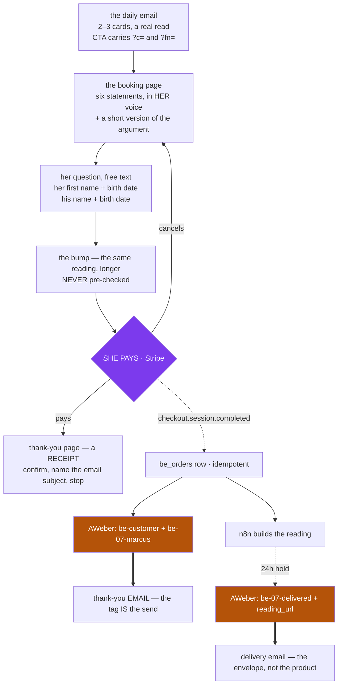

# 07 Marcus Daily Tarot — design

*2026-09-02 · brainstormed with the operator · **not yet built**, nothing live*

A daily tarot email to Marcus Stone's own list, selling a $35 personal reading through a
booking page. The deck's seventh offer, and its first **recurring** one — 02–06 are all
one-off event letters.

---

## The chain

**What we found.** BE-02 (Twin Flame Tarot) worked: an email sales letter → a booking page of
six statements in the buyer's voice → $35 + a $12.77 bump → a 24h PDF. Marcus Stone has his own
AWeber list of 76,718 that has been mailed twice, in June, and performed better than Evelyn's
daily does now.

**What it means.** The BE machinery already built — booking page component, Stripe, `be_orders`,
the webhook, AWeber tagging — can carry a second persona without new plumbing. What it cannot
carry unchanged is *frequency*: BE-02 sold on scarcity ("she does not lay a twelve on request"),
and that argument dies the second day you send it.

**What we do.** Sell the same shape daily, but make the scarcity true by tying the product to the
card that was drawn that day. Rotate the daily read on a fixed weekly rhythm so the ask can be
hard once a week and absent once a week. Fulfil with n8n so volume costs nothing.

---

## Decisions locked

| | |
|---|---|
| **Offer** | `07` — Marcus Daily Tarot |
| **Persona** | Marcus Stone. Tarot master, shadow work. Direct, archetypal, plain-spoken. Not Evelyn's register |
| **Audience** | `seerwithin_marcus_promo_66`, list id **6960130**, 76,718 subscribers. **This list only** |
| **Gate** | **No women-only gate.** (BE-02 gated on `S7`; 07 does not) |
| **Cadence** | One email a day, **6pm SGT = 10:00 UTC = 6am ET** — she reads it at breakfast |
| **Destination** | The booking page. **No chat handoff anywhere** — `/marcus` is not linked from the daily or the report |
| **Front end** | **$35.00** — a reading of today's card against her question, then a fresh draw. ~1,000 words, PDF |
| **Bump** | **$12.77** — the same reading at ~3,000 words |
| **Upsells** | **None.** No U1, no U2 |
| **SLA** | **24 hours** |
| **Fulfilment** | n8n. Grades its own output, regenerates once on failure, **sends either way**. No human in the path |
| **Repeat buyers** | One-click re-order — she types a new question and pays, nothing else |
| **Card art** | Reuse `evelyn/tarot-rws/` **read-only**. ⛔ `evelyn/tarot/` is frozen — live broadcasts point at it |
| **Lives in** | `improve-v1/v1-one-time-BEs/copy/07-marcus/` |

---

## 1 · Her path



There is one destination and one price. The `?c=` parameter tells us which day and which CTA
slot earned the click.

---

## 2 · The week

Card count rotates on a **fixed weekday rhythm**, not at random. Random rotation stops her forming
a habit; a rhythm she can learn gives variety *and* gives the ask somewhere to live.

| Day | Draw | The read | The ask |
|---|---|---|---|
| Mon Tue Thu Fri Sat | **2 cards** | The pull, and what it costs | **Soft.** The question, nothing else |
| Wed | **1 card + a practice** | Something to do tonight | **Barest.** The question, no product around it |
| **Sun** | **3 cards** | Full reading — the week's best content | **Hard.** This is the sales email |

### The spine: every email asks for her question

⭐ **This is the mechanic, and it governs every other decision below.** The free content's job is
to build the **setup** — the frame that makes a personal reading the obvious next move. It does
that by reading the card fully and truly, and then arriving at the one thing the card cannot answer
from a distance: *what she brought to it.*

So the ask is never "buy a reading." **It is "what would you ask?"** Every day, without exception.

This is proven on Evelyn's list. Format 04, *the tell*, drove the most v2 sales in the reframe deck,
and its CTA rule is a **tiny disclosure, not a purchase**. `PLAYBOOK.md:125`: interactive formats
close with *"tell me yours"*, and reply-style is the **tone** — the click still goes to the one
destination. 07 makes that the shape of every send rather than one format in seven.

**Why it converts better than a purchase ask.** A question is free to give and she already has one.
Typing it is the first yes, and it happens before any price is visible. By the time money appears
at statement 6, she has told a stranger the thing she actually wants to know — and people do not
walk away from that lightly.

⛔ **The ask is card-specific, never generic.** Not *"what's your question?"* but *"what would you
put to the Devil?"* The card sharpens the ask and gives it a reason to exist today.

**Why Wednesday still asks.** It asks for the question and nothing else — no price, no product name,
no reading offered. The give-day is one of two things holding a daily ask up, and it should be the
email people forward. But an email with no ask at all breaks the habit the other six days build.

**Why Sunday is the peak.** *(operator, 2026-09-02 — moved from Saturday.)* It lands **6am ET on a
Sunday**: home, unhurried, nobody at work. That is the best slot in the week for a long read and for
a question to surface on its own. A 250-word daily cannot do what BE-02's 17-beat letter did; Sunday
is the closest thing 07 has to that letter, and it carries the real argument.

### The two sells

| | **Soft** — Mon–Sat | **Hard** — Sunday |
|---|---|---|
| **The ask** | Her question, card-specific | Her question, then the product named |
| **Price** | Never appears | Stated plainly |
| **What sells it** | The withhold. He read the card truly and hit the wall her question is on the other side of | **The reading itself is the pitch** — Sunday demonstrates the product by being it |
| **Length** | ~250–320 words | ~550–650 |
| **Devices** | One CTA | Week recap · precedent · one CTA · **P.S.** |

`PLAYBOOK.md:124` — on conversion beats *"the CTA is the natural next step of the insight, never a
bolted-on sell."* Sunday earns that by being a worked example of what she'd buy.

### Sunday's closing device: the week, collected

Mon–Sat each end on something the card **could not** tell him from a mass email. Sunday collects
all six and shows they have the same missing piece:

> Six days, six things I couldn't tell you. Every one of them was missing the same thing.

⭐ **No other offer in the deck can do this.** It turns the whole week into a single argument that
lands on Sunday, and it is the strongest reason 07 should exist as a daily rather than a weekly.

### The strip-the-CTA test — inherited, and it applies to all seven days

`PLAYBOOK.md:85`: remove the closing invitation. Is what's left still a complete, usable thing the
reader is glad they read? **If not, it's an ad, not an email.** Sunday has to pass this too.

---

## 3 · The daily email

The governing rule: **complete on the general, empty on the personal.** Marcus tells her truly and
usefully what the cards say about today, and then says plainly that he will not guess whose it is
from a mass email. The withhold is honest, because it is true.

This **replaces** the teaser spec in `docs/kit/marcus-stone-emails/README.md` (~55 words, card +
meaning, click to `/marcus`). Substance instead of a trailer; booking page instead of chat.

**Anatomy**

1. Wordmark — *Marcus Stone / Daily Tarot · The Seer Within*
2. Card art — hosted `evelyn/tarot-rws/<slug>.jpg`, read-only, linked to the booking page.
   ⛔ **On Wednesday it links to nothing.** A linked hero is an ask, and Wednesday does not ask
3. The draw, named
4. The read — the substance. Picture before meaning: describe what is **on** the card, then what it
   means. She is looking at it
5. What the cards cannot tell him from here
6. The link
7. Sign-off, then **tomorrow's card named** — this is what trains the daily return

### ⛔ Time of day — she reads this in the MORNING

The send is 6pm SGT, which is **10:00 UTC and 6am ET**. On a US-weighted list she opens this at
breakfast, not at night. Three different uses of night-words, and only one is wrong:

| Use | Example | Verdict |
|---|---|---|
| **Narrating when she is reading** | *"Three up tonight"* | ❌ **Never.** A 12-hour miss, and it costs the intimacy the whole format runs on |
| **A practice pointed at later** | *"notice this tonight"* | ⚠ Legal, but at 6am it is 14 hours away. **Say "today"** — actionable while she is holding the email |
| **Describing the card, or quoting someone** | *"The moon's out"* (the Eight of Cups picture) · *"I check his profile every night"* (her words) | ✅ **Correct, leave alone.** The picture-before-meaning rule needs the art described as painted |

⭐ **The morning slot is an advantage, not a constraint.** A card that arrives at the *start* of the
day sets the day up rather than reviewing it — *"today's card"* is literally true at 6am, and she
carries the question through the day before she clicks. A daily tarot that landed at 10pm would be
a worse product.

⚠ **Not everyone is on ET.** The UK reads at 11am, Australia at 8pm. So avoid hard claims about her
surroundings (*"as you read this it's dark"*) even when they are right for most of the list.

**Voice.** First person, direct, archetypal. No "dear". Marcus names the thing. Contractions at
roughly the rate a person speaks. No aphorisms, no balanced clauses, no appositive tails.

---

## 3a · Rebranding the HTML — every place Evelyn currently leaks

The only built Marcus email is `docs/kit/marcus-stone-emails/the-moon.html`. Its wordmark, voice,
sign-off and CTA are already Marcus. Everything else is Evelyn's shell, and both prior sends to
this list went out under Evelyn's name — so these people have **never** had an email from Marcus
as himself. The rebrand is not cosmetic; it is the thing that makes the list his.

| # | What | Where | Fix |
|---|---|---|---|
| 1 | **From-name and from-address** | Not in the HTML — set on the AWeber list | **Marcus Stone**, on a Marcus address. ⛔ The single most important item, and the easiest to forget because it is invisible in the file |
| 2 | **Unsubscribe + subscriber-options links** are literal test placeholders — `aweber.com/z/r/?ThisIsATestEmail` | `the-moon.html:60,62` | Replace with AWeber's real merge tags. ⛔ **Blocker.** Shipping this to 76k means no working unsubscribe — a CAN-SPAM breach and a complaint spike on exactly the list we are trying to warm |
| 3 | **Card art served from Evelyn's namespace** — `…/evelyn/tarot/the-moon.jpg` | `the-moon.html:38` | Point at `evelyn/tarot-rws/`. ⛔ `evelyn/tarot/` is frozen — live broadcasts resolve against it and it must never be touched |
| 4 | **CAN-SPAM address** — `140 Broadway, Manhattan, New York NY 10005` | `the-moon.html:58` | Byte-identical to Evelyn's live sends. Same company, so legally fine, but the kit README flags it as placeholder — **confirm it is the real registered address** before the ramp |
| 5 | **Visual shell** — Georgia wordmark, Helvetica body, `#0000ff` links, `#8a8ca0` greys | throughout | Identical to Evelyn's reframe HTML. A reader on both lists sees the same email twice in a day. Marcus needs his own palette and type — his voice is already distinct, the design should be too |
| 6 | **No name personalisation in the body** | throughout | Evelyn's programme uses `{{ subscriber.first_name \| capitalize }}` in the body. Marcus's has none. Decide deliberately — ⚠ there is no fallback filter live, so an empty name renders as a blank |
| 7 | **CTA destination** — `/marcus` chat | `the-moon.html:37,49` | Goes to the **booking page**. §1 — there is no chat handoff in 07 |

**The invisible-versus-visible split matters.** Items 1, 2 and 3 are invisible to a reader and are
the ones that break things — the wrong sender, a dead unsubscribe, a frozen asset prefix. Items 5
and 6 are what she actually sees. Do the invisible three first; they are blockers, not polish.

⚠ **`the-moon.html` is a teaser built to the old spec** (~55 words, click to chat). It is a useful
shell for the shared furniture — wordmark block, hero, footer — but its body does not survive
§3's format. Rebuild the body; keep the chrome.


---

## 4 · The booking page

⚠ **This is the one place the model breaks if BE-02 is copied without thinking.** BE-02's page got
away with six short statements because a long letter had already done the persuading. A 200-word
Tuesday email has not. So 07's page carries a **short version of the argument above the
statements**, and a Tuesday click has to convert on the page alone.

⚠ **The question box comes FIRST, above the statements.** *(2026-09-02 — this reverses BE-02's
order, deliberately.)* The CTA that brought her here said *"tell me what you'd ask."* A page that
opens on six consent statements does not keep that promise, and she leaves. So the page opens with
the box, she types her real question, and only then does the argument begin.

This is also the strongest commitment device available: she discloses **before** any price is
visible. The `docs/intel` teardown of the $60k astrology offer names commitment-before-checkout as
its single biggest CRO lift.

Everything else holds:

- Statements are in **her** voice, first person. Marcus is named in the third person and never
  speaks on this page
- Money appears at **statement 6**, after five agreements
- The button does not exist until every box is ticked
- The bump renders between the last statement and the button, **never pre-checked**
- Cancel returns her with `?cancelled=1`, position restored, consent never, and it says nothing has
  been taken

**What it collects, for n8n:**

| Field | Why |
|---|---|
| **Her question — free text** | **The core of the offer, and the first thing on the page** |
| Her first name | Names her in the reading |
| Her birth date | Sign and number |
| His name | Most questions are about a specific person |
| His birth date, if known | Optional. Deepens his half of the read |

---

## 5 · The product

| | |
|---|---|
| **$35.00** | Today's card read against her question, then a fresh draw. **~1,000 words** |
| **+$12.77** | The same reading, **~3,000 words** |

**The rule that stops the bump reading as a toll.** The two lengths differ by **scope, not by
withholding**. The short reading answers her question and stops. The long one answers her question
and then reads everything else the same draw touched that she did not think to ask — his card
beyond her question, what the timing card says about the next season, what the spread says about
her that she did not come for.

The reason-why is therefore true, and it says something a buyer likes hearing: *the cards said more
than you asked.* Not *we cut it short.*

⛔ **Copy rule for `07-C3`:** it must never say "full", "complete", "unabridged", "the whole
reading", or anything that makes $35 sound partial.

**Why the daily ask is honest.** Today's card is only today's. Tomorrow is a different reading, not
the same one she skipped. That is the scarcity, and unlike BE-02's it renews without lying.

---

## 6 · Fulfilment

n8n receives the order, builds the reading, grades it against a rubric, regenerates once on
failure, and **sends regardless of the second result**.

```
be_orders row → n8n webhook
   → build: today's card + fresh draw + her question + her details + his
   → grade against rubric
   → fail? regenerate once
   → render PDF
   → hold to the 24h mark
   → AWeber tag be-07-delivered + reading_url → delivery email
```

⚠ **Operator decision, taken with the risk stated:** nothing blocks delivery, so the first bad
reading reaches a paying customer and we learn about it from the refund. Mitigation built in
rather than argued about — **every grader failure is logged with the order id and the reason**, so
the pattern is visible before the refunds are. Review the log daily for the first two weeks.

Both lengths come from the **same draw and the same data**. The bump is a second pass with a wider
brief, which is why it costs nothing to produce.

---

## 7 · Repeat buyers

She can buy every day, and that is the point — repeat readings, not the front end, are what
compounds lifetime value.

We already hold her first name, her birth date, his name and his birth date. A returning buyer
types **only her new question** and pays. This needs a stored customer and a saved card, which is
the same mechanism BE-02's one-click upsell charge already uses.

No pack, no cap, no discount for volume.

---

## 8 · Where it lives, and the one code change

```
improve-v1/v1-one-time-BEs/
  copy/07-marcus/              07-C1-booking-page.md, 07-C3-order-bump.md,
                               07-T1-thank-you-page.md, 07-T3-confirmation-email.md,
                               07-T4-delivery-email.md, 07-P1-the-reading.md
  copy/07-marcus/daily/        the rotating daily emails
  docs/07-marcus/0-WORKFLOW-07.md
  assets/07-*.png              flat, same as 02 / 04 / 06
```

**`scripts/copy-check.cjs` needs one change or the gate goes silent.** The offer number is parsed
out of the path (line 114, and again in the `offersSeen` line near 199):

```js
const offer = (rel.match(/copy\/(\d{2})\//) || [])[1];
```

`copy/07-marcus/` does not match — `07-` is not `07/`. With `offer` undefined, the price check
(~130), the SLA check (~139) and entry into the device-variance corpus (~175) are all guarded on
it and silently skip. The checker would print `✅ PASS` on anything in the folder. Fix:

```js
const offer = (rel.match(/copy\/(\d{2})(?:-[a-z-]+)?\//) || [])[1];
```

And add to `OFFERS`:

```js
'07': { name: 'Marcus Daily Tarot', sla: /\b24 hours?\b/i, prices: ['35.00', '35', '12.77'] },
```

Gate runs as `node scripts/copy-check.cjs copy/07-marcus`.

**Note on device variance.** That check catches *literal repeated sentences* across offers, not
reused devices. Keeping 07 in the same corpus as 02–06 costs nothing and stops copy-paste between
decks. The conceptual rule — do not sell the same woman the same trick twice — stays a human
judgment pass, and it matters less here because 07's audience does not overlap Evelyn's.

---

## 9 · The list, and the warm-up

**`seerwithin_marcus_promo_66` · id 6960130 · 76,718 subscribers.** Pulled live 2026-09-02.

| Sent | Emailed | Unique opens | Unique clicks | Complaints | Undeliverable |
|---|---|---|---|---|---|
| 2026-06-06 | 27,564 | 8,525 (30.9%) | 1,853 (6.7%) | 9 (0.33/1k) | 87 (0.3%) |
| 2026-06-07 | 35,705 | 8,516 (23.9%) | 1,287 (3.6%) | 4 (0.11/1k) | 95 (0.3%) |

**The good news.** 30.9% opens and 6.7% clicks beat Evelyn's current daily (~17–24% opens, ~2.4%
CTOR). This audience is worth mailing, and the first send's click rate is the best number anywhere
in the account right now.

**The problem.** Two sends ever, both ~87 days ago, both **Evelyn-branded** — so Marcus has no
established relationship with them under his own name. And the emailed counts (27.5k, then 35.7k)
are far below the current 76,718: **roughly 41,000 people on this list have never received a single
email**, and have been sitting since opt-in.

⚠ **Do not blast 76.7k daily on day one.** The sending domain is shared with Evelyn's live
thirteen-list daily programme. A complaint spike here damages a working revenue stream, and that is
not easily undone.

**Warm-up, before daily goes wide:**

| Phase | Segment | Size | When |
|---|---|---|---|
| 0 | A re-introduction from Marcus in his own name | — | Before anything daily |
| 1 | June openers | ~8.5k floor* | Daily from day 1 |
| 2 | June mailed, did not open | ~27k | Added across week 1 |
| 3 | Never mailed | ~41k | Added in batches across weeks 2–3 |

\* Each June send had ~8.5k unique openers, but we do not know the overlap between them.
Build the segment from *opened either send* — the true figure is between 8.5k and 17k.

**Stop rule:** complaints above **0.3 per 1,000** on any send, or undeliverable above **1%** —
hold the ramp and prune before adding the next batch. Evelyn's healthy band is 0.05–0.16/1k.

---

## 10 · Reused vs new

| Reused as-is | New build |
|---|---|
| Booking page component (config-driven, one page not four) | The rotating daily send engine — the deck has only ever sent one-off letters |
| Stripe checkout, dark behind `BACKEND_CHECKOUT_LIVE` | The n8n handoff and its grader |
| `be_orders`, the webhook, idempotency | The one-click re-order path |
| AWeber customer tagging → thank-you and delivery emails | A per-day card state file (what was drawn, what is queued) |
| `0-WORKFLOW.md`, `copy-check.cjs` | The list warm-up ramp |
| `evelyn/tarot-rws/` card art, read-only | — |

---

## 11 · Risks on the record

**1 · The daily ask has no precedent in this deck.** Two things hold it up: Wednesday gives without
asking, and today's card is genuinely only today's. **Watch the Saturday click rate** — decay shows
there first.

**2 · Nothing blocks a bad reading.** Operator's decision, taken knowingly. The grader log is the
mitigation, and it only works if somebody reads it.

**3 · The list is dormant, not warm.** Section 9. The ramp exists because the shared sending domain
carries Evelyn's live programme.

**4 · Marcus has never written to these people as himself.** Both prior sends were Evelyn's. Phase 0
of the ramp is a re-introduction, not a card.

**5 · The booking page carries more weight than BE-02's did.** If Tuesday clicks convert far below
Saturday's, the page is the thing to fix, not the email.

---

## 12 · Open before build

- [ ] Apply the `copy-check.cjs` regex change and the `'07'` entry — **first**, or every later gate
      run is meaningless
- [ ] `docs/07-marcus/0-WORKFLOW-07.md` — copy the master, then Step 0 worksheet
- [ ] ⛔ **Marcus from-name and from-address on list 6960130** — §3a item 1
- [ ] ⛔ **Real unsubscribe merge tags** — `the-moon.html` still ships `?ThisIsATestEmail` (§3a item 2)
- [ ] Confirm the CAN-SPAM address is registered, not placeholder (§3a item 4)
- [ ] Marcus's own palette and type, so his email is not Evelyn's twice (§3a item 5)
- [ ] The grader rubric — what makes a reading fail
- [ ] How many draws a day, and how the card state file avoids repeating a card too soon
- [ ] Confirm `evelyn/tarot-rws/` has all 78 cards at usable size
