# /fb-tarot — decode-him card landers · results report

**What this is:** a new **`/fb-tarot`** "tarot card" quiz-bridge funnel + a single image-driven skill
(**`fb-tarot-add-card`**). A media buyer drops a card-strip image in, and the skill reads it (face-up vs
face-down, which cards), then builds a working lander from it — reusing the existing chat → Stripe → upsell
engine unchanged. Every lander below was generated this way from Rio's card art.

> Take a pull of this branch and open the screenshots below to see each lander's full flow.

## How it works (same model as `/fb-palm`)
- Each **deck** = one card set (3 cards A/B/C). Each **hook** = the question in the headline.
- **The same deck answers many questions by changing one URL parameter** (`?hook=`). Copy + headline swap;
  the cards stay the same.
- Two kinds of hooks:
  - **decode-him** (`cards-honest` / `cards-return` / `cards-feels` / `cards-cheating`) — reads *him* as a
    **tendency, never a verdict**; affirms her intuition.
  - **self-frame** (`cards-love-again`) — reads *her* future and affirms the hopeful yes.
- Pricing: flat **$35 / $25** at launch (no split test), like the thumb-angle palm lander.

## Verification (every deck)
`tsc` clean (no new errors) · client builds · roster-sync checked · a Playwright flow test
(`tests/fb-tarot-flow.spec.ts`) walks the whole conversation and asserts: lander renders, card reveal shows,
the chat hand-off does **not** 400, no empty bubbles, no client errors, and the Meta pixel is blocked.

---

## Deck 1 — `arcana-mfh` · The Magician · The Fool · The Hanged Man
Built from `ZN_Tarot_Rio 6.png`. The ad ran the self-frame hook **"Will I love again?"**. Carries all 5 hooks.

**Try it:**
- `/fb-tarot?hook=cards-love-again&deck=arcana-mfh` — "Will I love again?"
- `/fb-tarot?hook=cards-honest&deck=arcana-mfh` — "Is he being honest with you?" *(same cards, decode-him)*

**Full flow:**

| 1. Lander | 2. Card reveal |
|---|---|
| 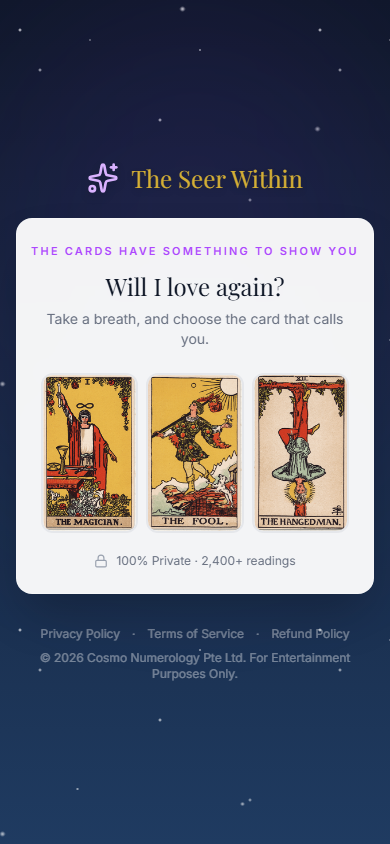 | 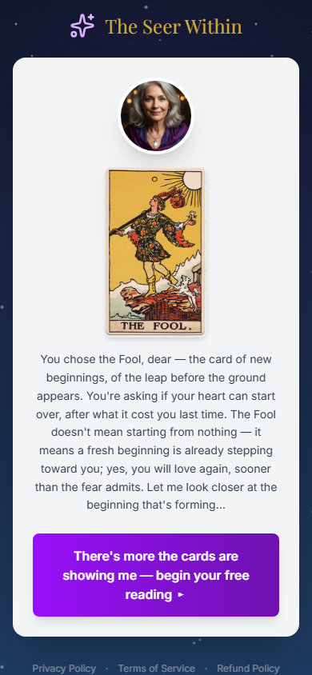 |

| 3. Chat hand-off | 4. After name | 5. Deepening reading |
|---|---|---|
| 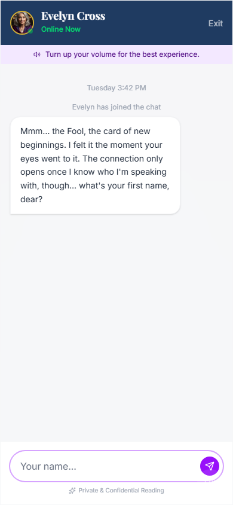 | 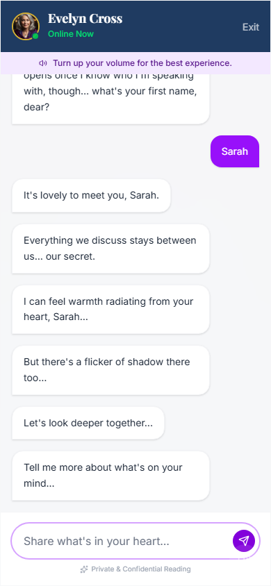 | 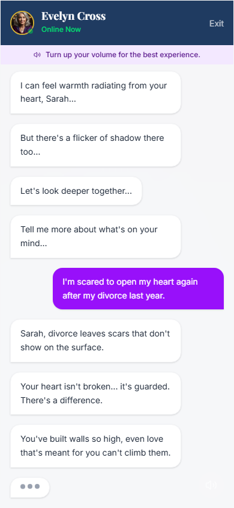 |

---

## Deck 2 — `arcana-eef` · The Emperor · The Empress · The Fool
Built from `ZN_Tarot_Rio 7.png`. The ad ran the decode-him hook **"Is he being honest with you?"**. Carries all 5 hooks.

**Try it:**
- `/fb-tarot?hook=cards-honest&deck=arcana-eef` — "Is he being honest with you?"
- `/fb-tarot?hook=cards-love-again&deck=arcana-eef` — "Will I love again?" *(same cards, self-frame)*

**Full flow:**

| 1. Lander | 2. Card reveal |
|---|---|
| 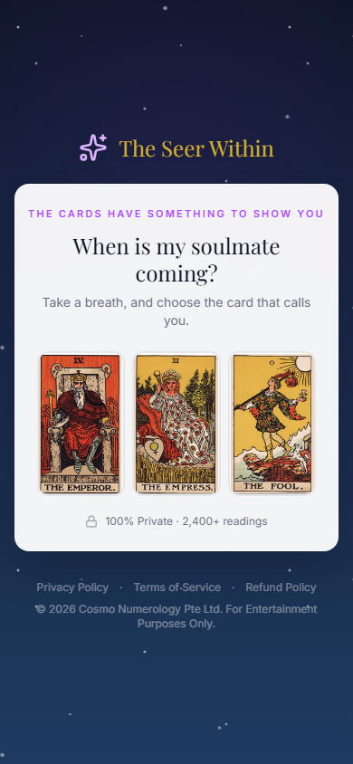 | 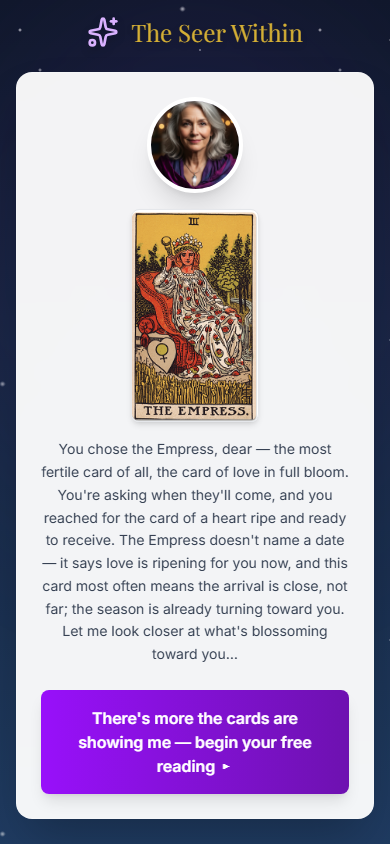 |

| 3. Chat hand-off | 4. After name | 5. Deepening reading |
|---|---|---|
| 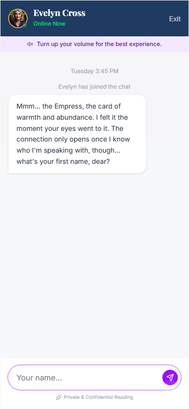 | 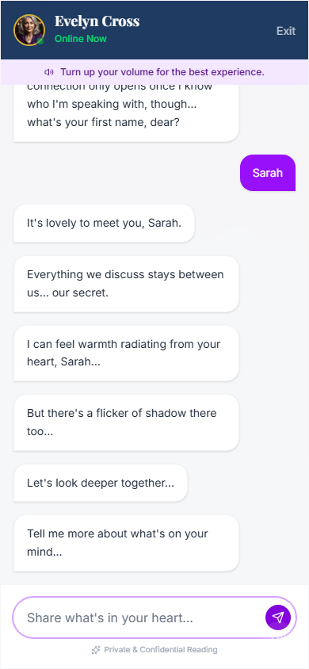 | 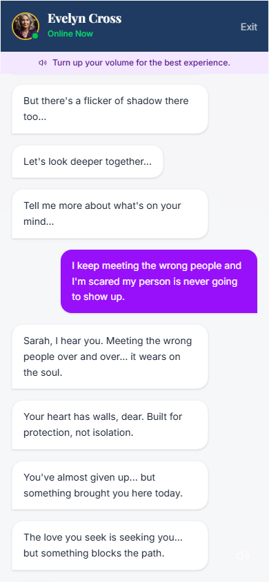 |

---

## Deck 3 — `return-mhf` · The Magician · The Hanged Man · The Fool  *(face-down)*
Built from `ZN_Tarot_Rio 1.png`. The ad ran the decode-him hook **"Will he come back?"** (`cards-return`).
This is the first **face-down** deck built from real card-back art — she pulls by intuition and the card is
*drawn* on reveal ("you **turned** the …"). Because the backs are identical, the 3 cards were **drawn** from
the Major Arcana pool (Magician · Hanged Man · Fool). Carries all 4 decode-him hooks.

**Try it:**
- `/fb-tarot?hook=cards-return&deck=return-mhf` — "Will he come back?"
- `/fb-tarot?hook=cards-feels&deck=return-mhf` — "How does he really feel about you?" *(same cards)*

**Full flow:**

| 1. Lander | 2. Card reveal |
|---|---|
| 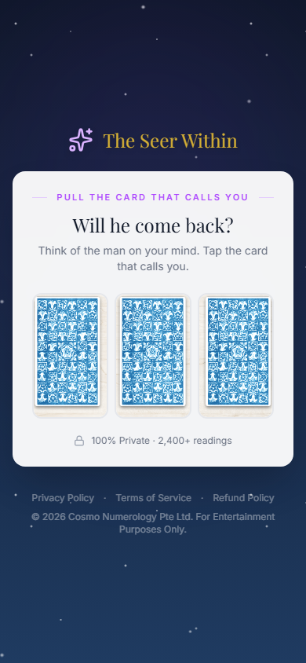 | 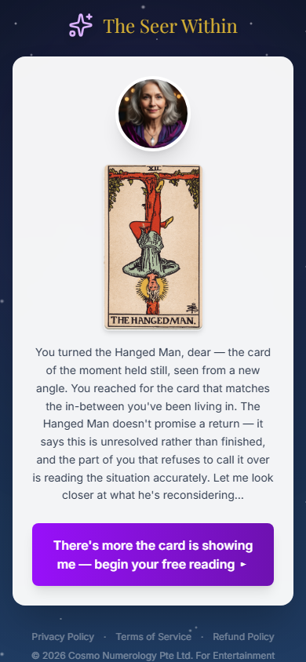 |

| 3. Chat hand-off | 4. After name | 5. Deepening reading |
|---|---|---|
| 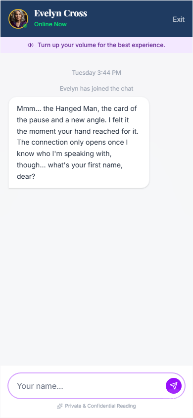 | 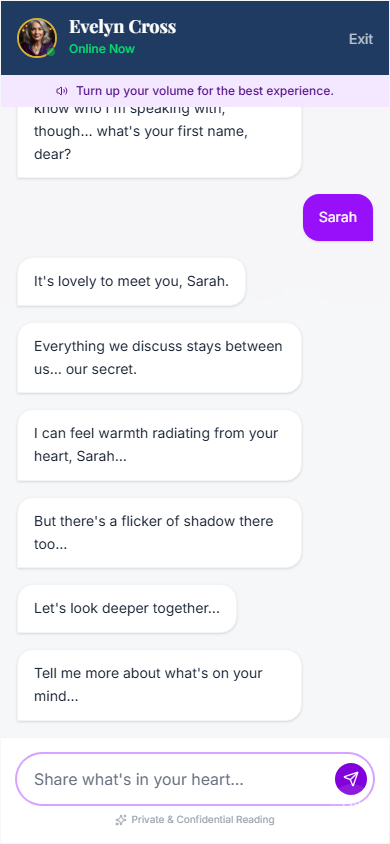 | 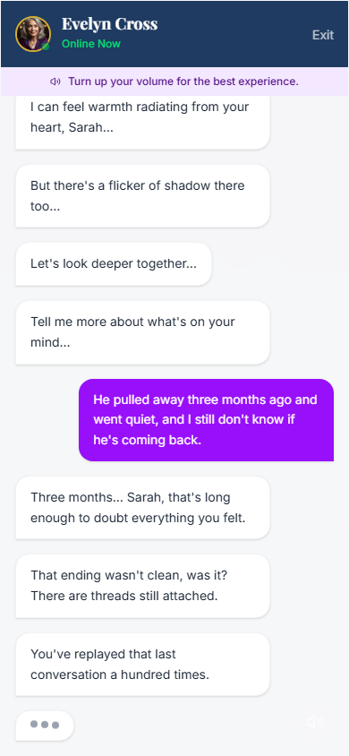 |

*Plain-text transcript: `screenshots/return-mhf/transcript.txt`.*

---

## Landers built so far

| Deck | Cards | Facing | Ad hook | All hooks? | Status |
|---|---|---|---|---|---|
| `arcana-mfh` | Magician · Fool · Hanged Man | face-up | `cards-love-again` | ✅ 5/5 | ✅ built |
| `arcana-eef` | Emperor · Empress · Fool | face-up | `cards-honest` | ✅ 5/5 | ✅ built |
| `return-mhf` | Magician · Hanged Man · Fool | face-down | `cards-return` | 4/4 decode-him | ✅ built |
| `decode-him` (seed) | Sun · Moon · Tower | face-down | `cards-honest` | ✅ 5/5 | ✅ built (placeholder art) |

*Reads are drafts pending sign-off. Card readings live in `client/src/content/tarotReads.ts`; the skill is
`.claude/skills/fb-tarot-add-card/`; design doc `fb-tarot/docs/PRD-tarot-bridge.md`.*

## Regenerate these screenshots
```bash
# against a muted sandbox (or dev) on :5000 — read-only (?noemail=1), Meta blocked
npx playwright test tests/fb-tarot-flow.spec.ts
```
