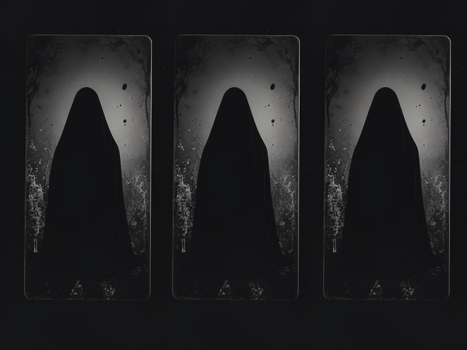
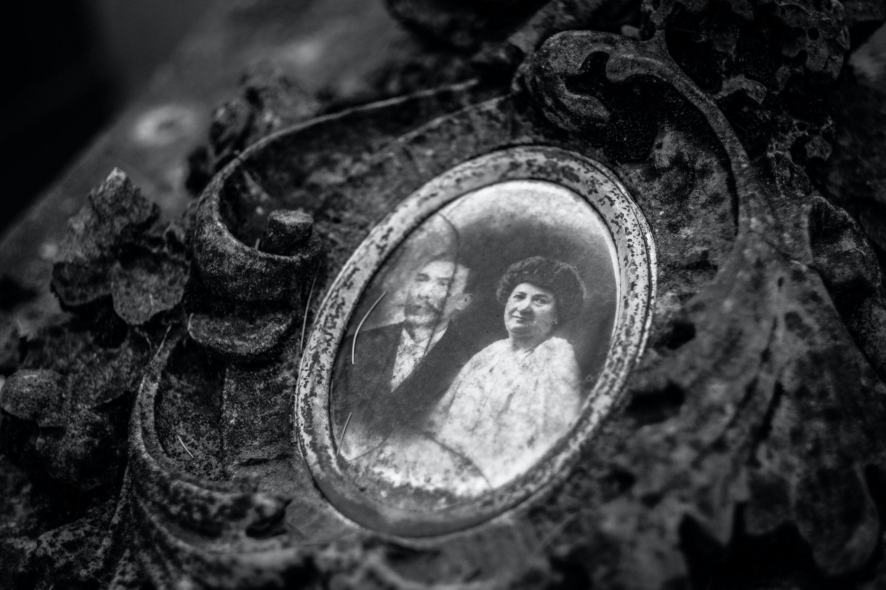
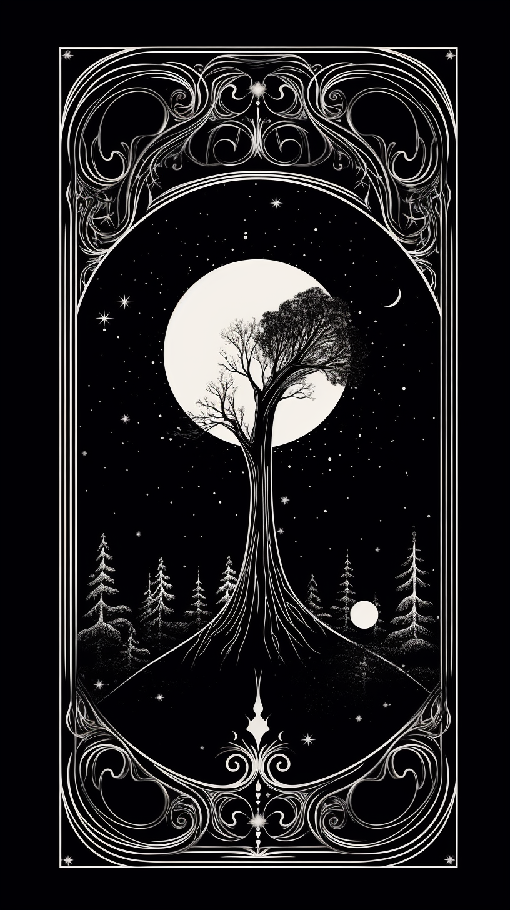
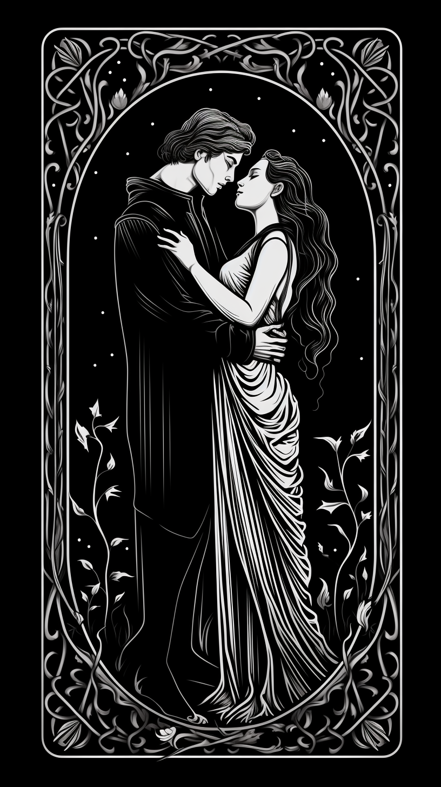
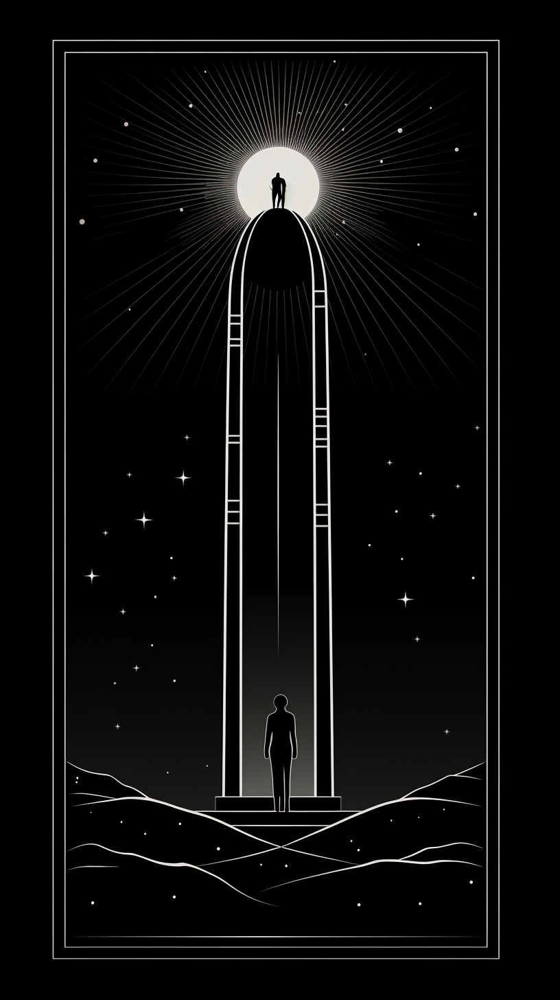
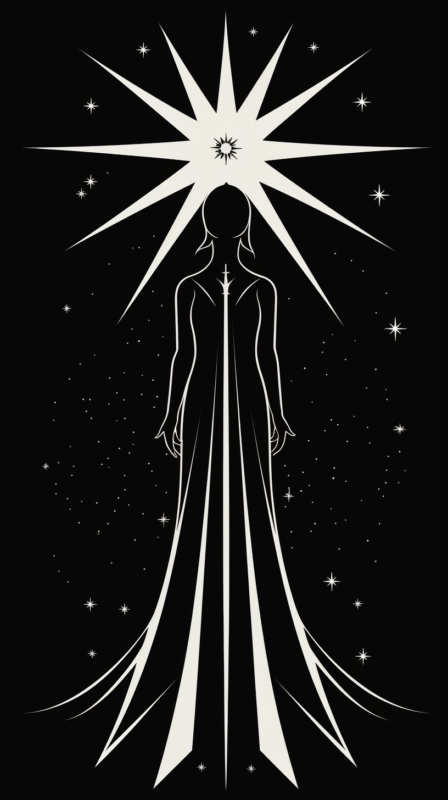
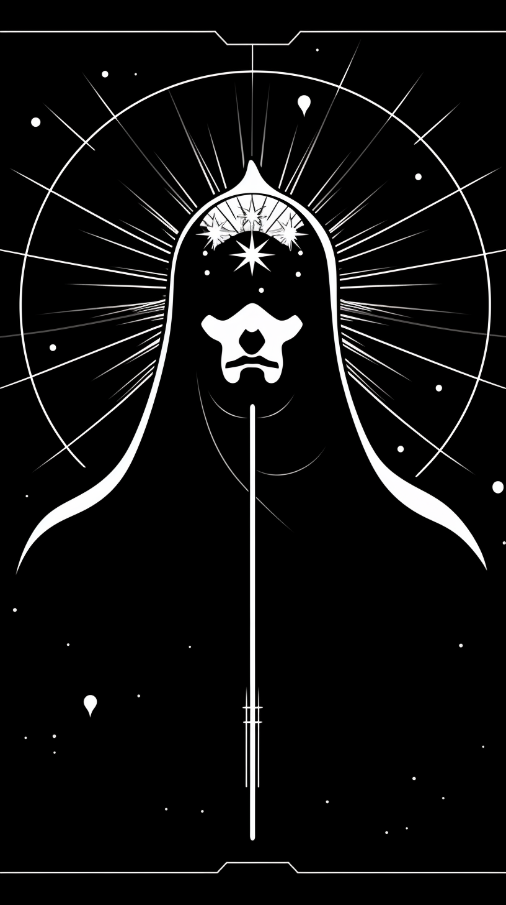
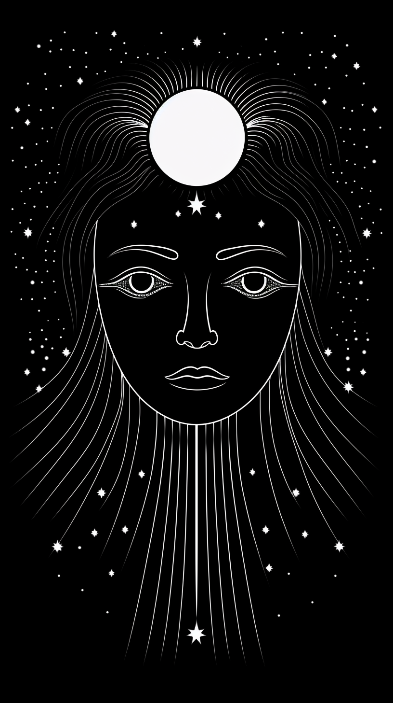

## First Version:

# %FIRSTNAME%, For An Unusual Reason I’ve Drawn Three Tarot Cards For You

*These Signify A MASSIVE Change In Your Love Life With The Very FIRST Appearance Likely To Be In Just 5-7 Days*

%FIRSTNAME% -

Madame Delacroix here.

I write to you with urgency.

Let me share in detail what the future holds for you…

Last night I woke up from a dream after preparing your spell.

A dream about you.

My Twin Flame Tarot cards SPOKE to me ASKING to be picked.

So I started a FREE tarot drawing for you.

And picked out 3 cards.

Please don't miss out on the potential LUCK AND LOVE you can get that my first two cards have shown...

And DEFINITELY don't ignore the warning of the THIRD DRAW.

This is important as the winds of destiny will change your fate soon.

The last time this happened was DECADES ago when I was a young girl…

And my client then, Jane, ended up finding her TWINFLAME.

Here’s what the tarot cards are telling me about your NEAR future.

First of all, it clearly appears that if you follow my advice to the letter, you could quickly trigger fabulous opportunities for LOVE and LUCK!

%FIRSTNAME%, I will reveal this three-card spread in a moment.

But you should first know that in order to stack all the odds in your favor and attract 100% of the golden astral vibrations that I saw, you need a complete spread.

I’ll explain below how to do this in-depth consultation remotely.

Right now, you should know that the 3 cards that I drew for you are generally good cards, but you should still be cautious and stay on your guard, as I’ll explain now.

### Your first card: the World

It's a trump card, no doubt the best Tarot card.

Its power for happy change is far greater than the other Arcana.

When it is drawn, it means: "Luck will favor you, %FIRSTNAME%."

### It indicates the end of misfortune and the beginning of a cycle of luck!

It’s true that this card activates powerful protection. It also favors the start of a happy period in your life, especially in the field of love.

With such a good card, you can expect to experience an important change on a financial level.

That was confirmed by the tarological report about your near future. It shows the high likelihood of a big love windfall.

In order to give you more details about this new important information that should help you trigger a first wonderful windfall in your life, we just need to do another spread of 12 new cards.

And this first occurrence doesn’t seem to be the only one, %FIRSTNAME%!

Since I see the appearance of a second wonderful windfall for you, that should change your LOVE LIFE in the following weeks.

### Your second card: the Lovers

As its name suggests, this Card concerns the field of love.

It has a double meaning and you absolutely must not take it lightly if you want to approach your romantic future in a positive and serene way.

Firstly, it can indicate that a renewal is presenting itself to you.

Secondly, it can herald a particularly pleasant new encounter, capable of completely transforming your love life.

My feelings concerning your draw is that you’re currently experiencing some emotional tension, and you feel like not enough attention is paid to what you do, nor, more importantly, to who you are deep down, %FIRSTNAME%.

You should know that the cards enable me to immediately answer all the questions that you’re asking yourself and to immediately find the solution to the problems worrying you…

(And they allow me to reveal to you how to stack all the odds in your favor in order to WIN these 2 Wonderful Predictions that I saw for you!)

**As it happens, the person on your mind could well become more attentive towards you than ever before.**

The second interpretation is of an encounter that would bring you such happiness, it would change your future.

It no doubt concerns someone you know. I could provide you with further details if you accept for me to carry out a complete spread for you.

### Now, let’s look at your third card: the Tower

I urge you to be cautious.

Without actually being negative, this card is a pressing warning to do what’s necessary, here, right now.

Even if you don’t really feel like it or you don’t feel brave enough.

You absolutely must take action, or else you may see a problem diminish, or even undo your chances of happiness.

I cannot yet tell you exactly what seems to be blocked. I see too many problems and difficulties that are specific to you and which can arise abruptly.

That’s why a complete consultation is necessary, so that you know exactly what’s involved and so that I can give you the means to be able to avoid these obstacles.

The Tarot cards will show you exactly what to do and how to take action in order to progress along the path that will lead you towards happiness.

Until your next draw, ([the one you can do by clicking HERE](http://google)), you must seriously consider what just happened: your 3 cards are giving you a perfectly clear and urgent message.

If you want to do everything in order for happiness, love and health to enter your life, it is in your interest to stack all the odds in your favor and find out exactly what your future has in store for you, %FIRSTNAME%!

### In concrete terms, what do you have to do after this draw?

First of all, and without wasting a moment, [you give me permission to draw the 12 Tarot cards HERE](http://google).

That’s the only condition for me to be able to reveal to you the exact details of the events of LOVE and LUCK written in your near future.

### Let’s take another look at the second card drawn (the Lovers) and the encounter that will soon happen

The Lovers indicates a special encounter for you in the next few weeks.

A potential Twin Flame in your life is predicted, but you must do a complete spread in order to find out on which day to play and most importantly determine your lucky encounter.

With such comprehensive and detailed information, you can expect to change your love life.

Once again, I will explain exactly what to do in order to have the best chance of “winning”.

It was by following my instructions that Jane received, within just a few days, more than enough to complete her LOVE LIFE.

With you too, I’m expecting complete success.

### But beware, %FIRSTNAME%, the Tower recommends the utmost caution!

The message is clear: you must immediately take action to eradicate a problem, which otherwise would be very likely to prevent your happiness and block the encounter written in your near future.

In concrete terms:

Likely - an ex coming back to ruin your potential chances.

Or a lover pulling away and blocking you.

That’s why [you must draw 12 new cards here](http://google), so that I can do a Twin Flame Spread for you concerning the important areas of your life.

Then, you’ll know what to do to progress along the path to your happiness.

There’s one more thing that needs to be clarified about the field of love.

The Lovers gives you 2 options, but which is the right one?

To find out, you absolutely must carry out an [in-depth Twin Flame Tarot reading](http://google), which will give you all the details about your future.

I need to do with you what I always do when something bad can destroy newfound happiness: check the Tarot cards.

I see so many wonderful opportunities in store for you, so many happy unforgettable moments, full of kindness, warmth, tenderness and luck... that you don’t have a moment to waste, %FIRSTNAME%!

All you have to do right now is to [allow me to read your full 12 cards](http://google).

Only then will you truly get the answers to the important questions that you’ve been asking yourself deep down inside.

What are the pitfalls of life to avoid at all costs, the false friends, false hopes, bad encounters?

The secret language of Tarot has no secrets for me.

I will give you all the answers you’re waiting for.

The 12 Cards that will be drawn are of crucial importance for you and your loved ones.

### That’s why I’m asking you to not waste any time and draw them as seriously as possible, with conviction and faith in the future.

For you, I’m going to do something exceptional, that I usually reserve for my “protégés”:

I’m going to use the Major Arcana from my Tarot deck.

Every tarot deck has 22 Major Arcana and 56 minor arcana cards.

This method gives my vision of the future far more energy and precision, and the details will surprise you.

It’s just up to you to take control of your destiny and get a complete report in which I will reveal certain hidden details about your own life, secrets that no one has ever dared discuss with you before, %FIRSTNAME%.

[Follow me HERE](http://google) and see how this small, simple gesture can transform the rest of your life and bring you the key to all sorts of mysteries concerning your life.

I can’t wait to tell you more.

Your devoted friend,

Madame Delacroix

## Second Version:

# %FIRSTNAME%, I’ve Drawn Three MORE Tarot Cards For You

*These Signify A DRAMATIC Change In Your Romantic In Just 5-7 Days*

%FIRSTNAME% -

Madame Delacroix here.

I write to you with more news from the psychic realm.

Today I started a FREE tarot drawing for you.

And picked out 3 new cards.

Please don't miss out on the potential LUCK AND LOVE you can get that my first two cards have shown...

And DEFINITELY don't ignore the warning of the THIRD DRAW.

This is important as the winds of destiny will change your fate soon.

Here’s what the tarot cards are telling me about your NEAR future.

First of all, it clearly appears that if you follow my advice to the letter, you could quickly trigger fabulous opportunities for LOVE and LUCK!

%FIRSTNAME%, I will reveal this three-card spread in a moment.

But you should first know that in order to stack all the odds in your favor and attract 100% of the golden astral vibrations that I saw, you need a complete spread.

I’ll explain below how to do this in-depth consultation remotely.

Right now, you should know that the 3 cards that I drew for you are generally good cards, but you should still be cautious and stay on your guard, as I’ll explain now.

### Your First Card: The Star

The Star, a beacon of hope and inspiration, shines brightly for you, %FIRSTNAME%.

This card symbolizes renewal, clarity, and an influx of optimism. It heralds a time where the universe aligns in your favor, offering guidance and support.

The Star's presence suggests that any recent challenges are fading, making way for a period of tranquility and inner peace.

It signifies that your dreams and aspirations are within reach, and now is the time to pursue them with renewed vigor and confidence.

This card is a reminder that you possess the inner wisdom and intuition to navigate life's journey successfully. Trust in your abilities and the universe's guidance.

The Star lights the path to spiritual growth and enlightenment, encouraging you to remain open to the endless possibilities that lie ahead.

Embrace this time of serenity and positivity, %FIRSTNAME%.

The Star is a symbol of your potential to manifest your deepest desires and achieve a harmonious balance in life. The universe is conspiring to shower you with blessings, so keep your heart and mind open to receive them.

### Your Second Card: The Emperor

The Emperor signifies stability, authority, and structure in your life.

This card represents the power of leadership and control over one's own life.

It suggests a period where taking charge and asserting your will is essential to achieving your goals.

In the context of love, The Emperor can imply a need for a structured approach.

It may indicate a relationship with someone who embodies strength, reliability, and protection.

This card can also mean that establishing clear communication and boundaries is crucial for a healthy relationship.

The Emperor's appearance in your reading indicates that you're in a position to make significant decisions that will shape your future.

It's time to take control of your destiny, using your wisdom and experience to guide you.

In your romantic life, this might involve making important choices that will set the course for long-term happiness.

Embrace the qualities of leadership and stability that The Emperor brings. By doing so, you'll find that you're able to build a solid foundation for your relationships and personal endeavors.

### Your Third Card: The Moon

The Moon emerges in your reading, %FIRSTNAME%, cloaked in mystery and uncertainty.

This card is a harbinger of confusion, illusion, and the need to navigate through uncertainty.

It warns of potential deception in relationships or misunderstandings arising from unclear communication.

In love, The Moon advises caution.

It suggests that things might not be as they seem, and urges you to trust your intuition. This is a time for introspection, to uncover hidden truths and face your fears.

The appearance of The Moon indicates a phase where the path ahead is not entirely clear, and you may feel emotionally unsettled.

Be wary of making significant decisions based on incomplete information.

Instead, seek clarity and wait for the truth to reveal itself.

The Tarot cards will show you exactly what to do and how to take action in order to progress along the path that will lead you towards happiness.

Until your next draw, (the one you can do by clicking HERE), you must seriously consider what just happened: your 3 cards are giving you a perfectly clear and urgent message.

If you want to do everything in order for happiness, love and health to enter your life, it is in your interest to stack all the odds in your favor and find out exactly what your future has in store for you.

### In concrete terms, what do you have to do after this draw?

First of all, and without wasting a moment, you give me permission to draw the 12 Tarot cards HERE.

That’s the only condition for me to be able to reveal to you the exact details of the events of LOVE and LUCK written in your near future.

### Let’s take another look at the second card drawn (the Emperor) and the choices that lie ahead

The Emperor indicates a decision to be made.

You must take control and be decisive, and a complete spread will help you have all the information you need to choose wisely.

With such comprehensive and detailed information, you can expect to change your love life.

Armed with a clear signal from the cards you may proceed in complete certainty.

### But beware, %FIRSTNAME%, the Moon suggests confusing times ahead

The message is clear: you are entering a period of uncertainty, where the way forward may be difficult to see.

You must know exactly which way to move, so confusion does not slow your progress.

In concrete terms:

Likely - a relationship in turmoil, disrupting your emotions.

Or a lover keeping secrets and giving you false signals.

That’s why you must draw 12 new cards here, so that I can do a Twin Flame Spread for you concerning the important areas of your life.

Then, you’ll know what to do to progress along the path to your happiness.

There’s one more thing that needs to be clarified about the field of love.

The Star gives you an indication of blessings close at hand, but are you prepared to recognize and receive them?

To find out, you absolutely must carry out an in-depth Twin Flame Tarot reading, which will give you all the details about your future.

I need to do with you what I always do when there is a fork in the road: check the Tarot cards.

I see so many wonderful opportunities in store for you, so many happy unforgettable moments, full of kindness, warmth, tenderness and luck... that you don’t have a moment to waste, %FIRSTNAME%!

All you have to do right now is to [allow me to read your full 12 cards](http://google).

Only then will you truly get the answers to the important questions that you’ve been asking yourself deep down inside.

What are the pitfalls of life to avoid at all costs, the false friends, false hopes, bad encounters?

The secret language of Tarot has no secrets for me.

I will give you all the answers you’re waiting for.

The 12 Cards that will be drawn are of crucial importance for you and your loved ones.

### That’s why I’m asking you to not waste any time and draw them as seriously as possible, with conviction and faith in the future.

For you, I’m going to do something exceptional, that I usually reserve for my “protégés”:

I’m going to use the Major Arcana from my Tarot deck.

Every tarot deck has 22 Major Arcana and 56 minor arcana cards.

This method gives my vision of the future far more energy and precision, and the details will surprise you.

It’s just up to you to take control of your destiny and get a complete report in which I will reveal certain hidden details about your own life, secrets that no one has ever dared discuss with you before, %FIRSTNAME%.

[Follow me HERE](http://google) and see how this small, simple gesture can transform the rest of your life and bring you the key to all sorts of mysteries concerning your life.

I can’t wait to tell you more.

Your devoted friend,

Madame Delacroix

# Checkout Page

Twin Flame Tarot Reading - Booking Page

By Booking This Reading You Agree To The Following:

❤️‍🔥YES, dear Madame Delacroix, you're entirely right and I completely agree with you. THE MESSAGE FROM THE 3 TAROT CARDS that you drew for me makes me want to find out much more about my future.

❤️‍🔥Yes, I give permission to the Enchantress Madame Delacroix to draw my destiny based on the prior reading.

❤️‍🔥Yes, I understand that this reading is done by a professional and its instructions should not be taken lightly.

❤️‍🔥 Yes, I understand that this is a once in a lifetime opportunity and such a change might never present itself again.

❤️‍🔥 Yes, I understand this is an intense time-consuming service and that the reading will take a minimum of 16 hours to complete.

❤️‍🔥 Yes, I agree to pay a modest one-time sum of 19.77 USD for this service.

[IMAGE]

Madame Delacroix, you are now in possession of my complete tarot spread. I therefore request that you produce MY COMPLETE TAROT READING as soon as possible, in which you will give me all the information I need for my future happiness.

I understand that you will also send me free of charge MY PERSONAL HOROSCOPE  so that I can seize these 2 wonderful financial opportunities and find out more about this romantic improvement that you "saw" in my near future. Thank you, Madame Delacroix, for this wonderful FREE GIFT that you are giving me.

Link: https://zhmedia.thrivecart.com/tft/

**Bump copy:** Yes! I Want To Remove Negative KARMA forever!

Use my POWERFUL Astro Force ritual to DISPEL any negative KARMA you built up through your life that’s PREVENTING you from having any good luck and brings MISFORTUNE into your life. This is a simple and clear instructional you can start tonight!

# Subject lines:

%FIRSTNAME% - a chance encounter next week?

%FIRSTNAME% - I had a dream about you

%FIRSTNAME% - your love is in danger

Your last chance to prevent it…

%FIRSTNAME% - peek into your future

%FIRSTNAME% - your relationship might be crumbling

Your last chance to prevent it…

# Thank You Page:

**Thank you page:**

Dearest,

I’d like to thank you for making the right decision and following my advice.

I’ll get started immediately and come back to you once I’ve consulted my deck of Major Arcana Cards.

Please look out for your inbox and email - it will be titled with your name and: Your Great Complete Tarot Reading.

[IMAGE]

This will take around 8 hours to complete.

See you soon,

Madame Delacroix

P.S. Here’s your copy of Karmic Cleansing. Click to download.

# Confirmation Email

**Subject line:** Your Twin Flame Tarot Reading Has Been Confirmed

Dearest %FIRSTNAME%,

I’d like to thank you for making the right decision and listening to my advice.

I’ll get started immediately and come back to you once I’ve consulted my deck of Major Arcana Cards.

This will take around 8 hours to complete.

While you wait I’d like to share a POWERFUL PARABLE with you.

This wonderful text was sent to me by someone I have known for a very long time now. I was so moved when I read it that I just could not keep it to myself.

That's why I immediately wanted to share it with you, and I hope you will share it with others too. If you do, you will benefit from an unlimited source of positive energy: the gratitude of all those you have sent this wonderful story to!

A "Parable" is a short initiatory story making it possible to transmit hidden powers to the reader by overcoming an obstacle: their critical mind. The greatest prophets, wise men and initiates have also used Parables to reveal the truth.

*\*\*\*\*\*\*\**

*"A farmer had bought a donkey because he needed help to turn the soil of his fields.*

*They had been working together like close partners for years.*

*On one sweltering day, the donkey fell into a well.*

*The farmer was wondering what to do as the animal had been groaning for hours and hours.*

*He regretfully decided that the animal was too old to be taken out to safety and that the well had to be sealed anyway.*

*He then asked his neighbors to give him a hand so he could bury the donkey. With their shovels, they all began digging.*

*The donkey quickly understood what was going on and he started braying incredibly loudly.*

*But, all of a sudden, he stopped - which surprised everyone...*

*A few shovelfuls later, the farmer took a look at the bottom of the well and what he saw stunned him...*

*Every time a shovelful of earth was falling on the donkey, it would do something amazing: it shook the earth off its back and tamped the soil.*

*As the farmer's neighbors kept digging and digging, it would do that repeatedly.*

*When the whole well became filled with earth, they were all surprised to see the donkey get out of it... and start trotting!"*

Conclusion?

Life may sometimes throw difficulties of all kinds your way but what you need to do to get out of any rut, to avoid any pitfalls and the "hardships" of life is to pull yourself together and forge ahead!

Each of the problems you have to deal with is an opportunity you are given to progress. You can always find a way out of the deepest well provided that you do not ever throw in the towel!

See you soon,

Madame Delacroix

# %FIRSTNAME% - HERE’S YOUR GREAT COMPLETE  TAROT READING

%FIRSTNAME%,

Dearest one, the cosmic forces have aligned in your favor as you've chosen to receive a Complete Tarot Reading at this most auspicious moment. The celestial bodies above and the mystic wisdom of the Tarot cards converge to provide you with unparalleled guidance and protection.

Your natal chart reveals a constellation of guardian stars gracing your path for the next two months, bestowing upon you a period of extraordinary fortune in both your financial and romantic pursuits. Such prosperity is rare, a cosmic gift to be cherished and nurtured.

However, this transformative journey requires your active participation, for the universe rewards those who embrace change. I shall be your guiding light, illuminating the path you must take to manifest the life you've always envisioned. Together, we will uncover the shifts in mindset and behavior needed to harness this abundance of blessings.

Fear not, for I shall impart the sacred knowledge necessary to lead you towards your heart's desires. Embrace this journey, and watch as the cosmos conspire in your favor.

### The Zodiac Spread

Behold, the celestial revelations of your Zodiac Spread await. This Complete Tarot Reading has been divinely crafted just for you, as the twelve cards were selected with utmost care and spiritual intuition.

Prepare to embark on a journey of discovery, delving into the arcane messages that shall unfold your destiny. The wisdom of the Tarot may at times appear enigmatic or seemingly contradictory, but fear not. For within these mystic symbols lies a deeper truth, charting the milestones and phases you must traverse to break free from limitations and embrace true joy.

Allow the universe to guide you, illuminating the path towards enlightenment and self-discovery. Embrace the wisdom imparted by the cards, and in time, you shall gain a profound understanding of their intricate tapestry. With an open heart and an inquisitive mind, you shall unlock the secrets that lie within, navigating the complexities of life and ultimately, attaining the happiness you seek.

### The celestial wisdom has guided your choice to Temperance, a truly harmonious and transformative card.

[IMAGE]

Temperance bestows upon you, %FIRSTNAME%, the promise of favorable shifts in your life, provided you follow the divine guidance meant to banish limiting beliefs and embrace a path towards growth and fulfillment.

This card heralds a profound metamorphosis, a complete overhaul of your being that shall permeate every aspect of your existence.

However, to manifest these changes, you must remain vigilant, displaying the courage to self-reflect and, when necessary, modify your thoughts and actions to align with the flow of good fortune.

Temperance gently reminds you that change may not transpire as swiftly as you anticipate. It embodies the art of balance and compromise, encouraging you to collaborate with others to achieve your aspirations.

Patience and serenity are your allies, even when progress appears to be slow. Trust that your desires shall come to fruition in due time.

Navigating the intentions of others may prove challenging, particularly when faced with those who harbor ill-will or indifference towards you. Avoid confrontation and disputes, %FIRSTNAME%, as they generate negative energies that could hinder your advancement.

In moments of conflict or setbacks, seek resolutions that prevent further escalation. Some may misunderstand your intentions or life goals, and to win their support, demonstrate how collaboration can benefit all parties involved.

Clear communication of your plans and aspirations is essential to avoiding misinterpretations that could impede your progress. Embrace the essence of Temperance, and you shall flourish in harmony and balance.

### The cosmos has guided your selection to The Magician, a card brimming with potential and new beginnings.

[IMAGE]

For you, %FIRSTNAME%, The Magician heralds the dawn of a new life chapter, filled with gratification and joy. But to manifest this reality, it is crucial to adopt the right mindset and actions.

This card beckons you to seize the initiative, breaking free from the stagnant routines that have ensnared you. The Magician inspires you to examine and dismantle the prejudices that hold you back from progress.

Embrace discernment and ingenuity, and dare to explore innovative ideas that diverge from your current beliefs. For many of them have only led you astray.

The Magician also warns of those in your circle whose intentions may not align with your well-being. Beware of flatterers and deceivers.

As your fortunes grow, some may seek to exploit your newfound abundance. Hidden behind veiled motives, they can be difficult to unmask. However, your favorable astral chart shall grant you the clarity to perceive their schemes and navigate the cunning manipulations of insincere individuals.

The Magician implores you to embody authority and ambition, %FIRSTNAME%.

At times, you may shy away from asserting your ideas and revealing your true self. Capitalize on this astrologically blessed period to forge ahead with confidence.

To achieve success, clarify your objectives and maintain focus during your endeavors. By doing so, you shall accelerate your progress and ultimately, manifest the life you've always yearned for.

### The cosmic forces have guided your choice to Strength, a card that radiates power and determination

[IMAGE]

The presence of Strength bodes well, suggesting that you have a remarkable opportunity to achieve your goals swiftly. However, patience and perseverance are key, as is channeling your energy positively, %FIRSTNAME%.

This period favors the fruition of your plans and desires, so long as you embody courage, determination, and unwavering resolve. The stars shall infuse you with the vigor needed to express your talents and conquer any obstacles in your path.

By staying focused and asserting yourself, you will not only reach your desired outcomes but also experience unparalleled success.

Strength urges you to remain steadfast in every aspect of life. Achieving your objectives is essential, but be mindful of the importance of sharing and connection in finding genuine happiness.

When you reach your goals, embrace generosity and spread joy to those around you. This benevolence will bring you immense satisfaction, social recognition, and the opportunity to express your true self.

Stay resolute, but avoid stubbornness, %FIRSTNAME%. At times, you may need to reassess past decisions and let go of pride or any sense of superiority.

Take ample time to make informed choices, and resist pressure from others who may try to manipulate you or use emotional coercion. Stand your ground and prioritize your own interests without succumbing to selfishness, impatience, or aggression.

Refrain from indulging in negative emotions such as anger or recklessness, which may cloud your judgment and lead to regrettable decisions.

To amplify your inner strength, remain committed to your chosen path. Avoid distractions or the temptation to juggle too many tasks simultaneously. Focus, and you shall achieve greatness.

### The cosmic alignment has guided your choice to The Hierophant, a card of wisdom and spiritual guidance

[IMAGE]

Success awaits you, provided you demonstrate compassion, benevolence, and a willingness to listen to others, for there is still much to learn.

Rekindle connections with those you may have overlooked or deemed unimportant. Embrace forgiveness and fairness, and in turn, your own transgressions shall be pardoned, %FIRSTNAME%.

Beware the stagnation of routine, which can breed boredom and diminish enthusiasm. Maintain a constant flow of stimulating projects to evade the trappings of monotony.

Cultivate your creativity, sense of humor, and pursuit of pleasure to create lasting, memorable experiences in life.

Prepare for an array of changes in the coming weeks and months. Adapt to new people, situations, and the numerous opportunities for happiness. Seize these moments and live without regrets.

Immerse yourself wholeheartedly in your endeavors, employing imagination and originality to tackle challenges. Refrain from relying on outdated methods that have proven fruitless in the past.

Approach problems from multiple perspectives to increase your chances of resolution. Through persistence, you will find a way to surmount any obstacle.

During this astrologically favorable period, fully investing in your activities shall yield swift results, %FIRSTNAME%.

Each day, set your intentions and review your progress at the day's end. This practice ensures you remain aligned with your objectives, avoiding wasted time and energy. Moreover, steer clear of fickleness and jealousy.

### Your choice has been guided to the Wheel of Fortune, a symbol of destiny's ever-changing cycle

[image]

This selection is auspicious, as the Wheel of Fortune generally signifies positive transformations, prosperity, and good fortune.

To fully embrace the extraordinary life filled with wealth, love, and luck that awaits you, %FIRSTNAME%, you must make informed decisions and avoid misguided paths in the coming weeks.

Seize the abundant opportunities presented to you across various aspects of life, particularly those related to financial growth and finding true love.

Contemplate the repercussions of your actions.

The Wheel of Fortune can rapidly change course, plunging you into unfavorable circumstances if you fail to react promptly. This is why it is crucial to make the right choices at the right time. Heed the advice in your reading and implement it without delay.

To prevent an adverse shift, remain true to yourself, %FIRSTNAME%, and harness both your known and yet-to-be-discovered abilities. Trust in the positive cosmic forces, and you shall uncover your hidden talents.

To counter the inherent instability of the Wheel of Fortune, establish clear, positive objectives, adhere to them, and respond swiftly and appropriately.

Reflect upon your life's aspirations and devise a plan to achieve them.

Armed with certainty, do everything necessary to triumph.

As for obstacles, avoid magnifying their significance.

Rather than viewing them as hindrances to your progress, consider them as indicators of actions to avoid (or never repeat) in order to succeed.

By maintaining composure and unwavering focus on your goals, no person or circumstance can impede your ambitions. However, should you waver, the Wheel may turn unfavorably.

### Your Choice has been guided to The Devil. Here is the message it carries

[IMAGE]

The Devil card advises you to practice caution and not succumb to materialism's allure. It also highlights the pursuit of earthly pleasures, albeit with restraint.

On the one hand, The Devil represents a surge of potent energy, %FIRSTNAME%. This energy will be positive if directed towards endeavors with beneficial outcomes.

Conversely, drawing The Devil serves as a cautionary tale. Should you harbor ill intentions or seek to harm others, you may initially experience success. However, beware of the inevitable repercussions, for you will reap what you sow.

You possess the innate ability to harness your personal magnetism, attract fortune, and persuade others of your ideas' merit. Consequently, you will quickly achieve your objectives.

With energy in abundance, you will effortlessly captivate others and derive immense satisfaction from various pleasurable pursuits.

Alternatively, you can choose to channel this potent energy into your aspirations, projects, and desires, rather than focusing solely on your love life.

The Devil signifies a wealth of energy at your disposal. In addition to utilizing it effectively, the card urges you to avoid excessive indulgence that could deplete your vitality. Misdirected energy may cloud your judgment or result in physical ailments.

Excessiveness can impair your common sense, %FIRSTNAME%, leaving you disoriented and lost. Therefore, remain vigilant and resist the domination of your weaknesses. Temptations will be strong.

Should you express your darker side, you risk venturing down a slippery slope concerning your health and mental well-being. Regaining control of your life could prove challenging in such circumstances.

### Your Choice fell on the card of Justice. Here's the message it carries

[IMAGE]

You may often feel the urge to challenge established rules or question the laws and principles upon which your life is founded.

To overcome your obstacles and transform your life, %FIRSTNAME%, you will need to reassess some of your values. However, avoid discarding all your beliefs at once. Exercise sound judgment to determine which values to retain and which to abandon.

The favorable period you are entering will help you make these decisions by revealing your positive qualities and inner capabilities. Rely on these strengths to make the right choices and to resolutely reject ideas and habits that are detrimental to your growth.

Maintain discipline and resist the influence of individuals who may have a harmful impact on you, %FIRSTNAME%. You possess more inner strength than you realize, and by asserting yourself and living more for yourself, you will achieve great stability.

However, this does not mean you should be selfish or disregard the happiness of those around you, as this would quickly result in negative consequences.

Avoid dishonesty or unfairness, as these actions could lead to a negative backlash and return you to your previous lifestyle.

Remain honest, even when faced with temptations to defy laws and regulations. Upholding legality will help you avoid litigation and other problems, preserving your reputation in the process.

### Your Choice has fallen on the Hanged Man. Here is what this card means:

[IMAGINE]

The Hanged Man suggests that for the upcoming period to be favorable, you must practice impartiality. While focusing on your happiness is important, you should also strive to please your circle of friends, %FIRSTNAME%.

Upon gaining any financial success, treat yourself but also remember to help someone you appreciate, perhaps by offering a gift. Your wealth will continue to grow if you uphold moral values.

Choosing the Hanged Man indicates support from the stars in various areas but also implies the need to share a portion of your gains or earnings, even if it's a small amount.

Whenever you achieve a goal or fulfill a desire, pause to consider your next steps and the directions you wish to take. Sometimes, you may need to change your perspective.

You will enjoy continued good fortune as long as you learn from your failures and adapt well to situations.

Success may require a few sacrifices, but don't worry, as these sacrifices involve letting go of things that are hindering your happiness and preventing luck from favoring you. By releasing these burdens, you will find that your life will take a positive turn.

To live an independent life, %FIRSTNAME%, you must be willing to endure certain constraints. However, these constraints will be minimal compared to the benefits you'll receive. Embrace innovation and be a master of it.

Additionally, strive for a higher ideal, a noble goal, or a just cause to defend. This pursuit will provide the motivation you need to achieve your objectives.

### Your Choice has fallen on The Chariot. Here is what this card means:

[IMAGE]

By choosing The Chariot in your draw, %FIRSTNAME%, you open up dazzling perspectives for your future, as this card promises money, glory, success, and triumph!

Now is the time to express your ambitions in all areas of life, particularly concerning money, love, and luck.

Indeed, the period will be favorable for everything you undertake in these areas if you demonstrate wisdom and thoughtfulness.

Don't get involved lightly in projects that seem too good to be true. Use your reason to analyze each opportunity, and don't get carried away too easily. Don't let your emotions and the prospect of easy gains get the better of you.

The Chariot also encourages you to take stock of yourself and define your priority goals. Consider money not only as a goal but more as a means to acquire what you want. Be materialistic, but don't be excessive about it.

Strive to become wealthy, as everyone needs money, but focus more on the positive things having money would enable you to do.

You will attain excellence, success, and even fame if you don't compromise on what is truly important to you, %FIRSTNAME%. By not lowering your standards and aiming for easy pleasures, you will achieve the life of your dreams.

If you're open-minded enough, you will take advantage of opportunities that could otherwise pass right under your nose.

Avoid certain faults you may have, such as a lack of scruples, being overly cold and calculating, or being insensitive to others' problems, %FIRSTNAME%. Don't wait for other people to show their understanding for you.

Be aware that some people may try to profit from your positive financial situation to extract money from you or steal some of your possessions. Others may attempt to manipulate you. Be careful who you place your trust in, or you could face some cruel disappointments.

### Your choice has led you to the Judgment card. Here's what it signifies

[IMAGE]

The Judgment card suggests that major life changes are on the horizon. To navigate these changes successfully, you must be willing to deeply evaluate your personality. Though it may be challenging, it is essential.

Take the time to assess your situation, %FIRSTNAME%. As you experience the transformative events coming your way, remember to stay grounded in what truly matters to you.

Reflect on your past to create a new beginning for your happiness, particularly during this auspicious period.

Honesty and openness with yourself and others are crucial. Don't shy away from making necessary decisions, or you risk remaining stuck in your current unsatisfactory circumstances.

A stable and consistent approach is key to achieving success in life, accumulating wealth, finding true love, and realizing your desires.

Set clear objectives for yourself, %FIRSTNAME%, and create a step-by-step plan to reach them. Remain dedicated to your goals and don't waver until you've made your dreams a reality.

In times of uncertainty, stay the course if it aligns with your personality. Be steadfast and unwavering.

Remember that you have rights and responsibilities in life. You can assert your rights as long as you fulfill your duties.

Avoid indulging in excess and unproductive self-glorification. Instead, rely on your genuine enthusiasm driven by the desire to achieve what truly matters to you. This approach will help you overcome obstacles more rapidly.

Accept your past mistakes and seek forgiveness for your faults. Choose humility over pride to find success.

Lastly, don't let agitation or distress consume your energy unnecessarily. Utilize your organizational skills to make the most of your time effectively.

### Your choice has led you to the High Priestess card. Here's what it signifies

[IMAGE]

The High Priestess represents a highly favorable period, %FIRSTNAME%. It foretells a time of significant and positive transformation, abundant with opportunities for personal growth and the achievement of fortune and emotional balance.

Explore the depths of your character to uncover underutilized abilities, such as intuition, determination, and inspiration.

Embrace risk-taking, as the stars are aligned in your favor. With conviction and self-confidence, and by focusing on positive goals, success is assured.

It's essential to break free from bad habits that hinder you from living the life you desire, %FIRSTNAME%. Make a conscious effort to let go of these negative patterns, or you may struggle to find happiness and fulfill your wishes.

To overcome passivity and routine, two obstacles in your journey towards personal growth, establish clear plans with specific objectives. Stay committed to these plans to avoid straying from your path and leading a passionless life.

To combat routine, embrace new ideas and explore innovative, original concepts.

Continuously strive for progress, never settling for mediocrity. Stay ahead of the curve when it comes to innovation and creativity.

When faced with challenges, opt for conciliation rather than confrontation. This approach will prevent escalation and maintain harmony in your life.

### Your choice has led you to the Death card, also known as the Nameless One. Here's what it signifies

[IMAGE]

Drawing this card of the Major Arcana is often dreaded for the wrong reasons, since the Nameless One is symbolized by a skeleton holding a scythe. Nevertheless, its relation to Death is distant.

Often misunderstood due to its skeletal figure with a scythe, the Nameless One isn't directly associated with death. Instead, it represents profound change, radical transformation, and rebirth through tapping into your personal abilities.

The Nameless One suggests that you will soon face significant changes, %FIRSTNAME%. These changes can be either positive or negative, depending on the situation and your adaptability.

There's no need to worry about how this period will unfold. If you apply the lessons learned from past and present mistakes and remain committed to self-improvement, a fulfilling life with love and prosperity awaits you.

The Nameless One urges you to approach this phase with unwavering self-confidence and faith in your abilities.

Don't wait passively for change; actively participate in transforming your life.

An open-minded attitude is essential for embracing these changes positively. The Nameless One implies that you'll need to question your usual habits and ideas rigorously, requiring immense courage to break free from the inertia that's been holding you back.

At times, you may need to think and act differently from your usual approach, but it's necessary to achieve true happiness, emotional harmony, wealth, and the fulfillment of your desires.

The Nameless One highlights a demanding path that, if navigated well, will lead to a better life, provided you don't repeat past mistakes that have caused harm.

Embrace change positively, %FIRSTNAME%, and avoid resistance.

### YOUR PERSONAL HOROSCOPE

%FIRSTNAME%, after thoroughly reading and analyzing your Twin Flame Tarot Reading, you can proceed to the second part - your Personal Horoscope. I am offering this to genuinely help and guide you towards happiness.

To win the two mentioned sums, and even more, avoid falling into a routine that might hinder my predictions. Trust your innate originality.

By "originality," I mean your untapped potential for finding novel ways to behave and express yourself. Embrace this originality in the coming weeks.

Your current mindset has not allowed you to live the life you desire, with the love you need or a life that truly reflects your personality. You must change some ideas and behaviors that oppose your happiness.

During this favorable astral period, focus on the essential changes. Visualize your desires to increase the chances of them becoming a reality.

In terms of finances, in the first week following your Complete Tarot Reading, concentrate on the sums and material goods you desire.

Wait until this period of astral visualization has passed before playing any games.

Next, consider the games you'd like to play. Focus on the ones you wouldn't choose initially. One of these new games offers a real winning opportunity if you can discover it.

In the week following the astral visualization period, play two familiar games and two new ones.

If nothing occurs during this favorable astral phase, don't be disheartened. Repeat the astral magic ceremony—seven days of visualization and seven days of playing. You may then receive the expected sums or even win a third amount!

In love, during the first two, and fourth weeks after reading your Tarot Reading, be attentive to the people you encounter. Among them is a hidden gem. Someone you know might reappear and intrigue you.

To seize this romantic opportunity, be charming and persuasive, using your existing communication skills. Your success depends on expressing these abilities, %FIRSTNAME%.

Be confident, express yourself through words and presentation. Test intellectual compatibility before making a choice.

For these predictions to materialize, avoid indecisiveness.

### Conclusion

You aspire to take control of your life, fulfill your dreams, and achieve complete independence. Opportunities like the one presented by this Reading to create lasting change are rare.

By properly implementing your Reading's recommendations, you'll expedite the transformation needed to attain the complete freedom you've yearned for, %FIRSTNAME%.

Anticipate positive changes in the upcoming weeks! However, be cautious of overindulgence, which could occasionally push you past your limits, making it challenging to manage your emotions.

One final piece of advice: don't be surprised if your Reading's predictions take some time to manifest. This depends on how quickly you absorb and, most importantly, apply the guidance you've received.

Sincerely,

Madame Delacroix

#### $$$ Brain Dump

triggers on tag: twinflametarot
