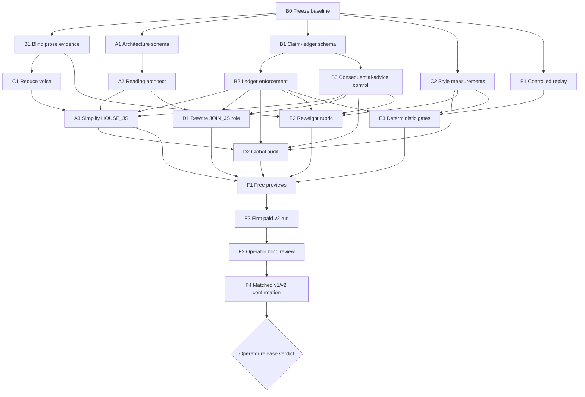

# Phase 3 prose repair sprint

**Status:** Final v2 proof generated and visually inspected; waiting at the operator review gate. No production workflow has been pushed, activated, uploaded, or committed.

**Goal:** Produce roughly 7,800–8,600 words of delivered prose and a roughly 32-page reading that retains the locked tarot and fulfilment behavior while reading like a coherent human-written essay rather than twelve executions of the same template.

**Current review artifact:** `02-phase3-operator-review-v2-b.pdf` — 34 pages. It contains the buyer-facing reading and the revised 28-night gift only. Prompt notes, audit findings, and grader scores are outside the PDF. `Sarah` is the dry-run fixture name; the live build reads Stripe metadata `firstName` and falls back to `Friend`.

**Current evidenced defect:** The advisory grader passes the final proof but still hears a mild recurrence of a “cost” move in houses 5, 7, 8, and 9. It does not repeat an exact construction and the deterministic audit reports zero repeated cross-house eight-grams. This remains visible for the operator to judge rather than being silently labelled solved.

**First dry-run evidence:** 8,325 delivered prose words, 7,584 interpretation words, twelve houses between 586 and 745 words, 33 pages, zero generic claims about women, zero method-announcement candidates, 67 teaching-conditionals, 16.9-word mean sentence length (SD 10.8), 88.2-word mean paragraph length, and one repeated ten-word span across houses 5 and 8. Promise, draw, build, architecture, image, and pagination checks pass. The prose grader fails line 13; the release gate remains closed.

**Exact first-run commands:**

```text
node scripts/dryrun-02-reading.mjs --order cs_phase3_v2_20260910_b --artifact cs_phase3_arch_v2_20260910_e --arc v2 --draw docs/02/dryrun-02-draw-cs_phase3_arch_v2_20260910_d.json
node scripts/dryrun-02-reading.mjs --order cs_phase3_v2_20260910_b --artifact cs_phase3_arch_v2_20260910_e --arc v2 --regrade docs/02/dryrun-02-reading-cs_phase3_arch_v2_20260910_e.md
node scripts/make-02-pdf.mjs --from dryrun-02-reading-cs_phase3_arch_v2_20260910_e
```

**Primary buyer test:** An intelligent woman aged 55+ should feel personally addressed, respected, taught something useful, and able to trust which details come from her material. She should not be able to predict the next house's rhetorical structure.

**Operator feedback at the first blind look (2026-09-10):** “its a huge upgrade.” The operator proposed underlining or bolding takeaways so a long reading is easier to scan. Treat this as evidence for restrained emphasis, while preserving the prose as an essay and avoiding a repeated visual formula.

**Independent blind-agent scorecard (2026-09-10):** Readability 7/10, trust 3/10, humanness 7/10, personal relevance 6/10, desire to continue 6/10, likelihood to recommend 4/10. Decision: **REVISE AND REVIEW AGAIN**. It wanted to continue after the opening and judged the document substantial, but found repeated unsupported certainty, consequential advice in house 3, a predictable image→correction→claim→action progression, and a self-confirming claim in the fixed ledger gift. Its recommendation to hedge every forecast conflicts with the locked promise contract; retain the promised verdicts while removing invented supporting biography and high-consequence instructions.

## Final v2 proof evidence — 2026-09-10

- [x] Generated with `--order cs_phase3_v2_20260910_d --artifact cs_phase3_trust_v2_20260910_i --arc v2`.
- [x] Preserved draw hash `041f1bc3ccd784c3`, architecture hash `008f41282e4fbd3b`, and prose build revision `14ba7b912dc41630` in the reading artifact.
- [x] Delivered 8,352 buyer-facing prose words: 352 opening, 7,521 interpretation, and 479 close.
- [x] Kept all twelve interpretations within 530–743 delivered words.
- [x] Produced zero repeated cross-house eight-grams, zero demographic claims about women, and zero terms of endearment.
- [x] Recorded 433 sentences at 17.37 mean words with 9.99 SD; 82 paragraphs at 91.72 mean words; 82 teaching-conditional occurrences.
- [x] Passed the advisory grader at weighted 7.6/10 and recommend 8/10. The grader's mild “cost” recurrence warning remains open to operator judgment.
- [x] Rendered 13 images and exactly eight seeded bold takeaways; no underlining or model-supplied HTML is allowed.
- [x] Visually inspected all 34 pages at thumbnail scale and the opening, close, and gift at full-page scale.
- [x] Removed the two-line/one-line orphan sequence found in the first render by allowing the close to follow house 12 under its divider.
- [x] Preserved the failed `cs_phase3_trust_v2_20260910_h` draft as evidence that a fixed trust ladder becomes another repeated formula.
- [x] Added bounded local dry-run retries for transient provider 429, 529, and 5xx responses after a real 529 stopped the first attempt.

### G — Formatted takeaways

- [x] Confirm the current reading renderer escapes Markdown rather than rendering `**bold**` inside generated prose.
- [x] Use a controlled renderer marker rather than allowing arbitrary model HTML or raw Markdown.
- [x] Prefer bold to underlining unless the operator requests underline after seeing a proof; underlining conventionally resembles a link.
- [x] Set the proof limit to at most one short takeaway per house, roughly one emphasis every two pages, and never emphasize predictions, dates, money, or third-party claims.
- [x] Seed placement across early, middle, and late positions so emphasis does not always become a closing formula.
- [x] Reject missing, duplicated, nested, or paragraph-spanning markers before rendering.
- [ ] Render a two-house proof before spending on another full reading.
- [x] Inspect the proof at full-page size and thumbnail size for scanability and sales-letter appearance.
- [x] Add the selected rule to the confirmation-run PDF audit.

## Locked constraints

- [x] Keep twelve newly drawn cards per buyer from the sixteen-card pool.
- [x] Keep promises pinned to rooms 2, 5, 8, and 12.
- [x] Keep `THE CARD DECIDES HOW, NEVER WHETHER`.
- [x] Keep reversals off.
- [x] Keep arc-guided drawing by v1/v2 letter metadata.
- [x] Keep v2 responsible for both sales letters.
- [x] Keep `claude-opus-5` as the writer.
- [x] Keep the rendered Waite block before each interpretation.
- [x] Keep every interpretation between 500 and 800 words.
- [x] Keep the full delivered prose near 8,000 words and roughly 32 pages.
- [x] Keep one dated room only: room 5.
- [x] Keep timing relative; never introduce a calendar date.
- [x] Keep card-lore accuracy and the successful anti-template-bleed checks.
- [x] Edit the generator/spec and rebuild the n8n artifact; never hand-edit the n8n JSON.
- [x] Do not push, activate, upload, or commit during this sprint unless separately authorized.

## Evidence rule

No task is complete because a prompt looks better or a model grader says `PASS`. Every completed box must point to an artifact, measurement, or operator verdict.

- [x] Record the command used for every preview and dry run.
- [x] Always supply an explicit `--order <id>`.
- [x] Save the draw JSON beside every generated reading.
- [x] Save before/after counts rather than describing improvement from memory.
- [x] Quote the exact offending output when logging a prose failure.
- [x] Map every unsupported personal claim to the missing source that makes it unsupported.
- [x] Keep automated scores separate from the operator's verdict.
- [ ] Do not mark the sprint complete until the operator has read the final PDF.

## Baseline

### B0 — Freeze current artifacts

- [x] Preserve `dryrun-02-reading-cs_phase3_v1_20260910_c.md`, PDF, HTML, and draw JSON.
- [x] Preserve `dryrun-02-reading-cs_phase3_v2_20260910_b.md`, PDF, HTML, and draw JSON.
- [x] Record current word counts, page counts, per-house word counts, cross-references, dates, first-person phrases, repeated n-grams, sentence length, paragraph length, and teaching conditionals.
- [x] Record the current v1 repeated opener family across rooms 2, 9, and 11.
- [x] Record the current v2 unsupported duration claim in room 5.
- [x] Record the current estimated customer recommendation score as a hypothesis, not a measured customer result.

**Done evidence:** A baseline table containing file paths, exact counts, quoted failures, and the command that produced each count.

### B1 — Annotate the prose blind

- [x] Select six representative passages from v1 and six from v2.
- [x] Tag one strong teaching passage in each reading.
- [x] Tag mechanical openings and endings.
- [x] Tag repeated argument transitions.
- [x] Tag demographic generalizations.
- [x] Tag unsupported personal claims.
- [x] Tag instructions whose consequence is disproportionate to their evidence.
- [x] Annotate equivalent functions in the three gold PDFs without copying gold prose into a production prompt.

**Done evidence:** A prose evidence sheet with source page/house, quotation, function, fault, and gold-standard counterpart.

## Workstream A — Reading architecture

### A1 — Define a prose architecture schema

- [x] Define JSON fields for each room's primary interpretive task.
- [x] Define optional allocations for teaching, analogy, normalization, application, cross-room evidence, and ending function.
- [x] Define a 500–800-word allocation for every room.
- [x] Give promise rooms more room without forcing identical structure.
- [x] Ensure no rhetorical element is mandatory in all twelve rooms.
- [x] Avoid named formats, sample sentences, example nouns, or vivid example lore.
- [x] Seed every allocation from the order ID.

**Done evidence:** A schema fixture for v1 and v2 showing twelve distinct allocations and no prose.

### A2 — Add the reading architect

- [x] Add a deterministic architect stage before the twelve house writers.
- [x] Make the architect output structured data only.
- [x] Validate required fields and reject malformed plans before paid writing calls.
- [x] Pass only the relevant room allocation to each house writer.
- [x] Store the architecture plan with the dry-run artifacts.

**Done evidence:** Two saved architecture JSON files generated from explicit v1 and v2 order IDs.

### A3 — Simplify `HOUSE_JS`

- [x] Remove the ordered mandatory ladder from every house call.
- [x] Retain the ladder's useful ingredients as optional room allocations.
- [x] Remove requirements that make writers announce their reasoning stages.
- [x] Keep the compact lore and obligation inputs.
- [x] Keep previous-house signatures for repetition awareness.
- [x] Confirm that the writer sees no worked prose example.

**Done evidence:** Free previews from at least rooms 5 and 7 showing different paragraph-role sequences.

## Workstream B — Claim control and trust

### B1 — Define the claim ledger

- [x] Define allowed source classes: buyer fact, sales promise, arc obligation, card lore, house meaning, cross-room evidence, required forecast.
- [x] Require each hard personal claim to have a source class.
- [x] Distinguish a hard personal claim from an illustrative possibility.
- [x] Distinguish a promised forecast from invented biography around that forecast.
- [x] Define prohibited unsupported additions: duration, profession, possession, diagnosis, private ritual, relationship history, tally, and location.
- [x] Define proportionate and reversible action guidance.

**Done evidence:** A room-by-room claim ledger fixture for one v1 and one v2 draw.

### B2 — Generate and enforce the ledger

- [x] Build each room's permitted claim ledger before writing.
- [x] Pass only permitted claims and their evidence to the house writer.
- [x] Add a post-generation unsupported-claim audit.
- [ ] Make the audit identify the sentence and missing source.
- [ ] Regenerate only the failed room.
- [ ] Cap targeted regeneration attempts and preserve every failed artifact for diagnosis.

**Done evidence:** An adversarial test catches an invented duration while retaining the required known-man verdict.

### B3 — Control consequential advice

- [x] Detect imperatives involving relationships, money, health, law, housing, or employment.
- [x] Require those actions to be reversible and proportionate unless explicitly promised by the product.
- [x] Keep firm tarot conclusions without converting them into unsupported irreversible instructions.
- [ ] Route any failure to targeted room repair.

**Done evidence:** Room 7 can state the card's conclusion without instructing the buyer to take an irreversible step.

## Workstream C — Voice and reader relationship

### C1 — Reduce `VOICE`

- [x] Address one intelligent adult rather than a demographic category.
- [x] Keep the essayist voice and remove psychic hedging.
- [x] Allow the argument to earn certainty.
- [x] Make first person optional.
- [x] Remove house-level expectations for terms of endearment.
- [x] Make normalization conditional on a real source of self-reproach.
- [x] Instruct the writer not to announce the stages of its reasoning.
- [x] Keep the voice prompt positive and compact.
- [x] Put phrase detection in the audit, not as a long phrase list in the writer prompt.

**Done evidence:** Active cached voice is materially shorter and contains no worked example.

### C2 — Add whole-reading style measurements

- [x] Count terms of endearment across the reading; target no more than three.
- [x] Count generic assertions about women; target no more than two and require material relevance.
- [x] Count repeated eight-word sequences across rooms; target zero outside fixed boilerplate.
- [x] Cluster normalized opener and ending structures; target no family in more than two rooms.
- [x] Measure sentence length; diagnostic target mean 18–21 words.
- [x] Measure paragraph length; diagnostic target mean 65–95 words.
- [x] Measure teaching conditionals; diagnostic target 50–80 across the reading.
- [x] Measure sentence-length variance so a good mean cannot hide clipped repetition.
- [x] Report metrics without automatically failing narrow stylistic misses.

**Done evidence:** Metrics are printed by preview/dry-run tooling and saved in the artifact.

## Workstream D — Opening, close, and continuity

### D1 — Rewrite `JOIN_JS` responsibilities

- [x] Make the opening orient the buyer to the table and one or two genuine patterns.
- [x] Prevent the opening from listing the four promised verdicts.
- [x] Preserve discovery of individual rooms.
- [x] Make the close resolve two or three important relationships between rooms.
- [x] Restate room 5 timing without creating a second date.
- [x] Give one immediate, proportionate action.
- [x] Prevent the close from introducing a new claim.
- [x] Pass the claim ledger to the joiner.

**Done evidence:** Opening contains at most two thematic tensions; close adds zero unsupported claims and cites no more than four rooms/cards.

### D2 — Add a global audit before joining

- [ ] Audit repeated openings, endings, transitions, analogies, and paragraph-role sequences.
- [ ] Audit demographic lecturing and repeated intimacy markers.
- [ ] Audit unsupported personal claims and consequential imperatives.
- [ ] Audit contradictions and unsupported cross-room connections.
- [ ] Return structured findings only; do not globally rewrite the reading.
- [ ] Send only failed rooms to targeted repair.
- [ ] Run the joiner after repaired rooms pass.

**Done evidence:** A fixture with planted failures returns the correct room numbers and fault categories.

## Workstream E — Reproducible evaluation

### E1 — Add controlled replay

- [x] Separate the deterministic order seed from the output artifact name.
- [x] Allow a saved draw and architecture plan to be replayed after a prompt change.
- [x] Require an explicit order ID for comparisons.
- [x] Print the build revision, order ID, draw hash, and architecture hash in the report.
- [x] Prevent replay mode from reaching upload or production nodes.

**Done evidence:** Two prompt versions produce readings from the same draw and allocation while preserving separate files.

### E2 — Reweight the rubric

- [x] Make desire to continue reading the highest-weight prose criterion.
- [x] Score trust and evidentiary discipline.
- [x] Score structural variation across rooms.
- [x] Score teaching quality and clarity.
- [x] Retain tarot and promise accuracy.
- [x] Stop rewarding raw insight density as a proxy for quality.
- [x] Keep model grading advisory after deterministic gates.

**Proposed weighting:**

| Criterion | Weight |
|---|---:|
| Desire to continue reading | 25% |
| Trust and supported specificity | 20% |
| Human structural variation | 20% |
| Teaching and clarity | 15% |
| Personal relevance | 10% |
| Tarot and promise accuracy | 10% |

**Done evidence:** The current flawed v2 artifact cannot receive an overall pass without its unsupported duration being surfaced.

### E3 — Keep deterministic release gates

- [x] Every room contains 500–800 interpretation words.
- [x] Total delivered prose contains approximately 7,800–8,600 words.
- [x] Promise evidence appears in rooms 2, 5, 8, and 12.
- [x] Other cross-room references remain sparse.
- [ ] There are zero unsupported personal claims.
- [x] There are zero unsupported irreversible directives.
- [x] There are zero repeated cross-room eight-word sequences outside boilerplate.
- [x] There is one dated room only.
- [x] There are no calendar dates.
- [x] The close marker is present.
- [x] Promise checker passes.
- [x] Draw checker passes.
- [x] PDF renders without missing images, blank pages, or stranded headings.

## Workstream F — Dry runs and human gate

### F1 — Free previews

- [x] Preview room 5 v2 with an explicit order ID.
- [x] Confirm its full promise ledger remains present.
- [x] Confirm it invents no duration or biography.
- [x] Preview room 7 with an explicit order ID.
- [x] Confirm the conclusion remains firm.
- [x] Confirm its action is proportionate and reversible.
- [x] Compare their paragraph-role sequences.

**Required commands after any prompt/spec edit:**

```text
python3 scripts/build-02-n8n.py
node scripts/check-02-promises.mjs
node scripts/check-02-draw.mjs
node scripts/check-02-architecture.mjs
node scripts/preview-02-prompts.mjs --house 5 --arc v2 --seed <explicit-order-id>
```

### F2 — First paid dry run

- [x] Generate v2 first because it carries the largest instruction and promise load.
- [x] Use a frozen explicit order ID.
- [x] Preserve Markdown, HTML, PDF, draw JSON, architecture JSON, claim ledger, and audit report.
- [x] Run deterministic gates before reading the model grade.
- [x] Render and inspect every PDF page.
- [x] Log exact quotations for every failure.
- [x] Do not patch acceptable houses because another house failed.

**Expected shape:** 7,800–8,600 interpretation words, roughly 32 pages, twelve visibly different argumentative shapes, no unsupported biography, four promise rooms, and one dated room.

### F3 — Operator blind review

- [x] Give the operator an anonymized PDF without prompt notes or grader scores.
- [ ] Ask whether they want to continue after the opening and three randomly chosen houses.
- [ ] Ask whether any passage speaks down to the buyer.
- [ ] Ask whether any exact personal detail feels invented.
- [ ] Ask whether the next paragraph or house becomes predictable.
- [ ] Ask for readability, trust, humanness, relevance, and likelihood-to-recommend scores.
- [ ] Keep the operator's quotations as release evidence.

**Operator gate:** Median category score at least 8/10 and no unresolved stop-reading defect.

### F4 — Confirmation runs

- [ ] Apply only changes supported by the first dry run and operator review.
- [ ] Rebuild and rerun all required static checks.
- [ ] Generate one matched v1 confirmation reading.
- [ ] Generate one matched v2 confirmation reading.
- [ ] Repeat the complete artifact and PDF audit.
- [ ] Confirm locked draw and promise behavior has not changed.
- [ ] Obtain the operator's final verdict before any deployment action.

## Sprint dependency graph



## Parallel sprint lanes

| Lane | Work that can run in parallel | Starts after | Must join before |
|---|---|---|---|
| 1 — Evidence | B1 blind annotation | B0 | C1, E2 |
| 2 — Architecture | A1 schema, then A2 architect | B0 | A3, D1 |
| 3 — Trust | B1 claim schema, then B2 and B3 | B0 | A3, D1, D2, E2, E3 |
| 4 — Instruments | C2 style metrics and E1 replay | B0 | D2, E3, F1 |
| 5 — Voice | C1 voice reduction | B1 | A3 |
| 6 — Assembly | D1 joiner and D2 global audit | A2/B2/B3/A3/C2 | F1 |
| 7 — Evaluation | E2 rubric and E3 gates | Evidence/instruments/trust | F1 |
| 8 — Runs | F1, F2, F3, F4 | All implementation lanes | Release verdict |

## Suggested sprint sequence

### Sprint 0 — Evidence and contracts, approximately half a day

- [x] Complete B0.
- [x] Run B1, A1, B1 claim schema, C2 measurement design, and E1 replay design in parallel.
- [x] Review schemas together before implementation.

### Sprint 1 — Core generation, approximately one day

- [x] Implement A2, B2, and B3 in parallel after their schemas are accepted.
- [x] Implement C1 from the prose evidence.
- [x] Join the lanes in A3.
- [x] Run free room 5 and room 7 previews before continuing.

### Sprint 2 — Whole-reading control, approximately half a day

- [x] Implement D1.
- [ ] Implement D2's separate structured repair loop.
- [x] Implement E2 and the deterministic parts of E3.
- [x] Add controlled replay.
- [x] Run all static checks.

### Sprint 3 — Generated evidence, approximately half to one day

- [x] Complete F1.
- [x] Complete F2 only after free previews pass.
- [ ] Complete F3 before changing the prompts again.
- [x] Log generated-artifact defects as evidence-backed issues.

### Sprint 4 — Confirmation, approximately half a day

- [x] Repair only evidenced defects from the blind scorecard and generated drafts.
- [ ] Complete F4.
- [ ] Stop at the operator release verdict.

## Cost and stop conditions

- [x] Use free previews until rooms 5 and 7 pass their specific gates.
- [ ] Budget one first v2 dry run and two confirmation runs.
- [ ] Expected base model cost: approximately $2.10 at the supplied $0.70 per reading.
- [ ] Allow up to approximately $3.50 for targeted room regeneration or one failed confirmation.
- [x] Stop paid generation if the same structural fault appears in three or more rooms; repair the shared instruction first.
- [x] Stop paid generation if a promise, draw, date, or lore gate fails; fix the deterministic contract first.
- [x] Stop implementation if a proposed fix requires a worked prose example inside a production prompt.
- [x] Stop before deployment, activation, upload, or commit and obtain separate authorization.

## Final release checklist

- [ ] Operator has read the anonymized final PDF.
- [ ] Operator says the prose is fit to charge for.
- [ ] Likelihood-to-recommend score is at least 8/10 in the operator review.
- [ ] No unresolved stop-reading passage remains.
- [ ] No unsupported personal claim remains.
- [ ] No repeated rhetorical formula dominates the houses.
- [x] Promise checker passes.
- [x] Draw checker passes.
- [x] Grader passes, with its result treated as supporting evidence only.
- [ ] Final v1 and v2 PDFs have been visually inspected page by page.
- [x] No n8n JSON was hand-edited.
- [x] No production workflow has been pushed or activated without explicit authorization.
