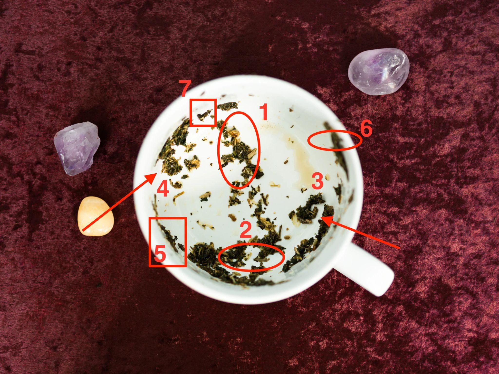

# %FIRSTNAME% - While Drinking My Tea I Noticed Something Extraordinary

*These tea leaves tell me an interesting story*

As you examine the patterns formed by the tea leaves, we  notice the following symbols:

**The first symbol: a bird taking flight**

The bird represents the man in question pulling away, seeking freedom, and distancing himself from the relationship.

It could indicate that he is going through a personal struggle, or that he is unsure about the future of the relationship.

He might even be looking at another woman.

**The second circle: a broken heart**

This symbol signifies the emotional turmoil and heartache that may arise from the uncertainty surrounding your relationship.

It highlights the fragility of your connection and the importance of the RIGHT COMMUNICATION and texts before everything falls apart.

**The third symbol: a withering tree**

The tree, which once stood tall and strong, now appears to be withering.

Symbolizing the instability and decline of the relationship.

This suggests that the foundation you once had is becoming shaky and NEEDS nurturing in order to regain its strength.

The man who was once HEAD OVER HEELS for you.

Is now playing HOT and COLD games.

**The fourth symbol: a boat on stormy waters**

The boat, tossed by turbulent waves, represents the challenges and obstacles that you and your partner are facing during this period of uncertainty.

It is a reminder that navigating through these difficulties together can ultimately strengthen your bond, but only if both parties are committed to weathering the storm.

But there’s good news too…

As we continue to examine the patterns formed by the tea leaves, three additional symbols appear, adding depth and nuance to the narrative of the shaky relationship:

**A bridge:**

This symbol represents the possibility of re-establishing the connection between you and the man who is pulling away.

BUT ONLY if you do the right thing and don’t build a bridge for him to walk away.

Rather a bridge that invites him to CHASE YOU AGAIN until the end of the earth.

**A lighthouse:**

The lighthouse stands tall amidst the storm.

Offering guidance and hope during the darkest moments of your relationship. This symbol suggests that there is a source of support or wisdom in your life, perhaps a close friend, family member, or even a counselor, who can provide valuable advice and help you navigate the challenging times.

**A butterfly:**

A symbol of transformation and renewal, the butterfly indicates that positive change and growth are possible for both you and your partner.

This metamorphosis may require letting go of old habits or patterns that no longer serve your relationship, making way for a new and healthier dynamic to emerge.

With the addition of these three symbols, your tea leaf reading presents a more complete picture of the situation.

The bridge, lighthouse, and butterfly offer a sense of hope and potential for healing amidst the uncertainty of the shaky relationship.

By fostering open communication, seeking guidance from trusted sources, and embracing the opportunity for growth and transformation, you and your partner can work towards overcoming the challenges and strengthening your bond.

If you’d like to have the full TEA READING from me - just click here.

Do note that this is purely optional but I highly recommend you get the full tea reading so you know EXACTLY what to do to navigate these difficult times.

=> Click here to get the full reading.

P.S. I don’t have much time to actually do this - and as you can imagine MANY people want to chat to me on a daily basis. So hurry up and reserve your spot.

=> Book your reading here.

#### $$$ Subject Lines

Here’s what tea had to say about your future

#### $$$ Brain Dump

Bullet points for all numbers, revealing half and teasing

Price point - - 1 USD - 11.70 USD - tomorrow 17 - then 27 and then 37
