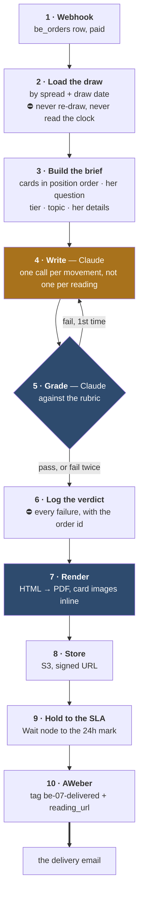

# 07 — the n8n fulfilment plan

**What it does:** an order arrives, and 24 hours later a PDF lands in her inbox containing a reading
written by Claude against the exact cards she was shown, with those cards printed in it.

⛔ **Nothing here is built.** This is the plan, not a record.

> **The graph now exists as importable JSON** — [`07-fulfilment.n8n.json`](./07-fulfilment.n8n.json),
> generated by [`scripts/build-07-n8n.py`](../../scripts/build-07-n8n.py). Read
> [`07-fulfilment-README.md`](./07-fulfilment-README.md) first: it lists what the workflow assumes,
> the five endpoints that do not exist yet, and why it was authored as JSON rather than built
> through the n8n MCP. Nothing is imported, nothing is active.

---

## The shape



---

## 1–2 · Trigger and the draw

The webhook fires on **Stripe's `checkout.session.completed`**, filtered on
`body.data.object.metadata.product` — the same trigger every other offer in the deck uses, and a
string the codebase calls load-bearing in six places. ⚠ 07 has no product key yet; `be_marcus_daily`
has to be added to `shared/backendOffers.ts` first.

⛔ **Her question does NOT travel in Stripe metadata** — values there cap at 500 characters and a
real question runs longer. The workflow takes the session id and fetches the order joined to the
draw from our own API. `be_orders` has no `spread`, `draw_date`, `tier` or `question` column today;
that migration comes first.

⛔ **The workflow never draws cards and never looks at the clock.** It loads the stored draw by
`spread` + `draw_date` — the same record the email and the booking page rendered from. If it drew
its own, the cards in the PDF would not be the cards she was shown, and that is the one failure the
whole offer cannot survive.

**Tier decides how much of the record it reads:**

| Tier | Cards |
|---|---|
| The Spread | the day's spread entire — 8 on a Two Doors day |
| The Pattern | + The Undertow's five |
| The Table | + The Other Chair's five |

---

## 3–4 · Writing it

### Model choice

| Job | Model | Why |
|---|---|---|
| **The reading** | **Claude Opus 5** (`claude-opus-5`) | Voice discipline over 1,000–2,600 words is the whole product. This is not the place to save money |
| **The grader** | **Claude Sonnet 5** (`claude-sonnet-5`) | A rubric check is a cheaper task than the writing, and a different model marking its own homework is worth something |
| **Position drafts** *(optional)* | Sonnet 5 | If per-position parallelism is needed for latency |

✅ Confirmed against the `claude-api` skill, 2026-09-03. ⛔ Opus 5 takes `thinking: {type:
"adaptive"}` and **rejects `budget_tokens` with a 400** — the old fixed-thinking-budget shape is
gone. Re-confirm before any future build; a model string in a document goes stale.

### ⭐ One call per movement, not one call per reading

A single call for 2,600 words drifts: the voice loosens, positions blur, and the later cards get
thinner than the early ones. Instead:

1. **One call per position**, each given the card, the position's job, her question, and what the
   earlier positions already said. Short outputs stay sharp.
2. **One call to join them** — transitions, the opening, the close.

This also makes a single bad position cheap to regenerate.

### What the prompt must carry

- ⛔ **The voice rules from [`07-P2`](../../copy/07-marcus/07-P2-the-device-set.md)** — picture before
  meaning, mirror stacks, shame removal, arithmetic not adjectives, no aphorisms, first person
  singular, no "dear"
- **The position's job**, verbatim from [`07-P1`](../../copy/07-marcus/07-P1-the-seven-spreads.md)
- **What the email already said** about the free cards, so the PDF doesn't repeat it back to her.
  ⭐ She has read that copy; saying it again is the fastest way to look automated
- ⛔ **The guardrails**: Marcus reads the cards, never the man. No outcome promises. No claims about
  what a named third party will do

---

## 5–6 · Grading

**Regenerate once on failure, then send either way** *(operator decision)*. The mitigation is the
log, and the log only works if somebody reads it — **daily for the first two weeks**.

Rubric — each a yes/no, any *no* fails:

- [ ] Every position in the tier is present and reads its own job
- [ ] The free cards are not re-explained
- [ ] Her question is answered, in her own terms, in the first 200 words
- [ ] No outcome promise, no claim about a third party's intentions
- [ ] No hedges — predictions stated flat
- [ ] Voice: no "dear", no aphorism, no balanced-clause cadence
- [ ] Picture before meaning on every card
- [ ] Word count within ±20% of the tier

---

## 7 · The PDF, with the cards in it

**Route: HTML → PDF.** Not markdown → Word → PDF. A tarot reading is a layout problem — a card
image sitting beside its own passage — and HTML gives per-position control that a Word template
does not.

**Renderer:** headless Chromium behind an HTTP call, so n8n stays orchestration and the render is
one node.

**Structure, per position:**

```
┌──────────────────────────────────────────┐
│  III · WHAT IT COSTS                      │  ← position name, ochre, letterspaced
│  ┌────────┐                               │
│  │  card  │   Two or three paragraphs      │  ← image left, text right
│  │  image │   about this card in this      │
│  └────────┘   position, on her question    │
└──────────────────────────────────────────┘
```

- Cards come from **`assets/tarot-rws/`** — the REPO ROOT, not this folder. 104 PNGs; the S3 JPGs
  at `evelyn/tarot-rws/` are converted from them by `scripts/host-be-asset.cjs`
- ⚠ **They are 350 × 600px** (five are 408 × 700) — about **1.2 inches** wide at 300dpi against a
  real card's 2.75. Fine beside a paragraph on a SCREEN; soft if she prints it. Decide which the
  PDF is for before commissioning a rescan
- ⛔ **There is no card back in that directory** — the 22 `-reversed` files are rotated faces. The
  only back is `marcus/card-back.jpg`, on S3, with no local copy
- **Cover** carries the spread name, the date it was cut, and her first name
- **The free cards appear too**, marked as the ones she already saw, so the spread is whole on the page
- ⛔ **The AI disclosure goes in the PDF as well as the sales page.** Sandwiched, and with the labour
  split honest: the draw is the day's real cut, the writing is assisted

---

## 8–10 · Store, hold, deliver

Signed S3 URL under a `07/readings/` prefix. ⛔ **Never `evelyn/tarot/`.**

**Hold to the 24h mark with a Wait node**, do not send on completion. The SLA is a promise; arriving
in ninety seconds reads as machine-made and prices the product down.

⚠ **The market at $35 expects same-day.** Holding to 24h is defensible only while the bump sells
speed — if the bump becomes something else, revisit the SLA rather than the promise.

Delivery is the AWeber tag plus `reading_url`. **The tag is the send.**

---

## Build order

1. The **draw record** — schema, generator, and the read the email and booking page both use.
   ⛔ Everything else depends on it
2. The **prompt set** — one per position job, plus the joiner. Prove the voice on a hand-run before
   any automation exists
3. The **grader rubric** as a callable, scored against a handful of deliberately bad readings
4. The **PDF renderer** — the layout, with real cards, before it is wired to anything
5. **Wire the n8n graph**, end to end, against a test order
6. **The log**, and whoever reads it

## Open

- [ ] Where the draw record lives — Supabase table, or flat files in the repo
- [x] ~~Print-resolution card art~~ — **answered.** `assets/tarot-rws/` (repo root) holds 104 PNGs
      at 350×600. Enough for on-screen reading, ~2.4× short for print. The open question is now
      *"is the PDF meant to be printed?"* — not *"where is the art?"*
- [ ] Chromium render host — self-run or a service
- [ ] Signed-URL expiry, and what happens when she opens it in a year
- [ ] Cost per reading at each tier, so the $35 / $57 / $87 ladder holds up
