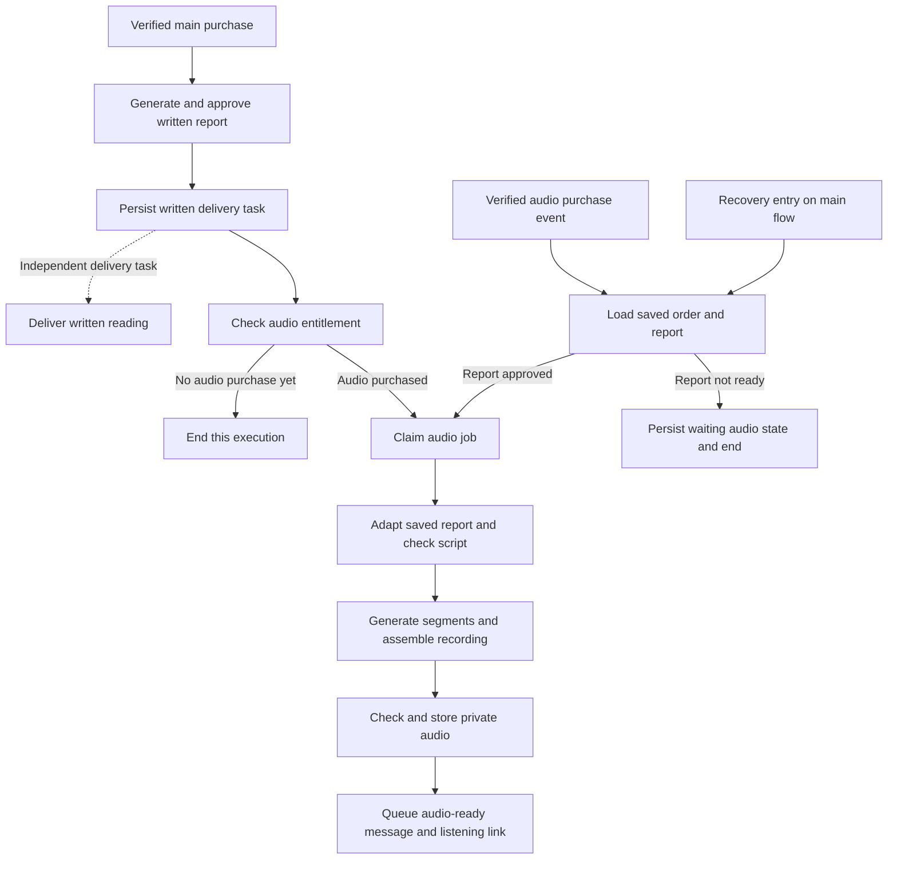

# 08 Marcus — n8n audio fulfillment build plan

> **Latest confirmed decisions:** standard delivery within 24 hours; +$12.77 bump within 12 hours, both measured from confirmed main payment. Audio shares that order deadline. Use Replicate Chatterbox with the Marcus voice Joel will supply. Create a NEW Marcus n8n workflow; existing workflows must remain untouched. See the delivery policy and Chatterbox setup in the n8n folder. These decisions supersede older open-timing/provider notes below.

Status: proposed implementation, 2026-09-10. Local-first authorization remains in force. This is a build specification, not an installed workflow. Replicate Chatterbox and 24h/12h shared deadlines are selected; reference voice and final audio price remain pending.

Related: [audio product scope](../upsell-1-audio/SCOPE.md) · [copy shape](../upsell-1-audio/SHAPE.md) · [funnel checklist](../FUNNEL-BUILD-CHECKLIST.md) · [local data contract](../data/CONTRACT.md).

## The result we need

A verified audio purchase produces a narrated version of that buyer’s approved written report. The customer gets a private listening link. It plays the saved interpretation of her own paid draw through her name-derived personal card’s meaning.

The audio branch never draws cards, invents a second reading, changes the underlying report, or postpones the written delivery. Buying audio after the report is ready must work just as well as buying it while the report is being written.

Recommended first product: a complete spoken version of the report, lightly edited for listening, without music. A private player supports play/pause, seeking, and speed control. Download access is a product decision. Do not add promises about recording length, Marcus personally recording it, or delivery speed until those facts are approved.

## Where n8n fits — a branch of the main 08 flow

**Decision, 2026-09-10: build audio as a chain inside the main 08 fulfillment workflow.** The earlier proposal for four separate audio workflows is superseded. Sections below describe stages within that main workflow, not separately deployed workflows.

The main report-complete path saves/queues written delivery before it starts audio work. It must not wait for narration to finish before allowing the written delivery task to run. No merge barrier ties written delivery to audio success. Delivery tasks can be dispatched by another execution of the same main workflow; a long audio node must not sit in front of the written send.

There are two ways to enter the same audio chain:

1. The main reading flow approves the report, then checks whether audio was purchased.
2. A later verified audio-purchase event re-enters the main workflow at an explicit **audio-resume** route. It loads the existing approved report and jumps to audio; it does not rerun the main reading chain.

If the purchase arrives before report approval, persist waiting state and end that execution. The report-complete path picks it up. A recovery entry checks missed or interrupted work. Do not keep a long-lived execution open while waiting for the customer to decide, and do not assume the upsell purchase happened before a single `IF` check.

The application verifies payment and owns durable order/job records in Supabase. n8n coordinates generation, checks, and delivery through authenticated backend operations. Each event asks the same backend operation whether the order is eligible; an atomic claim admits one execution to audio. If main completion and late purchase arrive together, only one may generate it.

**Separate product/job state, shared workflow canvas.** Written report, audio and delivery retain independent status and retry records even though their processing lives in the same main flow. The backend must validate the event and order state; a client-supplied “resume at audio” flag is not authorization.

## Stage A — entry and reconciliation inside the main workflow

| Step | n8n node / responsibility | Result and failure behavior |
|---|---|---|
| A1 | Webhook with service authentication | Accept a backend event reference, not a browser claim that audio was paid. Validate structure. |
| A2 | HTTP Request: persist/reconcile event | Backend verifies entitlement and report status, deduplicates event, and durably creates waiting/queued job. |
| A3 | Respond to Webhook | Acknowledge after durable acceptance, before expensive generation. On persistence failure return a retryable error. |
| A4 | Switch/IF: route to shared audio branch | Route eligible work to the shared audio branch in this workflow. A missed execution is recovered by the sweep. |

Webhook response handling is supported by n8n’s [Respond to Webhook node](https://docs.n8n.io/integrations/builtin/core-nodes/n8n-nodes-base.respondtowebhook/). The persistence-before-acknowledgment rule above is our proposed design, not a built-in guarantee.

Use only opaque event/order references in trigger payloads. Load the actual names, report and cards through authenticated backend access. Backend payment handling must not wait for speech generation to finish.

## Stage B — audio chain after the approved report

| Step | Node / service | What must be built |
|---|---|---|
| B1 | Main-flow audio entry → HTTP Request | Atomically claim eligible job with a lease and owner token. Stop if another worker owns it, it is already complete, or entitlement was cancelled. |
| B2 | HTTP Request: load bundle | Fetch approved report version/hash, question, exact saved draw, personal card/method version, language, voice/config version, and approved audio deadline if defined. |
| B3 | Code or backend script adapter | Convert approved structured prose to spoken text. Strip markup, URLs, image alt text and layout labels; verbalize headings/numbers without losing meaning. |
| B4 | Script QA → IF | Check every report section is accounted for, same card names/order/conclusions, and no invented personalization. On failure save a review state; do not narrate an unapproved rewrite. |
| B5 | HTTP Request: save script manifest | Save script version/hash, section IDs, ordered segment text/hash and pronunciation overrides before provider calls. |
| B6 | Loop Over Items → HTTP Request | Generate pending segments within the chosen provider’s text/rate limits. Save provider job IDs and results per segment. Skip segments already valid and stored. |
| B7 | Wait/poll or authenticated completion callback, if needed | For asynchronous providers, persist provider job ID and resume by it. Poll with a deadline; validate callbacks and tolerate duplicates. Synchronous providers skip this step. |
| B8 | HTTP Request: media worker | Assemble ordered segments into one playable file, with consistent codec/sample rate/volume and deliberate pauses. Optional chapter offsets come from segment boundaries. |
| B9 | Media checks → IF | Check decode, non-empty duration, segment count/order, missing/truncated speech, volume and unintended silence. Human listening review for initial samples and flagged cases. |
| B10 | HTTP Request: publish artifact record | Save private audio key, transcript key, hashes, duration, format and source versions; re-check cancellation and lease ownership. Mark ready only after the stored file is accessible and passes QA. |
| B11 | HTTP Request: queue delivery | Create one delivery task for this artifact. Main written delivery is independent. |

The [HTTP Request node](https://docs.n8n.io/integrations/builtin/core-nodes/n8n-nodes-base.httprequest/) supports JSON requests and file responses. Provider-specific authentication, polling and limits must be filled in only after choosing the provider.

### Script rules

Use the approved report text as the source, rather than asking an LLM to perform another reading. Start with deterministic cleanup. If spoken adaptation needs an LLM, give it the report and a restricted editing brief; save and check the output before narration. Prefer section-based comparison over judging only overall similarity.

The script should contain the report’s short opening, its explanation of the personal card, each paid position, the connections between them, and the closing reflection. Brief free-card context may remain where needed. Do not paste the entire daily email into the audio or re-read free positions as newly purchased material.

Do not read internal words such as “lens version,” markdown markers, status labels, asset URLs, or code. Customer names and tarot pronunciations need a versioned pronunciation policy. A voice choice and any authorized voice material are explicit configuration; the workflow does not select a different narrator on each retry.

A future approved correction to a written report requires an explicit replacement-audio version. Never silently change the source version in an in-flight or previously delivered audio job.

### File handling and media assembly

Proposed durable destination: existing private S3/object storage, with artifact metadata in Supabase. Confirm the project’s storage choice before implementing; the customer contract does not depend on the bucket vendor.

Prefer a small media worker that fetches stored segments, uses a media tool to assemble/check them, and returns artifact metadata. Do not assume n8n Cloud provides a shell, ffmpeg, or a shared local disk. Avoid moving large base64 audio through every workflow node or putting it in SQL text fields.

Inspect the target n8n hosting mode before deciding how temporary binary data is handled. n8n documents the memory impact and storage modes in [binary-data handling](https://docs.n8n.io/hosting/scaling/binary-data/). Its internal execution storage is separate from the permanent private bucket that serves customer recordings. Do not assume a configured customer bucket automatically configures n8n’s binary storage.

## Stage C — audio delivery branch and listening page

- [ ] Claim a ready artifact’s delivery task and reload the current verified recipient address.
- [ ] Create a stable protected listening-page link. The page verifies an access token/session and obtains a fresh short-lived media URL. Do not email an expiring storage URL as the only long-term access path.
- [ ] Build the audio-ready message with first name, purchased question, listening link, and accurate delivery wording. Proposed subject: “Your audio reading is ready, %FIRSTNAME%.”
- [ ] Send through the selected transactional/provider adapter. If reusing AWeber, prove repeat purchases can trigger separate deliveries; a tag already present on a subscriber must not swallow the next day’s audio.
- [ ] Store send attempt ID/provider message ID and status. Provider acceptance is `sent`; claim `delivered` only when corresponding provider evidence is available. Playback is a separate event and is not email delivery.
- [ ] If a send times out after possible provider acceptance, reconcile by message/idempotency reference before resending. Do not promise exactly-once email delivery without provider support.
- [ ] Capture bounce/failure signals and show a support-visible recovery action. Keep the written order intact if the audio email fails.
- [ ] Build player states: waiting for audio, ready, temporarily unavailable, expired/invalid access and recoverable access-link refresh. Support keyboard controls, transcript, mobile playback and byte-range media delivery for seeking.
- [ ] Support a requested resend by reusing the approved artifact. Resending a link never redraws, rewrites or regenerates the recording.

The thank-you page reads audio status from the backend. It should not call the generation workflow directly or declare the audio delivered just because the customer clicked accept.

## Stage D — recovery route on the main flow

Use a recovery entry on the main workflow, invoked by the agreed scheduler, to find paid audio waiting on a now-approved report, eligible jobs without an active lease, expired leases, finished provider jobs without recorded artifacts, overdue jobs and unresolved sends. Reconcile existing provider work before restarting it.

Record errors through explicit failed/review branches and backend job updates in the main flow. An existing shared operations error handler can remain in use, but no new standalone audio error workflow is required by this plan. n8n’s [error-handling guide](https://docs.n8n.io/flow-logic/error-handling/) documents error-handling facilities; those facilities do not replace durable business-state recovery.

Recommended retry policy: bounded backoff for transient service errors, no automatic retries for invalid text/credentials/configuration until corrected, and manual review for content mismatch. Record attempts and next retry time. Lease renewals and fencing tokens prevent a stale worker from overwriting newer successful work.

Audio shares the confirmed order deadline: 24h standard or 12h with the bump. A deadline is never permission to deliver a truncated or unreviewed recording. See [delivery policy](DELIVERY-POLICY.md) for the late-purchase edge case.

## Backend and Supabase pieces needed alongside n8n

These are proposed logical records, not applied table migrations. Extend existing storage where it can enforce the same invariants.

| Record | Required fields / constraints |
|---|---|
| Audio entitlement | Parent order ID, audio product/version, verified payment reference, amount/currency, purchase/refund/cancellation state; unique purchase reference |
| Approved report | Report ID/version/hash, order/draw reference, structured text, approved state/time |
| Audio job | Entitlement ID, pinned report ID/version/hash, script/config version, stage, lease owner/token/expiry, attempts, next retry, deadline, error; unique logical job per entitlement and explicit artifact revision |
| Audio segment | Job/script version, index/section ID, text hash, provider request/job ID, state, private object key/hash/duration, retry details; unique job + script version + segment index |
| Audio artifact | Job/revision, report/script/voice versions, private audio/transcript keys, hash, MIME type, byte length, duration, QA result, ready time |
| Delivery task | Artifact/revision, recipient reference, attempt and provider IDs, accepted/delivered/bounced timestamps where available, last error; stable idempotency identity |
| Event outbox | Event ID, type, order reference, created/acknowledged state, attempts; permits replay when n8n is unavailable |

Proposed service operations to build (names are contracts, not existing URLs):

- `reconcileAudio(orderId, eventId)` → waiting, queued, cancelled or existing-complete job.
- `claimAudioJob(jobId)` / `renewLease(jobId, token)` → one active owner.
- `loadAudioBundle(jobId)` → immutable source report and saved reading context.
- `saveScript`, `recordSegment`, `completeAudio`, `failAudio` → stage-aware writes requiring current lease token.
- `claimAudioDelivery`, `recordDeliveryAttempt`, `reconcileDelivery` → delivery lifecycle.
- `getCustomerAudioStatus` / `getListeningAccess` → restricted customer projection and playable media access.

Production operations require service authentication and ownership checks; local fake-data APIs are not a production access model. Never store voice-provider secrets in workflow JSON exports or expose private report data to analytics.

## Local-first build checklist

- [ ] Freeze the report-to-audio manifest contract; extend [local types](../../../local/08-marcus/contracts.ts) beyond the current fixture-only audio string.
- [ ] Create fake paid-audio and report-approved events in both arrival orders, plus approved sample reports for healing and commitment.
- [ ] Build a script normalizer and section-coverage check using those reports.
- [ ] Build a fake TTS adapter with success, async completion, timeout, truncated result and rate-limit fixtures. A fixture file must remain labeled a fixture.
- [ ] Add durable local job/segment/artifact/delivery storage and restart tests; the current memory-only harness is insufficient proof of recovery.
- [ ] Build media assembly/check adapter, private player and captured audio-ready email. A synthetic local sound file can test playback but cannot prove spoken content quality.
- [ ] Extend the main 08 workflow source and generated inactive n8n JSON with stages A–D; add a README of entry routing and every endpoint/credential dependency. Keep the audio branch in the main canvas. Do not repeat 07’s gap of treating missing endpoints as implemented.
- [ ] Import the main flow into an isolated local n8n instance with fake adapters; prove its report-complete branch and late-purchase resume route create playable fixture output and a captured delivery task.
- [ ] Once the voice/provider is chosen, separately authorize/configure a real sample generation test. Compare script against the recording and review pronunciation and listening quality.
- [ ] After local evidence, plan isolated provider/storage/payment integration before production activation.

## Acceptance matrix

| Test | Passing result |
|---|---|
| Purchase before report approval | One waiting job becomes eligible after approval; no fresh reading generated |
| Report approval before purchase | Audio starts when purchased; same saved report is used |
| Duplicate or simultaneous events | One logical job; no duplicate provider request where provider reconciliation is available |
| Worker restart after segment 3 | Stored segments reused, unfinished work resumed in original order |
| Provider success followed by timeout | Existing provider job reconciled before another generation request |
| Script misses a paid position or changes a card | QA blocks audio and records the mismatch |
| Damaged, silent or out-of-order audio | No customer delivery; bounded recovery or review |
| Report version changes mid-job | Pinned version preserved; explicit reviewed replacement if required |
| Refund/cancel before generation or send | Entitlement rechecked and undispatched work stopped under approved policy |
| Audio fails; report ready | Written reading still delivered independently |
| Audio bought after written delivery | Same workflow re-enters audio route, uses stored report; no repeat writing or written delivery |
| Main completion and audio purchase arrive together | Atomic audio claim admits one execution; the other returns the existing job |
| Email send ambiguous/fails | Reconcile or retry delivery only; preserve audio artifact |
| Old or forwarded listening link | Access checks work; refresh media URL safely; no other customer’s report exposed |
| Another daily bought by same subscriber | Separate order audio and delivery; existing email tags do not suppress it |

**Definition of done:** one reviewed sample report becomes a matching playable recording, saved privately, reachable through the customer’s listening page, and delivered to an approved test address with restart/retry evidence. Current local “audio script fixture” does not meet that definition.
