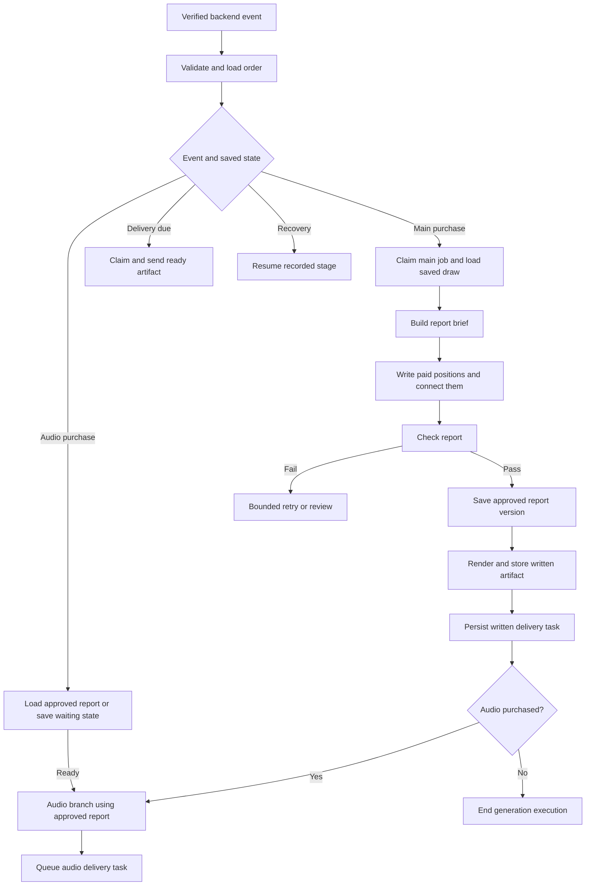

# 08 Marcus — main n8n fulfillment plan

> **Latest confirmed decisions:** standard delivery within 24 hours; +$12.77 bump within 12 hours, both measured from confirmed main payment. Audio shares that order deadline. Use Replicate Chatterbox with the Marcus voice Joel will supply. Create a NEW Marcus n8n workflow; existing workflows must remain untouched. See the delivery policy and Chatterbox setup in the n8n folder. These decisions supersede older open-timing/provider notes below.

Status: new inactive workflow draft authored; production implementation and activation remain incomplete. The local harness now produces a structurally validated PDF fixture, not a production-written customer reading or recording.

## Confirmed product rules

- Main written reading: $35. Same-day delivery bump: +$12.77.
- Fixed face-up cards come from the exact daily edition the buyer clicked.
- Remaining cards are drawn separately per paid order and saved once.
- Every edition supplies its own theme and ordered free/paid positions. Brief, writing, grading and PDF rendering derive counts from that edition; they do not assume six cards.
- First and last name identify an additional personal card. Its meaning guides the interpretation; it occupies no spread position.
- Audio is an optional recording of the approved personalized report, generated by a chain inside this main workflow.
- Written delivery never waits for audio. Local tests come before remote integration.

## One main workflow, routed by event and saved state

Persisted task dispatch permits another execution of the same workflow to send a ready written artifact while an audio execution is still running. Do not place the written send after a long audio step or use a merge that waits for both outputs.

## Stage-by-stage build checklist

| Stage | Work to build | Exit condition |
|---|---|---|
| Entry | Receive authenticated backend event; check paid product/entitlement against stored payment evidence; deduplicate event. Persist before acknowledging. | Valid durable job or recognized replay; no browser-supplied payment claims |
| Claim | Atomically claim main/audio/delivery job with lease and attempt identity. | One active owner; other executions return existing state |
| Order context | Load immutable edition/version, question, spread positions, fixed cards, first/last name, delivery email and purchases. | All required data present; no fallback to today’s edition |
| Personal card + draw | Call shared backend operation to create-or-load the paid draw and personal card. Enforce no duplicate drawn cards and exclude fixed faces. | Saved per-order cards and method versions; retries reuse them |
| Brief | Combine paid positions/cards, personal-card meaning, free-email context and approved writing rules. | Complete versioned brief; free positions are context, not paid rereading |
| Write | Generate paid position explanations, connect their meanings, and write a practical closing reflection. Model/prompt configuration is pinned. | Structured report candidate covering every paid position |
| Grade | Check names, exact cards/positions, personal-card contribution, image/meaning accuracy, completeness and readable Marcus voice. | Pass, bounded rewrite or explicit review; never silently send a failed report |
| Approve | Save accepted report text, source hashes, prompt/model versions and verdict. | Immutable approved report that both formats can use |
| Render | Render the approved report as a PDF with the exact ordered spread and clear typography, then verify/store privately. | Readable PDF artifact and metadata |
| Written delivery | Calculate approved service-level deadline; queue delivery; send through selected adapter at agreed time. | Provider outcome recorded, retries use same artifact |
| Audio check | Reconcile verified audio entitlement after report approval. | Claim audio branch or end; no indefinite wait for buyer |
| Audio chain | Adapt approved report for speech, QA script, generate segments, assemble/check/store recording, queue audio delivery. | Playable recording or independent visible failure; see AUDIO-BRANCH.md |
| Receipt/player | Expose restricted customer status and valid access links. | Customer sees only purchased products and accurate status |
| Recovery | Reconcile stale leases, missed events, failed generation/render and uncertain sends; resume saved stage. | Recoverable work retained; issues have order-linked records |

## Audio timing race — required behavior

If audio is purchased before the report is approved, save waiting entitlement state. The report-complete route picks it up. If audio is purchased after report approval or written delivery, the audio-purchase event re-enters this same workflow at its audio route. It loads the saved report and skips drawing/writing/rendering the written purchase.

Both paths use the same atomic audio claim. A scheduled recovery entry covers missed or simultaneous events. There is no separate audio fulfillment workflow in this plan. Detailed stages: [AUDIO-BRANCH.md](AUDIO-BRANCH.md).

## Decisions still needed

| Decision | Why it matters | Current position |
|---|---|---|
| Written delivery mechanism | Determines private storage, message template and customer wording | PDF confirmed; attachment versus restricted private link remains open |
| Standard delivery timing | Sets base deadline | Confirmed: 24 hours after main payment |
| Speed bump | Sets expedited deadline | Confirmed: 12 hours after main payment; no calendar cutoff |
| Audio voice/provider | Configures narration | Replicate Chatterbox; Joel will supply Marcus reference voice |
| Audio deadline / bump coverage | Sets audio due time | Same order deadline: 24h standard / 12h with bump |
| Main generation model and review policy | Determines prompts, cost and response to failed QA | Compare permitted local/sample outputs; no unapproved failure-send policy |
| Name edge cases | Ensures reproducible personal card for supported names | Master 33 and non-ASCII handling unresolved; local harness fails explicitly |
| Target n8n instance and environment | Determines where credentials/workflow are eventually installed | Local-first; eventual instance unconfirmed |
| Audio price | Required for final purchase/receipt integration | $17 is a test value only, not approved |

These decisions do not block writing workflow source, defining job contracts, fixture adapters, or local retry tests. They block final provider configuration, delivery promises and launch. Keep proposed values in test configuration and docs rather than silently treating them as product facts.

## Local proof required next

- [ ] Durable local order, report, job and delivery storage; restart recovery beyond current memory-only harness.
- [ ] Main n8n workflow source plus generated inactive JSON with explicit main/audio/delivery/recovery routing.
- [x] Fake payment, structural writer, PDF renderer, narrator-manifest, storage and captured delivery adapters; no shared `.env` imports. Production-quality writing and playable audio remain pending.
- [ ] Test two buyers of one edition, failed QA/rendering, main-only orders, bump orders and both audio timing paths. Repeat events and a separate eight-card 4-up/4-down themed PDF are covered locally.
- [x] Local n8n main-reading execution produced an adaptive eight-card PDF and queued captured written delivery; see [execution evidence](LOCAL-EXECUTION-EVIDENCE.md). Audio execution remains pending.
- [ ] Approved real report/voice samples when those services and terms are chosen.
- [ ] Isolated remote integration evidence before production activation.

## Related implementation contracts

[Data contract](../data/CONTRACT.md) · [paid product](../paid-reading/SCOPE.md) · [audio branch](AUDIO-BRANCH.md) · [local audit](../local-testing/AUDIT.md) · [master checklist](../FUNNEL-BUILD-CHECKLIST.md).
